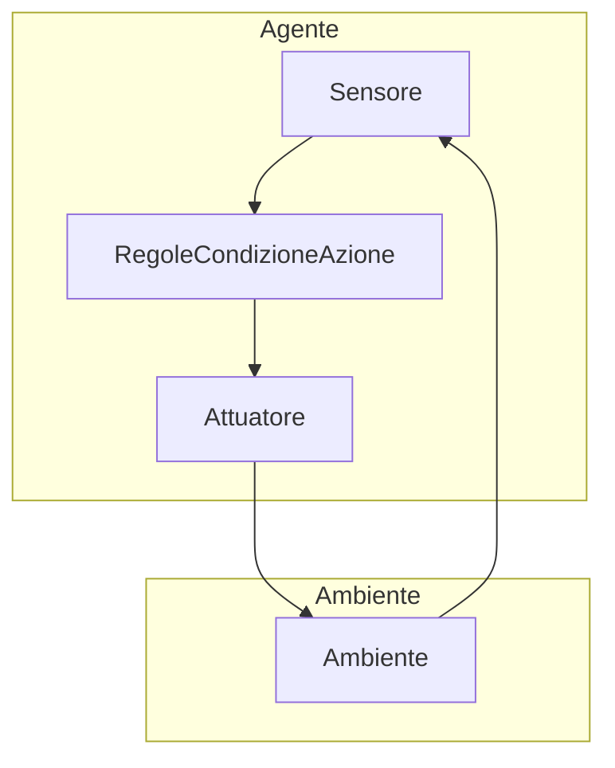

18-05-2024 18:50

--- 
>[!info] 
>Nelle sezioni seguenti vedremo come approcciarci al problema della ricerca in maniera intelligente. Si parte con la definizione di agente razionale per poi porre negli stessi termini sia la ricerca non informata che quella euristica

## Agenti razionali

### Agire razionalmente: gli agenti 

- Come detto nell'introduzione dobbiamo muoverci verso la ==risoluzione di un problema in maniera== intelligente, ==razionale==, ma come facciamo se ==il computer== è una macchina di per sé ==non intelligente==?
- Cerchiamo innanzitutto di ==astrarre== dall'implementazione "computazionale"
	- Noi abbiamo innanzitutto un **ambiente** nel quale identifichiamo un ==problema==
	- Per risolvere questo problema ci serve qualcosa che ==percepisca== l'ambiente e che ==agisca== su di esso: **un agente**

> Un agente è qualunque cosa che percepisce il suo ambiente mediante ==sensori== e agisce sull'ambiente mediante ==attuatori==

- Tra le percezioni e le azioni intercorre una stretta relazione esplicitata dal *==programma==* (se si tratta di una percezione) e/o dalla *==funzione==* (se si tratta dell'intera sequenza)
- Possiamo raccogliere le ==coppie sequenza/azione== in una tabella che quindi può descrivere ogni aspetto dell'agente

| Sequenza                             | Azione |
| ------------------------------------ | ------ |
| (input sensore1, input sensore2)     | x      |
| (diverso input s1, diverso input s2) | y      |
| ...                                  | ...    |


> [!warning] Nota bene:
> La scelta di un'azione compiuta dall'agente dipende esclusivamente dalla *sequenza di percezioni* [^2]


#### Agenti razionali

- Poiché noi vogliamo che le azioni siano finalizzate al conseguimento di un obiettivo gli agenti di cui abbiamo bisogno sono ==intelligenti==


>[!quote]
>L'intelligenza computazionale è lo studio della progettazione degli ==agenti intelligenti==
>- Poole et al 1998


- Il principio cardine intorno al quale costruire questo tipo di agenti è che essi debbano compiere *azioni razionali* [^1] 
	- Per intelligenza infatti noi ci riferiamo alla razionalità e prescindiamo da quello che è invece il comportamento umano, più complesso

- I ==fattori== su cui valutiamo la ==razionalità== dell'agente sono però 4
	- La sequenza delle percezioni (dipende dai ==sensori==)
	- Le azioni effettuabili (dipende dagli ==attuatori==)
	- Una misura di ==performance== dell'azione stessa
	- La ==conoscenza dell'ambiente==
- Questi fattori racchiudono quindi tutti gli aspetti da specificare per progettare un agente razionale e vengono chiamati *Task Environment*
>[!example]- Esempio: Taxi a guida autonoma
>- Performance
>	- Sicurezza
>	- Velocità
>	- Rispetto del codice stradale
>	- Profitto
>- Ambiente
>	- Strade
>	- Traffico
>	- Pedoni
>- Atturatori
>	- Volante
>	- Accellratore
>	- Freni
>	- Luci
>- Sensori
>	- Videocamere
>	- Tachimetro
>	- GPS
>	- Sensori del motore

```python
class Problem(object):
    """The abstract class for a formal problem. A new domain subclasses this,
    overriding `actions` and `results`, and perhaps other methods.
    The default heuristic is 0 and the default action cost is 1 for all states.
    When yiou create an instance of a subclass, specify `initial`, and `goal` states
    (or give an `is_goal` method) and perhaps other keyword args for the subclass."""

    def __init__(self, initial=None, goal=None, **kwds):
        self.__dict__.update(initial=initial, goal=goal, **kwds)

    def actions(self, state):        raise NotImplementedError
    def result(self, state, action): raise NotImplementedError
    def is_goal(self, state):        return state == self.goal
    def action_cost(self, s, a, s1): return 1
    def h(self, node):               return 0

    def __str__(self):
        return '{}({!r}, {!r})'.format(
            type(self).__name__, self.initial, self.goal)
```
### Programmi ed agenti: tipologie
- Quando progettiamo un'agente vogliamo che il suo programma tenga conto di un numero di informazioni piccolo rispetto alla tabella di tutte le percezioni 
- Da questa necessità emergono i seguenti approcci 
#### Simple reflex agents
- Questo tipo di agente seleziona le azioni solamente in base alla percezione corrente
- Le azioni da eseguire vengono scelte sulla base di una serie di *regole condizione-azione* [^3]

>[!info]- Approfondimento: Riflessi di Braintenberg
>Queste regole di condizione-azione sono assimilabili ai riflessi dei veicoli di Braitenberg. Questi veicoli, teorizzati dall'omonimo neuroscienziato italiano, sono stati teorizzati per mettere in evidenza come da una somma di comportamenti semplici possa essere emergerne uno complesso come la paura. Si tratta essenzialmente di robot con tutta una serie di sensori e di attuatori per l'appunto


#### Model-based agents


- Alle condizioni descritte in precedenza bisogna aggiungere ulteriori informazioni
	- ==Stato interno==
		- L'agente possiede uno stato interno che dipende dalle proprie percezioni
	- ==Modello dell'ambiente== 
		- L'agente ha un'idea dell'ambiente e delle sue evoluzioni
	- ==Conseguenze delle proprie azioni sull'ambiente==
		- Self explainatory

#### Goal-based agents


- Questi agenti prendono decisioni in base ad un ==obiettivo== coinvolgendo anche considerazioni sul futuro (prima si faceva implicitamente)
- Essenzialmente le regole di condizione-azione valutano anche il raggiungimento di un obiettivo 
	- La decisione sull'azione da intraprendere viene effettuata sulla base di 
		- Come è cambierebbe l'ambiente effettuando quella determinata azione
		- Se questa azione permette di raggiungere l'obiettivo

#### Utility-based reflex agent


- Questi agenti prendono decisioni in base ad un ==obiettivo== coinvolgendo anche considerazioni sul futuro (prima si faceva implicitamente)
- Essenzialmente le regole di condizione-azione valutano anche il raggiungimento di un obiettivo 
	- La decisione sull'azione da intraprendere viene effettuata sulla base di 
		- Come è cambierebbe l'ambiente effettuando quella determinata azione
		- Se questa azione permette di raggiungere l'obiettivo

- In questo caso l'agente ==non sceglie in maniera binaria== (se ha raggiuntoo meno un obiettivo) ma si appoggia ad una ==misura di performance interna==: l'*utilità*

### Applicazioni
#### Ricerca
> Il problema della ricerca consiste nell'identificazione di una sequenza di azioni per poter raggiungere il proprio obiettivo

- 
###### Progettazione
- Abbiamo detto che per progettare un agente ci servono 4 fattori, per identificarli innanzitutto formuliamo il problema
	- Dobbiamo raggiungere un luogo Y a partire da un posto X: **stato iniziale e stato goal**
	- Abbiamo una serie di città raggiungibili: **azioni che cambiano lo stato**
	- Ogni transizione ha una sua funzione di costo : **misura di performance**
	- L'**ambiente** è 
		- Osservabile
			- L'agente conosce sempre lo stato corrente
		- Discreto
			- Le azioni disponibili non sono infinite
		- Noto
			- Abbiamo una mappa accurata quindi conosciamo le conseguenze della nostra azione
		- Deterministico
			- Ad ogni azione corrisponde un risultato preciso
##### Implementazione: Romania
- Stati: maggiori città rumene
	- Stato iniziale: Arad
	- Stato goal: Bucharest
- Azioni: Guidare da una città all'altra
- Costo: Distanza in km

#### Aspirapolvere
#### Puzzle 8
#### 8 regine
## Ricerca non informata
- Per rappresentare e risolvere computazionalmente il problema della ricerca dobbiamo traslare quello che abbiamo appena detto nel lingo di ==algoritmi e strutture dati==
### Le strutture dati 
#### Grafo
- La rappresentazione di tutti gli stati possibili viene fatta con un grafo [^5]
	- In questo caso non si parla di nodi ma di stati
	- Gli ==archi== corrispondono alle ==transizioni di stato==
#### Albero
- Per tenere traccia dell'esplorazione del grafo usiamo un **albero di ricerca**
	- In questo caso dobbiamo muoverci verso la risoluzione del problema quindi ==oltre allo stato== ci servono ==ulteriori informazioni== sull'esplorazione del problema
		- Ogni nodo dell'albero dovrà avere quindi più attributi ([[Tec. di prog. - Lezione 1#OOP in python]])
			- ==Stato==: stato identificato da n [^4]
				- Due diversi nodi possono avere lo stesso stato
			- ==Genitore==: nodo che ha generato n
			- ==Azione==: l'azione che ha generato n
			- ==Costo del cammino==: il costo g(n) del cammino dall'origine fino a n
	- Terminologia
		- Lo ==stato iniziale== rappresenta la **radice**
		- Ogni ==diramazione== è data da **azioni** e stati sucecssivi
		- Lo ==stato corrente== è detto **nodo padre**
		- I ==nodi senza figli== sono **nodi figlia**
			- Quelli in attesa di essere espansi sono raccolti nell'insieme frontiera (F)
#### Strutture accessorie
- Sono necessarie **strutture accessorie** per tenere conto dei **nodi visitati (E)** e della **frontiera (F)**
	- Distinguiamo gli algoritmi di ricerca sulla base della struttura dati adoperata  per la frontiera (heap,stack etc) 
	- Per evitare la ridondanza teniamo traccia degli stati vistitati in una lista E

### Misure di performance
#### In generale
- Dobbiamo innanzitutto valutare
	- **Completezza** 
		- Se esiste una soluzione, l'algoritmo riesce a trovarla?
	- **Ottimalità**
		- La soluzione trovata è di costo minimo?
	- **Complessità**
		- La dividiamo in 
			- Temporale
				- Numero di nodi generati
			- Spaziale
				- Massimo numero di nodi nella frontiera
#### Variabili
- **Fattore di ramificazione: b**
	- Numero massimo di successori posseduti da uno stato
- **Profondità dello spazio di ricerca: d**
	- Minima profondità di un nodo goal

### Algoritmi
>[!warning] Nota bene: Passaggi comuni
>- Inizializza la frontiera con la radice 
>	- $F = {s0}$
>- Inizializza l'insieme dei nodi esplorati
>	- $E = \emptyset$
>- Condizioni di uscita
>	- Se F è vuota restituisci fail
>		- Essenzialmente se non ci sono nodi di espandere hai finito no?
>	- Se s_n è goal restituiscilo con il cammino in E
>- Se s_n non compare in E espandi n aggiungendo i suoi figli a F
>- Aggiungi n ad E

#### Ricerca in ampiezza
#### Ricerca a costo uniforme
#### Ricerca in profondità
#### Ricerca a profondità limitata
#### Iterative deepening
#### Ricerca bidirezionale


[^1]: Un'azione è definita razionale se massimizza il raggiungimento di un obiettivo sulla base delle informazioni disponibili

[^2]: La sequenza di percezioni è la storia completa di tutto quello che l'agente ha percepito

[^3]: Come dice il nome si tratta di regola che associano a delle condizioni (percezioni) un'azione specifica

[^4]: Per stato si intende una configurazione unica del problema in un certo punto del processo di risoluzione

[^5]: Un grafo è una struttura matematica utilizzata per modellare relazioni tra coppie di oggetti costituita da due insieme, uno dei vertici (nodi) e uno degli archi (spigoli)

--- 
# Reference: [[AI e Machine Learning - Lezioni e slide]]
