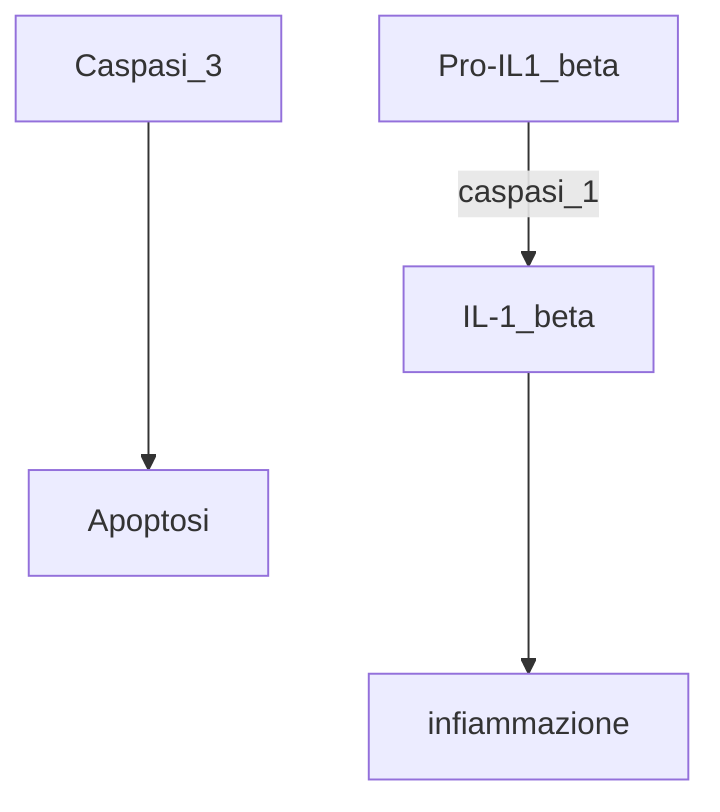

21-03-2023 10:12
Stato: #ideaLez 
Tag: #Citologia #PatologiaGenerale 

>[!info]- definizione chatGPT
>L'apoptosi è un processo di morte cellulare programmata che avviene naturalmente nel corpo per eliminare le cellule danneggiate, vecchie o non necessarie. Durante l'apoptosi, la cellula si degrada in modo controllato e viene eliminata senza causare danni ai tessuti circostanti.

- Se le cellule non vanno incontro ad apoptosi si possono duplicare con danni al DNA aumentando esponenzialmente la possibilità di sviluppi neoplastici
	- Di conseguenza duplicazioni di cellule tumorali
- Essendo un fenomeno molto complesso intervengono numerosi geni e di conseguenza proteine regolati su più livelli

# Corredo proteico e genetico
## Famiglia delle Bcl-2
- Anti-Apoptotiche
	- Bcl-2, bcl-xL, bcl-W, Diva, Ced-9, Adenovirus E1B, Epstein-Barr virus BHRF
	- ==Attività Pro-Oncotica==
		- In molti fenomeni neoplastici è presente una *up-regolazione* dell'espressione di queste proteine
		- Linfoma a cellule B![[Linfoma a cellule B#^9f36ea]]
	- In terapia alcuni farmaci agiscono inibendo l'espressione dei geni associati a queste proteine
- Killer
	- [[Bax]], bak
		- Intervento di bruno: "Intervengono nel processo di apoptosi mitocondriale"
		- Bax in particolare: ![[Bax#^999480]]
	-  Bcl-Xs, bas, bid, noxa, egl-1 (c.elegans), bim
## [[p53]]
![[p53#^c6f420]]

## Caspasi

### Azione

### Domini funzionali dei geni

- Possono legare le proteine da attivare dal punto di vista terapeutico
#### DED
- *Death effector domain*
- Genera apoptosi
- ==Manca nella caspasi 3==
#### LS
- *Large subunit*
- Funge da ponte
#### SS
- *Small subunit*
- Azione regolatoria

### Target citoplasmatici

#### Cross talk tra due vie
- La via delle *![[MAP chinasi#^77faa8]]*
- Via della *PI3K : fosfatidilinositolo 3 chinasi*
	- Attivata sia dalla Ras che dalle *[[FAK|focal adhesion kinases]]*
	- Correlata alla ![[PKB#^fec657]]
- Molecole implicate nell'incremento dell'apoptosi
	- **Inibitrici di fattori pro-survival**
		- [[PKB|AKT]], FAK, Raf, [[Nf-kb]], [[STAT1]]
	- **Attivatrici di fattori pro-apoptotici**
		- PKC (isoforme delta e theta), PAK2, Bid 
	- Da tenere in considerazione come fattore pro apoptotico la proteina bad
- ### Target nucleari

- CAD
	- **Caspase** Activated DNAse
		- Desossiribonucleasi
- Regolazione
- Survivina
- **FAS**
	- il ligando del fas lega una proteina transmembrana
		- Alterazioni sono presenti 
			- in malattie autoimmuni come il [[Lupus eritmatoso sistemico|LES]]
			- Malattie linfoproliferative (tumori non hodgkin etc)
	- Ponti transmembrana
	- Alla fine attivazione delle caspasi 
# Terapia
- Inibitori dell'espressione di questi geni

---
# References 

