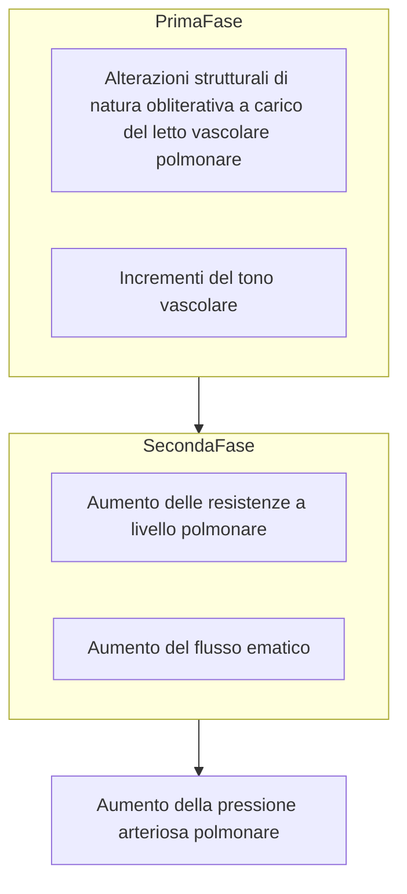

\18-02-2025 \16:57

--- 

## Aspetti generali
- L'==1% di tutti i nati vivi== risulta affetto da cardiopatie congenite 
- Circa il ==4% è figlio di donne esse stesse affette== da cardiopatie congenite
- ==Più dell'85% raggiunge l'età adulta== 

### Eziologia
- Le cardiopatie congenite sono in genere **conseguenza di** 
	- ==Aberrazione nello sviluppo== embrionale
	- ==Arresto dello sviluppo== embrionale
- **Meno del 10%** di tutte le cardiopatie congenite è **riconducibile a**
	- ==Anomalie cromosomiche==
	- ==Mutazioni dei singoli geni==
- **Nell'ambito** di manifestazioni tipiche delle sindromi di **Down, Tuner, trisomia 13-15, 17-18**
	- ==Si può porre diagnosi di malformazione cardiaca== se sono state riscontrate anomalie cromosomiche tramite 
		- *Amniocentesi* 
		- Biopsia dei villi coriali
	- Un altro fattore che depone per la **diagnosi di malformazioni cardiache** è l'individuazione in tali cellule delle **alterazioni enzimatiche** associate 
		- Alla *sindrome di Hurler* (gargoilismo)
		- All'==omocistinuria==
		- Alla ==malattia da accumulo di glicogeno di tipo II==
### Fisiopatologia

- Le **alterazioni anatomofisiologiche** secondarie a cardiopatie congenite hanno *natura dinamica*
	- Malformazioni che sfuggono inizialmente alla diagnosi possono assumere rilevanza clinica nell'adulto
- Assumono *talora* ==rilevanza clinica nell'adulto==, per esempio
	- Una valvola aortica bicuspide congenita normofunzionante
		- Può andare incontro a calcificazioni e ispessimenti 
		- Nel lungo periodo l'esito è la stenosi aortica significativa
	- Uno shunt sinistro-destro secondario a un difetto interatriale
		- Può non dare luogo a forme di insufficienza cardiaca o ipertensione polmonare prima dei 40-50 anni
#### Ipertensione polmonare
- **Stato del letto vascolare polmonare** -> ==elemento determinante==:
	- Le ==manifestazioni== cliniche
	- Il ==decorso== di una data lesione
	- La possibilità di ricorrere alla ==terapia chirurgica==

##### Processo

>[!warning] Parametri clinici di valutazione
>- Data la mole di fattori influenzanti è essenziale **confrontare** e **quantificare** ==flusso e resistenze nel circolo sistemico e in quello polmonare== di soggetti con grave ipertensione polmonare
>- L'approccio, seppur combinato, potrebbe vertere più su una terapia "polmonare" o "cardiocircolatoria"
##### Vasculopatia polmonare ostruttiva 
> Progressivo rimodellamento e ostruzione dei vasi sanguigni polmonari di piccolo calibro

- Tra le cause "polmonari"
- **Non se ne conosce l'eziologia**, le ==cause sospette== sono
	- Iperafflusso polmonare
	- Ipertensione arteriosa polmonare
	- Ipertensione venosa polmonare
	- Policitemia
	- Ipossiemia sistemica
	- Acidosi
	- Alterazioni della circolazione bronchiale
##### Sindrome di Eisenmenger o cardiopatia cianogena congenita
>Caratterizzata da un'inversione del flusso sanguigno nelle cavità cardiache e nei vasi sanguigni, a causa dell'aumento della pressione polmonare: **Shunt bidirezionali/destro-sinistro** ==secondari all'aumento delle resistenze vascolari== 

- **Emodinamicamente**, presenza di ==ampia comunicazione fra circolo sistemico e polmonare== a livello
	- Aorto-polmonare
	- Ventricolare 
	- Atriale 

##### Principi generali di trattamento
- Vasodilatatori arteriosi polmonari 
- Trapianto di polmone singolo
- Riparazione del difetto intracardiaco
- Trapianto cuore-polmoni
#### Eritrocitosi
- L'**ipossiemia cronica** nelle cardiopatie cianogene congenite dà luogo a ==eritrocitosi== dovuta ad ==aumentata produzione di eritropoietina==
	- Si utilizza **impropriamente** il termine ==policitemia== poiché l'anomalia è essenzialmente eritrocitaria

##### Ematocrito 
- I pazienti cianotici con eritrocitosi possono presentare essenzialmente due condizioni
###### Compensato
- Equilibrio del ferro inalterato
- **Raramente** si manifesta con ==sintomi di iperviscosità==
	- Solo occasionalmente se l'ematocrito > 70%
	- Di conseguenza soltanto raramente è necessario il salasso
###### Scompensato
- Ematocrito instabile
- **Ricorrenti sintomi legati all'iperviscosità**
	- Si ricorre al **salasso**
		- Rimozione di 500ml di sangue in 45min e reintegrazione del volume ematico con soluzione salina isotonica
			- ==Temporaneo miglioramento== della sintomatologia
		- ==Effetti negativi==
			- Apporto di ossigeno limitato
			- Instabilità dell'ematocrito
			- *Deplezione marziale* [^1]
	- Non normalmente differenziabili da quelli da carenza di ferro -> *anemia microcitica ipocromica*

##### Alterazioni dell'emostasi
- A causa
	- Dell'==aumento del volume ematico== 
	- Della ==congestione== capillare
	- Di ==anomalie della funzionalità piastrinica==
	- Di maggiore reattività ai FANS
	- Di anomalie dei sistemi di coagulazione intrinseco ed estrinseco
- Alla base dell'**incremento del rischio ictus**
	- Maggiore ==nei bambini di età inferiore ai 4 anni==
	- Negli adulti non sembra che aumenti

#### Gravidanza
- Le alterazioni fisiologiche caratteristiche della gravidanza possono dar luogo a riscontri obiettivi erroneamente attribuibili a cardiopatie
##### Alterazioni cardiovascolari e rischio in gravidanza
- **Malformazioni cardiovascolari** associate a 
	- Vasculopatie polmonari
	- Ipertensione polmonare
	- Ostruzione del tratto di efflusso ventricolare sinistro
- **Aumenta il rischio di morte** in caso di malformazioni che portano a 
	- Insufficienza cardiaca
	- Aritmie rilevanti da un punto di vista emodinamico
- Il **feto** è maggiormente a rischio ==qualora la madre sia affetta da== 
	- Cianosi
	- Scompenso cardiaco
	- Ipertensione polmonare
- Le donne con **coartazione aortica** o **sindrome di Marfan** sono a ==rischio di dissezione aortica==

>[!info] Contraccezione
>Il tema è delicato ma va assolutamente affrontato con le pazienti.
>Lesioni correggibili dovrebbero essere adeguatamente trattate prima di intraprendere una gravidanza, l'effetto della gravidanza potrà essere valutato e discusso in base all'esito di questi interventi.
>Qualora la gravidanza costituisca un'effettiva controindicazione sarebbe opportuno prendere in considerazione la chiusura delle tube.
### Endocardite infettiva: rischio
- La **profilassi antibiotica** è indicata di routine ==nella maggior parte dei soggetti con cardiopatie congenite==, che siano stati operati o meno, in tutti i casi di 
	- **Interventi** 
		- Odontoiatrici 
		- A livello del tratto gastrointestinale 
		- Delle vie urogenitali
	- **Procedure diagnostiche particolari** 
		- Proctosigmoidoscopia
		- Cistoscopia
- Il **profilo clinico e batteriologico** dell'endocardite infettiva nei pazienti affetti da cardiopatie cianogene congenite ha subito ==variazioni in seguito allo sviluppo== 
	- Della ==chirurgia intra cardiaca== 
	- Dei ==dispositivi protesici==
- I due **fattori che predispongono** maggiormente all'endocardite infettiva sono 
	- Un ==substrato cardiovascolare suscettibile== 
	- La presenza di una ==fonte di setticemia==
- La **profilassi** include procedure 
	- Chemioterapiche (antimicrobiche)
	- Non chemioterapiche (igieniche).
		- È opportuno porre la ==massima attenzione all'igiene dentale e cutanea==
### Esercizio fisico: indicazioni
- Sull'eventuale pratica di attività sportive i **consigli dipendono** dalla ==natura== e dalla ==gravità== della ==lesione== cardiovascolare
- **Alcune condizioni** ==predispongono== maggiormente alla ==sincope== ed alla ==morte== cardiaca improvvisa
	- ==Ostruzione dell'efflusso ventricolare sinistro== (es stenosi aortica)
	- Vasculopatie polmonari 
- **Nella tetralogia di Fallot** non corretta chirurgicamente la ==diminuzione delle resistenze vascolari== sistemiche indotta dall'esercizio fisico, a causa dell'ostruzione all'efflusso ventricolare destro, determina 
	- Aumento dello shunt destro-sinistro
	- Aumento dell'==ipossiemia== 
	- ==Peggioramento== della sensazione soggettiva di ==difficoltà respiratoria== dovuto alla risposta del centro respiratorio alle variazioni della concentrazione dei gas ematici e del pH
## Difetti cardiaci specifici
>[!example] Classificazione 
>##### Complesse
>
>##### Di complessità intermedia
>
>##### Semplici
>

- In base alla complessità ci si rivolge a figure sempre più specializzate
	- Cardiopatie congenite complesse -> Centro di riferimento
	- Malformazioni intermedie -> Cardiologo e follow up periodici
	- Malformazioni semplici -> Internista preparato ed eventuali consulenze cardiologiche

### Cardiopatie congenite non cianogene con shunt sinistro-destro

>[!warning]- Possiamo realmente escludere la cianosi? (ragionamento fisiopatologico)
>- In queste condizioni cliniche lo shunt sx-dx ==non è inizialmente associato a cianosi==, *tuttavia* aumenta sia i volumi che le pressioni del circolo polmonare portando ad ==aterosclerosi del sistema vascolare polmonare== e ad ==ipertrofia ventricolare destra==
>	- Le arterie muscolari polmonari inizialmente rispondono con ==ipertrofia della media e vasocostrizione==
>	- Questo processo termina nell'ostruzione del lume a causa della proliferazione di cellule della parete vascolare: *arteriosclerosi iperplastica*
>- **Alla fine**, le ==resistenze vascolari polmonari raggiungono i livelli sistemici==, producendo un nuovo **shunt destro-sinistro** che immette sangue non ossigenato nella circolazione sistemica: *sindrome di Eisenmonger* 

#### Difetti del setto interatriale (DIA)
- Malformazioni congenite comuni, più frequenti nelle donne
##### Classificazione
- In base alla posizione anatomica classifichiamo questi difetti in **tre categorie**
###### Del tipo *seno venoso*
- Interessano la ==porzione superiore del setto interatriale==, in prossimità dello ==sbocco nella vena cava superiore== nell'atrio destro
- Si associano spesso a ==ritorno venoso polmonare anomalo==
###### Del tipo *ostium primum*
- Situati ==in prossimità delle valvole atrioventricolari== ciascuna delle quali può essere deformata e insufficiente
- ==Associati a sindrome di Down==
###### Del tipo *ostium secundum*
- Difetto che interessa la regione della *fossa ovale*, ad altezza media nel setto
- Da non confondere con il *forame ovale pervio* (==fisiologicamente== pervio soltanto durante l'[[Apparato cardiovascolare#Embriologia|embriogenesi]])
	- Nel DIA la porzione di setto è completamente assente
- Il difetto del FOP è molto meno grave
##### Manifestazioni cliniche
- Per ciò che concerne la **sintomatologia**
	- Talora, nei **primi anni di vita** si osservano 
		- ==Ritardi nello sviluppo== fisico
		- ==Maggiore incidenza di infezioni del tratto respiratorio==
	- A **partire dai 40 anni**
		- ==Aritmie== atriali
		- Ipertensione arteriosa polmonare
		- ==Shunt== bidirezionale e poi sinistro-destro
		- ==Scompenso== cardiaco

##### Esame obiettivo
>[!info] Alterazioni dei soliti reperti
>- L'==aumento delle resistenze polmonari== riduce il gap pressorio tra atrio destro e sinistro mascherando il rumore di efflusso polmonare e di afflusso tricuspidale.
>- La componente polmonare del secondo tono risulta però accentuata con un ==soffio diastolico da rigurgito polmonare==
###### Ispezione
- ==Itto== ventricolare destro ==accentuato==
###### Palpazione
- Onda sfigmica dell'==arteria polmonare==
- Fremito apicale  
###### Auscultazione
- **Primo tono**
	- ==Accentuazione== del rumore di chiusura della ==tricuspide==
- **Secondo tono**
	- Tipicamente ==sdoppiato==
- **Soffi** 
	- ==Mesodiastolico==, da eiezione, ==polmonare==
		- Associato all'incremento del flusso transpolmonare
	- ==Mesodiastolico==, a rullio, ==tricuspidale==
		- Area marginosternale sinistra
	- ==Olosistolico==, apicale
		- Associato a rigurgito mitralico o tricuspidale
		- Spesso DIA ostium primum

>[!example]- **DDx**: ==FA + DIA== vs ==Stenosi Mitralica + Ipertensione Polmonare==
>- All'esame obiettivo è difficilissimo
>	- Il soffio da rigurgito tricuspidale diastolico può essere scambiato per il soffio diastolico da stenosi mitralica
>	- Lo sdoppiamento ampio del secondo tono è similare allo schiocco di apertura della mitrale

##### Elettrocardiogramma
- Alterazioni secondarie alla dilatazione del tratto d'efflusso del ventricolo destro 
	- ==Deviazione assiale destra==
	- Aspetto ==rSr' nelle derivazioni precordiali destre==
- In base al tipo di difetto
	- **Seno venoso**
		- *Segnapassi atriale ectopico*[^2]
		- Blocco cardiaco di primo grado
	- **Ostium primum**
		- ==Deviazione assiale sinistra==
			- Coinvolge fibre del fascio di HIS e porta ad un *emiblocco anteriore sinistro* 
		- Rotazione in senso antiorario dell'ansa del QRS sul piano frontale
- Alterazioni delle pareti del cuore destro
	- Ipertrofia
	- Dilatazione
		- Visualizzabile all'*rx torace*

##### Ecocardiogramma
- Reperti
	- **Dilatazione** 
		- Delle arterie polmonari
		- Del ventricolo destro 
		- Dell'atrio destro
	- **Motilità anomala** del ==setto interventricolare==
- La **TEA**[^3] è indicata in caso di ==ambiguità dei reperti== ottenuti dall'ecocardiogramma transtoracico
- Il cateterismo è ormai stato quasi completamente soppiantato dall'ecocardio ma risulta ancora utile in caso di patologie più gravi o incongruenze nei reperti clinici

##### Trattamento
###### Chirurgico
- Con patch di pericardio o di materiale protesico
- **Indicazioni**
	- Non indicata nei pazienti con
		- DIA di piccole dimensioni 
		- Shunt sinistro destro non significativi 
		- Grave vasculopatia polmonare
###### Percutaneo
- Transcatetere
- **Indicazioni**
	- Pazienti di età superiore a 40 anni ==senza ipertensione polmonare severa==
	- Ositum secundum non complicato con significativo shunt sinistro-destro
###### Farmacologico
- Trattamento tempestivo delle ==infezioni delle vei respiratorie==
- Somministrazione di 
	- Antiaritmici
		- Nel caso di fibrillazione atriale o tachicardie sopraventricolari
		- Presidi standard per la terapia di
			- Ipertensione
			- Coronaropatia
			- Scompenso cardiaco
#### Difetti del setto interventricolare (DIV)
- Di solito difetto unico della *pars membranosa* del setto
- L'**alterazione funzionale** dipende dalle ==dimensioni del DIV== e dalle ==condizioni del letto vascolare polmonare==
	- Tranne che per difetti di piccole dimensioni, la diagnosi viene effettuata nei primi anni di vita
##### Manifestazioni cliniche
- La **storia naturale** varia notevolmente:
	- **Agli estremi** abbiamo
		- ==Chiusura spontanea== del difetto
		- ==Decesso== del paziente ==in età infantile==
- Alcune delle **manifestazioni**:
	- ==Ostruzione vascolare polmonare==
		- Causa fondamentale delle alterazioni irreversibili: *sindrome di Eisenmenger* 
		- Manifesto estremo di un ==aumento delle resistenze vascolari polmonari==
			- Queste in particolare sono valutate in fase preoperatoria come ==fattore prognostico peggiorativo==
	- Ostruzione del tratto di efflusso del ventricolo destro
		- Nel 5-10% dei casi evolve verso un quadro che ricorda la ==tetralogia di Fallot cianogena==
	- [[Insufficienza aortica]] ^a03704
		- 5% dei casi
		- Ipoplasia cuspidale o prolasso attraverso il DIV
	- Endocardite infettiva
##### Diagnosi
- L'==esame ecocardiografico bidimensionale associato al color-Doppler== permette in genere di definire 
	- Numero e sede dei DIV nonché 
	- Eventuali patologie concomitanti 
	- Fisiologia emodinamica dei difetti
- Le condizioni del letto vascolare polmonare possono essre valutate con lo studio emodinamico  quello angiografico
##### Terapia
- La **terapia chirurgica** è indicata in presenza di ==shunt sinistro-destro medio-gravi== con un ==rapporto tra il flusso sistemico quello polmonare superiore a 1,5:1==
	- Purché non si abbiano incrementi abnormi delle resistenze polmonari

#### Dotto arterioso pervio (di Botallo)
##### Anatomia e sviluppo
- Vaso che origina dalla ==biforcazione dell'arteria polmonare== congiungendosi all'aorta in sede immediatamente distale rispetto all'arteria ==succlavia sinistra==. 
- Nel **feto** esso è ==pervio==, mentre **dopo la nascita** ==si chiude== nel giro di pochi giorni
##### Emodinamica
- Il **flusso** nel dotto ==dipende== dai valori di pressione e resistenza nel circolo sistemico e polmonare, nonché dall'area trasversale e dalla lunghezza dello stesso.
- **In molti** pazienti adulti la pervietà del dotto arterioso ==non comporta alterazioni dei valori pressori a livello polmonare==
- Si rileva un **gradiente aorto-polmonare** che persiste per l'==intera durata del ciclo cardiaco== (associandosi a un flusso di shunt analogo) 
	- Questo spiega il ==tipico fremito unito a un soffio continuo== *"a locomotiva/di Gibson"* con ==accentuazione telesistolica== nell'area marginosternale sinistra superiore.
##### Aspetti clinici nell'adulto
- In soggetti adulti che **alla nascita** presentavano uno **shunt sinistro-destro consistente** a livello del dotto, si osserva in genere la comparsa di ostruzione vascolare polmonare (==sindrome di Eisenmenger==) con
	- Ipertensione polmonare
	- Inversione dello shunt (destro-sinistro) 
	- Cianosi
- La **comparsa di vasculopatia polmonare grave** esita nell'==inversione del flusso== a livello del dotto arterioso, con passaggio di ==sangue non ossigenato nell'aorta discendente==
	- Per tale motivo si osservano ==cianosi== e ==ippocratismo digitale== a livello delle ==dita dei piedi, ma non delle mani== (*cianosi differenziale*).
- Nell'adulto il **decesso consegue** fondamentalmente a ==scompenso cardiaco ed endocardite infettiva==;
	- **Talora** forme particolarmente gravi di ostruzione polmonare danno luogo a ==dilatazione aneurismatica== con formazione di depositi calcifici e ==rottura del dotto==.
##### Trattamento
- ==In assenza di vasculopatia polmonare grave== e shunt sinistro-destro prevalente è bene ricorrere alla **legatura o alla resezione chirurgica** del dotto arterioso.
	- L'**intervento** va **rimandato** di diversi mesi nei pazienti sottoposti a terapia ==per endocardite infettiva==, in cui il dotto appare spesso edematoso e fragile.
- La **chiusura transcatetere**, con utilizzo di dispositivi a spirale, bottone, tappo e ombrello, è divenuta d'uso ==comune== nei casi in cui la ==morfologia== del difetto sia ==appropriata==.

#### Malformazioni con shunt fra aorta ascendente e cuore destro
- Tre sono le malformazioni più spesso associate alla presenza di shunt fra aorta ascendente e cuore destro:
##### Aneurisma congenito di un seno di Valsalva con fistola 

###### Eziologia e tipologie
- L'aneurisma di un seno aortico di Valsalva, in particolare del seno coronarico destro, **consegue** alla ==separazione o alla mancata fusione della tunica media aortica e dell'annulus della valvola aortica==;
	- **Di solito** mette in comunicazione 
		- La ==cuspide coronarica destra==
		- Il ==ventricolo destro==
	- **Se** la patologia interessa ==anche la cuspide non coronarica==, la comunicazione avviene fra 
		- ==Aorta== 
		- ==Atrio destro==. 
###### Manifestazioni cliniche
- La **rottura dell'aneurisma** si verifica in genere nel ==terzo-quarto decennio di vita== e ad essa si associa la brusca comparsa di
	- Dolore toracico
	- Polso battente
	- Soffio continuo con accentuazione diastolica 
	- Sovraccarico cardiaco di volume; 
###### Diagnosi e terapia
- La **diagnosi** trova *conferma* nei reperti dell'==esame ecocardiografico bidimensionale e Doppler==. 
- Il **cateterismo** permette di ==quantificare l'entità dello shunt== sinistro-destro
- L'**aortografia toracica** consente di ==visualizzare la fistola==.
- La **terapia**
	- **Medica** mira alla ==regressione di scompenso, aritmie o endocardite==;
	- **Chirurgica** provvede all'==aneurismectomia== e alla ==ricostruzione della continuità aortocardiaca== tramite sutura diretta oppure con l'innesto di una protesi.  
##### Fistola arterovenosa coronarica

- Un'anomalia poco frequente, consiste nella presenza di ==comunicazione fra una coronaria e una cavità cardiaca==
	- In genere seno coronarico, atrio o ventricolo destro.
- Lo **shunt** associato è 
	- ==In genere di piccola entità==, per cui non si osserva compromissione della perfusione miocardica
	- ==Se== questo è ==di grande entità==, è possibile che si verifichi una *sindrome da "furto" coronarico* con ==ischemia miocardica e possibile angina o aritmie ventricolari==.
		- Le **potenziali complicanze** includono 
			- L'endocardite infettiva
			- La formazione di ==trombi== con occlusione o embolizzazione 
			- ==Infarto== miocardico
			- La ==rottura di una fistola== aneurismatica 
			- Raramente 
				- Ipertensione polmonare 
				- Scompenso cardiaco congestizio.
###### Aspetti diagnostici
- Il **reperto** di un ==soffio continuo, intenso e localizzato in sede superficiale==, nell'area marginosternale inferiore o media, impone una valutazione più accurata di pazienti spesso asintomatici; 
- L'esame **eco-Doppler** consente di visualizzare lo ==sbocco della fistola==.
	- Se quest'ultima ha origine in **sede prossimale**, le ==tecniche bidimensionali ne permettono spesso la visualizzazione==.
- L'**angiografia** (cateterismo classico, angio-TC o angio-RM) permette di definire ==sede e caratteristiche anatomiche della fistola==, eventualmente obliterabile tramite sutura o transluminale.  
##### Origine anomala della coronaria sinistra dal tronco comune della polmonare.

- *Generalmente* il soggetto **muore entro il primo anno di vita a seguito di infarto miocardico** e fibrosi
	- Il 20% raggiunge l'adolescenza o l'età adulta senza necessità di interventi chirurgici.
- La diagnosi di origine anomala della coronaria sinistra trova conferma nel **reperto elettrocardiografico** ==di infarto miocardico anterolaterale==.
- La **terapia chirurgica** nei soggetti adulti comporta l'impianto di un ==bypass coronarico== di mammaria interna o di safena.

### Cardiopatie congenite non cianogene senza shunt
- Malformazioni caratterizzate dall'ostruzione del tratto di efflusso del ventricolo sinistro 
#### Stenosi aortica congenita
##### Stenosi aortica valvolare (bicuspidia?)
- Le valvole aortiche bicuspidi sono ==più frequenti negli uomini che nelle donne==. 

- **Storia naturale**
	- La valvola aortica bicuspide congenita, che ==inizialmente può essere funzionalmente normale==, è la malformazione cardiaca più frequente e **può sfuggire** alla diagnosi **in età giovanile**. 
	- **Nell'adulto** può essere tuttavia ==difficile distinguerla dalle valvulopatie acquisite di origine reumatica e calcifica degenerativa==, dal momento che le valvole bicuspidi possono divenire col tempo stenotiche o insufficienti o essere sede di un'endocardite infettiva. 

- In **termini emodinamici**:
	- Rigidità delle cuspidi valvolari -> ispessimento -> depositi calcifici -> stenosi -> ipertrofia concentrica del ventricolo sinistro -> dilatazione dell'aorta ascendente. 
	- L'**aorta ascendente** è spesso ==dilatata== (condizione definita erroneamente dilatazione "post-stenotica"); ciò è dovuto a ==alterazioni istologiche della tonaca media== aortica ==simili== a quelle presenti nella sindrome di ==Marfan== e può determinare una dissezione aortica. 

- La **diagnosi** è ==confermata dall'ecocardiografia==, che può 
	- Evidenziare la morfologia della valvola e della radice aortica
	- Valutare il grado di stenosi o insufficienza. 
###### Terapia
- **Indicazioni mediche**
	- La terapia **medica** della stenosi valvolare aortica congenita comprende 
		- La ==profilassi dell'endocardite infettiva== 
		- Nei pazienti con riduzione della riserva cardiaca, la somministrazione di ==digossina e diuretici== con dieta iposodica, *in attesa della correzione chirurgica*. 
	- La **dilatazione della radice aortica** può richiedere la somministrazione di ==β bloccanti==. 
	- Qualora la stenosi assuma particolare gravità, ==è bene evitare sforzi fisici sostenuti== anche in assenza di sintomatologia. 
		- Nei pazienti con forme più lievi di ostruzione è probabilmente opportuno vietare la partecipazione a sport competitivi. 
- **Approccio chirurgico**
	- La **sostituzione della valvola** è indicata in soggetti adulti asintomatici con grave ostruzione, per esempio nei pazienti 
		- Con un'==area valvolare aortica inferiore a 0,45 cm²/m²==
		- Con ==sintomi== secondari di ==disfunzione== del ==ventricolo sinistro== o di ==ischemia miocardica==
		- Con ==evidenza emodinamica di disfunzione ventricolare sinistra==. 
	- **Nei bambini o adolescenti asintomatici** (o giovani adulti) affetti da stenosi aortica severa e in assenza di calcificazioni valvolari, è generalmente ==utile una valvuloplastica con palloncino==  
	- **Se il ricorso alla terapia chirurgica risulta precluso** dalla compresenza di altre patologie (neoplasie maligne, insufficienza renale o epatica), la ==valvuloplastica== con palloncino consente spesso un ==miglioramento nel breve periodo==. 
	- Questa procedura può essere effettuata **provvisoriamente**, in attesa della sostituzione della valvola aortica, ==nei pazienti con grave insufficienza cardiaca==.
##### Stenosi aortica sottovalvolare
###### Morfologia
- La **forma più comune** di stenosi aortica sottovalvolare è la cosiddetta *stenosi sottovalvolare ipertrofica idiopatica*, ==definita più correttamente con il termine== *miocardiopatia ipertrofica*, che interessa circa un terzo di questi pazienti alla nascita .
- La **forma discreta** (specifica, localizzata) della stenosi sottovalvolare è dovuta a un ==diaframma membranoso o a un anello fibromuscolare== situati nel tratto d'efflusso del ventricolo sinistro in sede immediatamente inferiore alla valvola aortica. 
	- Il **getto di sangue ad alta velocità** determinato dalla stenosi sottovalvolare ==colpisce== il versante inferiore della ==valvola== e spesso ne causa una ==progressiva fibrosi==, rendendola insufficiente.
###### Diagnosi
- L'**ecocardiografia** documenta l'==anatomia== dell'ostruzione sottovalvolare;
- Il **color-Doppler** individua la presenza di ==flusso turbolento== prossimalmente alla valvola e può permettere di quantificare il ==gradiente pressorio== oltre alla gravità di un'eventuale insufficienza. 
###### Terapia
- Consiste nell'==asportazione chirurgica== del diaframma o dell'anello fibromuscolare.
##### Stenosi aortica sopravalvolare

###### Morfologia
- Questa patologia comporta la presenza di una **stenosi localizzata o diffusa a carico dell'aorta ascendente**, originantesi immediatamente a valle degli orifizi coronarici, ==all'altezza del margine superiore dei seni di Valsalva==.
###### Emodinamica delle coronarie
- A differenza di altre forme di stenosi aortica, **in questo caso** le ==coronarie== sono ==soggette a elevate pressioni sistoliche del ventricolo sinistro==, sono spesso dilatate e tortuose e suscettibili di aterosclerosi precoce.
###### Eziologia
- In molti pazienti alla base di tale anomalia è presente un **deficit genetico**, localizzato sulla ==stessa subunità cromosomica dell'elastina sul cromosoma 7==.
#### Coartazione dell'aorta
##### Stenosi e Coartazione dell'Aorta

- L'aorta può presentare segni di stenosi o coartazione in qualsiasi punto del proprio decorso, ma la **sede più frequente** è costituita dalla ==porzione distale rispetto all'origine dell'arteria succlavia sinistra==, ==in prossimità del legamento arterioso==. 
- **Epidemiologia**
	- Interessa circa il 7% dei soggetti con cardiopatie congenite
	- È ==più comune tra i maschi== 
	- ==Più frequente nei pazienti con disgenesia gonadica== (per esempio, sindrome di Turner). 

##### Semeiotica

- Nella maggior parte dei **bambini** e negli **adulti** in giovane età, la coartazione isolata dell'aorta, ==in genere==, ==non dà luogo a sintomatologia==;
- **Talora** si osservano 
	- Cefalea
	- Epistassi
	- Estremità fredde 
	- **Claudicatio da sforzo**
		- In questo caso l'**esame obiettivo** rileva la presenza di un soffio cardiaco o di ==ipertensione a livello degli arti superiori==, con assenza, ==riduzione o ritardo del polso arterioso femorale==. 
- Le **manifestazioni cliniche** ==dipendono== dalla sede e dall'estensione della patologia, nonché dalla presenza di altre malformazioni cardiache, la più comune delle quali è la valvola aortica bicuspide. 
- La presenza di **dilatazione** arteriosa aneurismatica del ==circolo di Willis== può coinvolgere fino al 10% dei pazienti e comporta un ==rischio elevato di rottura con morte del paziente==. 

###### Esame obiettivo
- Spesso **alla palpazione** si apprezza la presenza di **ampi circoli collaterali** pulsatili negli ==spazi intercostali anteriori==, a ==livello ascellare== o nell'==area interscapolare==; 
- In alcuni casi, all'**ispezione** gli ==arti superiori== e la regione toracica presentano uno ==sviluppo maggiore== di quello degli arti inferiori
- Un **soffio mesodiastolico**, che si avverte nello spazio interscapolare sinistro, tende a diventare continuo se la riduzione del lume vascolare dà luogo a un ==flusso ad alta velocità nell'arca di coartazione==, che persiste per l'intero ciclo cardiaco. 
	- Il riscontro di **altri soffi**, sistolici o continui, all'altezza della parete toracica laterale riflette verosimilmente l'aumento del ==flusso in circoli collaterali== dilatati e tortuosi. 
###### Complicanze
- Aneurismi ed emorragie cerebrali
- Dissezione e rottura aortica
- Aterosclerosi precoce delle coronarie
- Scompenso ventricolare sinistro
##### Diagnosi 

- All'**ECG** si osservano segni di ==ipertrofia ventricolare sinistra==;
###### RX
- La **radiografia del torace** evidenzia talora la ==dilatazione dell'arteria succlavia sinistra== al margine superiore sinistro del mediastino, associata a ==dilatazione dell'aorta ascendente==. 
	- Pressoché **patognomonica** è la visualizzazione del cosiddetto *segno del 3* [^4] (eheh, 3 e 4)
	- La presenza di ==intaccature nella 3ª e 9ª costola==, dovute all'==erosione da parte di vasi== collaterali dilatati, è un importante segno radiografico.
###### Eco et al.[^5]
- L'**ecocardiografia bidimensionale**, attraverso le finestre parasternali, è in grado di identificare il ==sito e la lunghezza della coartazione==.
- Il **color-Doppler** può quantificare il ==gradiente pressorio==.
- L'**ecocardiografia transesofagea, la RM e la TC tridimensionale** permettono di visualizzare la ==lunghezza e l'entità dell'ostruzione==, oltre alle arterie collaterali associate. 
- Nell'adulto, il **cateterismo** ha indicazione primaria ==per valutare le arterie coronarie e intervenire terapeuticamente via catetere== (angioplastica e posizionamento di uno stent a livello della coartazione).

##### Trattamento

  - La **terapia è in genere chirurgica**, nonostante per molti pazienti sia disponibile anche l'alternativa di un cateterismo percutaneo con il posizionamento di uno stent in seguito alla dilatazione della coartazione.
  - La presenza di **ipertensione arteriosa postoperatoria** tardiva, in assenza di coartazione residua, sembra essere ==correlata== alla durata dell'==ipertensione preoperatoria==.
  - È importante un **follow-up** con valutazione della pressione arteriosa sia a riposo che sotto sforzo, e in molti pazienti l'unico reliquato è un'ipertensione sistolica isolata da sforzo, dovuta in parte alla vasculopatia diffusa.
	  - È comunque ==necessario eseguire una RM o TC di alta qualità== nel follow-up di tutti i pazienti operati nei quali sia stato posizionato uno ==stent==.
#### Stenosi polmonare con setto interventricolare integro
##### Morfologia

- Le **ostruzioni** all'efflusso ventricolare destro possono essere ==localizzate== in sede
	- Sopravalvolare
	- Valvolare 
	- Sottovalvolare 
- **Stenosi multiple** a carico delle porzioni periferiche delle ==arterie polmonari== caratterizzano l'*embriopatia da rosolia* e si associano ==talora tanto alla forma ereditaria quanto a quella isolata di stenosi aortica sopravalvolare==. 
- La **stenosi valvolare polmonare** rappresenta la ==forma più frequente di ostruzione isolata all'efflusso ventricolare destro==.

##### Decorso Clinico e Sintomatologia
- In presenza di una normale portata cardiaca, il riscontro in sistole di un **gradiente pressorio transvalvolare massimo** compreso ==fra 50 e 80 mmHg== segnala una *stenosi moderata*, mentre valori maggiori o minori dell'intervallo suddetto corrispondono, rispettivamente, a forme gravi o lievi della patologia. 
- Il **decorso** clinico **dipende** dalla ==gravità== dell'ostruzione più che dalla sede di quest'ultima. 
	- I **pazienti con stenosi** polmonare **lieve** sono in genere ==asintomatici== e la patologia risulta progredire in misura minima

	- Nei **pazienti con ostruzione grave** 
		- La ==pressione sistolica nel ventricolo destro supera spesso quella ventricolare sinistra==, dato che il setto interventricolare è integro. 
		- Nei ==pazienti più anziani== si osservano talora affaticamento, dispnea, insufficienza ventricolare destra ed ==episodi sincopali==
		- Si ascolta il ==prolungamento dell'eiezione ventricolare destra==, mentre il rumore di chiusura della valvola polmonare è ritardato e ha un'intensità ridotta. 
- L'**ipertrofia del ventricolo** destro ne riduce la compliance, per cui occorre una contrazione più vigorosa dell'atrio destro per aumentare il riempimento ventricolare, un fenomeno segnalato dal riscontro di un ==quarto tono cardiaco== e dalla presenza di ==onde prominenti nel tracciato del polso venoso giugulare==, a cui talora si associano ==pulsazioni presistoliche del fegato==.

##### Esame obiettivo

Ascoltazione: https://www.youtube.com/watch?v=cyhre7Zy2FU

- La diagnosi trova conferma nel riscontro di **sollevamento del precordio** nell'area parasternale sinistra, ==associato== a un **soffio sistolico** da eiezione *in crescendo-decrescendo* e a un **fremito** nell'area margino-sternale superiore sinistra, tipicamente ==preceduti== da un **rumore da eiezione sistolica** se l'ostruzione è a una valvola polmonare mobile e non displasica. 
- Il **soffio olosistolico** in decrescendo ==caratteristico dell'insufficienza tricuspidale== accompagna talora la stenosi polmonare grave, soprattutto in presenza di insufficienza cardiaca congestizia. 
- Il riscontro di **cianosi** segnala l'esistenza di ==shunt a livello di un forame ovale pervio o di un DAI==
- Nei soggetti con **stenosi** sopravalvolare o arteriosa polmonare **in sede periferica**, il ==soffio è continuo o sistolico==, risulta meglio apprezzabile nell'area della stenosi e si irradia ai campi polmonari periferici.

##### Esami Diagnostici

- Nei casi lievi l'**ECG** è normale, mentre le stenosi moderate o severe sono associate a ==ipertrofia ventricolare destra==. 
- La **radiografia del torace** mostra
	- Nelle stenosi polmonari lievi e moderate, un'ombra cardiaca di normali dimensioni con una normale vascolarizzazione polmonare.
	- Nelle ostruzioni severe è in genere evidente un'==ipertrofia ventricolare destra==. 
		- La dilatazione dell'arteria polmonare principale e di sinistra è dovuta in parte al getto di sangue ad alta velocità generato dalla stenosi e in parte alla debolezza tissutale intrinseca. 
##### Trattamento
  - Solitamente **è efficace** il ricorso alla ==valvuloplastica con pallone== (vedi Cap. 223), ma anche la correzione chirurgica diretta non comporta rischi eccessivi.
  - Le **stenosi multiple** a carico delle arterie polmonari **periferiche** in genere ==non sono passibili di terapia chirurgica==
	  - **È possibile** intervenire chirurgicamente o ==mediante angioplastica con palloncino e stenting== se la stenosi interessa solo un ramo prossimale dell'arteria polmonare o la sua biforcazione.
### Cardiopatie congenite complesse
#### Tetralogia di Fallot
##### Morfologia

  - Le **quattro componenti** della tetralogia di Fallot sono 
	  - Il difetto del setto interventricolare
	  - L'ostruzione all'efflusso ventricolare destro
	  - La posizione a cavaliere dell'aorta rispetto al DIV
	  - L'ipertrofia ventricolare destra dovuta all'esposizione del ventricolo destro alla pressione aortica attraverso l'ampio DIV.

##### Quadro clinico e variabilità
  - Il quadro clinico ==dipende dalla gravità dell'ostruzione all'efflusso ventricolare destro==.
	  - L'**ipoplasia** del tratto di efflusso del ventricolo destro **varia** in misura notevole: si va ==da forme lievi all'assenza completa== (*atresia polmonare*).
  - **Talora** si osserva la ==coesistenza di stenosi valvolare polmonare e ostruzione sopravalvolare arteriosa polmonare== a livello periferico; più raro è il riscontro di atresia unilaterale a carico di un'arteria polmonare (in genere la sinistra).
  - Nel 25% circa dei pazienti con tetralogia, l'arco aortico e l'aorta discendente sono posizionati a destra.

###### Emodinamica
  - Il ==rapporto fra la resistenza al flusso ventricolo-aortico e la resistenza al flusso nei vasi polmonari== contribuisce in misura significativa alla definizione del quadro clinico ed emodinamico. 
  - Particolare importanza riveste in tale ambito la gravità dell'**ostruzione all'efflusso ventricolare destro**.
	  - Si osserva un ==calo marcato del flusso polmonare== con ==passaggio== di un volume consistente di ==sangue venoso== sistemico, povero di ossigeno, ==dalle sezioni destre alle sinistre== attraverso il DIV.
		  - Al fenomeno fanno seguito **cianosi e policitemia** e il quadro clinico appare dominato dalle conseguenze tipiche di una ==grave ipossiemia sistemica==.
  - In molti lattanti e bambini l'ostruzione è lieve, ma ingravescente.

#####  Esami Diagnostici
  - All'**elettrocardiogramma** si riscontrano in genere segni di ==ipertrofia ventricolare destra==;
  - La **radiografia del torace** mostra tipicamente 
	  - Un *cuore "a scarpa" (coeur en sabot)* di dimensioni normali, con ==ventricolo destro prominente== e presenza di una ==concavità nella regione del cono polmonare==.
	  - ==Riduzione== della ==vascolarizzazione polmonare==;
	  - ==Talora== **arco aortico e radice aortica sono localizzati a destra**. 
  - L'**esame ecografico bidimensionale** permette di visualizzare 
	  - Il mancato allineamento di DIV
	  - L'aorta a cavaliere del difetto 
	  - La sede e **gravità della stenosi polmonare**.
		  - Sottovalvolare (fissa o dinamica) 
		  - Localizzata all'arteria polmonare o a uno dei suoi rami principali.
  - L'**angiografia selettiva** con iniezione di contrasto nel ventricolo destro consente un'==accurata valutazione anatomica== 
	  - Del tratto di efflusso ventricolare destro
	  - Della valvola e dell'annulus polmonari
	  - Del calibro dei rami principali dell'arteria polmonare;
  - L'**esame coronarografico** definisce anatomia e decorso dei vasi coronarici. 
  - In centri di alto livello queste alterazioni sono spesso ben dimostrabili negli adulti utilizzando l'angio-TC o l'angio-RM con una ricostruzione tridimensionale.
##### Trattamento
- Per una serie di motivi, solo una **minima parte** degli adulti affetti da tetralogia di Fallot ==non ha subito alcun tipo di intervento chirurgico== in passato. 
- Il **re-intervento** negli adulti vede la sua ==causa== più comune in un'==insufficienza polmonare severa==. 
	- **In pazienti selezionati**, può essere necessaria una procedura interventistica (==angioplastica== e posizionamento di ==stent== per stenosi di rami dell'arteria polmonare). 
- Persiste tuttavia il **problema** della ==funzione ventricolare a lungo termine== e dell'endocardite infettiva
	- Eventuali **aritmie** ventricolari o atriali possono necessitare di ==terapia medica== o di uno studio elettrofisiologico con ==ablazione==. 
	- La **radice aortica** ha un ==difetto tissutale della tonaca media== che ne determina in genere la ==dilatazione==, e questa è associata a insufficienza aortica. 

#### Trasposizione completa dei grandi vasi
##### Morfologia
- Questa condizione viene comunemente detta destro- o D-trasposizione dei grandi vasi.
  - L'aorta origina dal ventricolo destro, anteriormente e a destra
  - L'arteria polmonare, invece, origina dal ventricolo sinistro, posteriormente e verso sinistra.
- Vengono così a crearsi **due circoli separati e paralleli**, ma affinché sia possibile la vita extrauterina, è ==necessaria una qualche comunicazione== tra i due circoli:
  - **Generalmente** si associa una comunicazione interatriale
  - Nei due terzi dei casi si rileva la pervietà del dotto arterioso 
  - In un terzo circa dei casi è presente anche un DIV.
- La trasposizione dei grossi vasi risulta ==più comune nei soggetti maschili== e rappresenta il 10% circa di tutte le cardiopatie congenite cianogene.

##### Quadro clinico
- Il decorso dipende 
  - Dal ==grado di ipossia== tissutale
  - Dalla ==capacità dei ventricoli di tollerare condizioni di sovraccarico== in presenza di diminuita ossigenazione del sangue coronarico
  - Dalla ==natura delle malformazioni cardiovascolari== associate e dalle condizioni del letto vascolare polmonare. 
- **Entro la terza decade di vita**, il 30% circa dei pazienti avrà sviluppato una diminuzione della funzione sistolica del ventricolo destro e un'==insufficienza tricuspidale ingravescente== che può portare a scompenso cardiaco congestizio. 
- Le ==alterazioni morfologiche a carico del letto vascolare== compaiono a 1-2 anni dalla nascita nella maggior parte dei pazienti che presentano **ampi DIV** associati o **dotto arterioso pervio**, in assenza di ostruzioni all'efflusso ventricolare sinistro.

##### Terapia
- La **procedura più semplice** per garantire un aumento della comunicazione intracardiaca di sangue venoso sistemico e polmonare è rappresentata dalla ==creazione o== dall'==ampliamento==, mediante catetere a palloncino, catetere a lama o intervento chirurgico, ==di una comunicazione tra i due atri== del neonato. 
- La creazione di un'**anastomosi fra aorta e arteria polmonare** è indicata ==nei pazienti con grave ostruzione== all'efflusso ventricolare sinistro e ipoperfusione polmonare. 
- In sede intracardiaca ==si può intervenire modificando il ritorno venoso== (scambio intra-atriale, per esempio, con tecnica di *Mustard o Senning*[^6]) in modo da dirigere il sangue venoso sistemico verso la valvola mitrale, quindi nel ventricolo sinistro e nell'arteria polmonare, mentre il sangue venoso polmonare è deviato attraverso la valvola tricuspide e il ventricolo destro verso l'aorta. 

###### Sopravvivenza e complicanze a lungo termine
  - La sopravvivenza a lungo termine dopo queste correzioni chirurgiche è buona, ma circa la metà dei pazienti, nei 30 anni che seguono alla chirurgia di switch atriale, sviluppa aritmie (flutter atriale) o difetti di conduzione (malattia del nodo del seno).
  - Altre gravi complicanze a lungo termine includono:
	  - Progressiva disfunzione del ventricolo destro subaortico sistemico
	  - Insufficienza tricuspidale
	  - Aritmie ventricolari
	  - Arresto cardiaco 
	  - Morte improvvisa tardiva.
  - **Molti chirurghi**, attualmente, ==preferiscono correggere la malformazione in età infantile==, impiantando le due coronarie sull'aorta spostata posteriormente ed eseguendo poi la resezione di aorta e arteria polmonare, le quali vengono quindi anastomizzate con i ventricoli in forma incrociata (*switch arterioso*).
  - Nei pazienti con **DIV e grave ostruzione** a carico del tratto di efflusso ventricolare sinistro si ricorre a un condotto di ==bypass ventricolare intracardiaco==, con impianto di un condotto protesico extracardiaco che sostituisce l'arteria polmonare (*intervento di Rastelli*).
#### Ventricolo singolo
- Si tratta di un gruppo di malformazioni complesse in cui entrambe le valvole atrioventricolari, o una valvola atrioventricolare comune, si aprono su una singola cavità ventricolare. 
- Tra le **anomalie associate** si annoverano:
	- anomali rapporti di posizione delle grosse arterie
	- stenosi polmonare valvolare o sottovalvolare
	- stenosi subaortica
- La **sopravvivenza** fino all'età adulta ==dipende== dalla presenza di
	- Un flusso polmonare relativamente normale
	- Normali resistenze polmonari 
	- Buona funzione ventricolare.
- Questi pazienti, attentamente selezionati, vengono generalmente sottoposti a varianti dell'*intervento di Fontan*, che consistono nella ==creazione di una o più vie di collegamento tra vene sistemiche e arterie polmonari==.
#### Atresia tricuspidale

- L'atresia della valvola tricuspide **si associa**, quasi senza eccezioni, alla presenza di una ==comunicazione interatriale== e, spesso, all'==ipoplasia del ventricolo destro e dell'arteria polmonare==. 
- Il **quadro clinico** è di solito dominato da condizioni di ==cianosi grave==, secondaria alla commistione obbligata del sangue venoso sistemico e polmonare nel ventricolo sinistro. All'ECG si rilevano tipicamente:
	- dilatazione atriale destra
	- deviazione assiale sinistra
	- ipertrofia ventricolare sinistra
- Nel *tentativo* di ==garantire la sopravvivenza== del paziente fino al secondo o al terzo decennio di vita, si ricorre alla ==settostomia atriale== e a ==interventi palliativi== volti ad aumentare la perfusione polmonare, spesso tramite la creazione di anastomosi fra arteria polmonare e circolo arterioso o venoso sistemico. 
- Nei pazienti con resistenze arteriose polmonari nella norma o inferiori al normale e funzione ventricolare sinistra conservata, è **talora utile** l'*intervento di correzione di Fontan* (connessione atrio-polmonare o cavopulmonare totale).
#### Malposizione del cuore

- Si parla di malposizioni del cuore quando l'apice cardiaco si trova a destra nel torace (destrocardia) o all'altezza della linea mediana (mesocardia), oppure qualora il cuore occupi la normale sede anatomica ma vi siano anomalie nella posizione degli altri visceri (levocardia isolata). 
- Una definizione accurata del quadro anatomico complessivo richiede la conoscenza della posizione occupata dai visceri addominali e della ramificazione.

##### Classificazione delle Malposizioni

- **Destrocardia**: Non si associa a situs inversus.
- **Situs Indeterminato**: Il sito dei visceri appare indeterminato.
- **Levocardia Isolata**: Si osservano di solito altre malformazioni congenite, spesso di tipo complesso.
- **Destrocardia Speculare**: Compare in pazienti con situs inversus totale; in questo caso, solitamente non si rilevano alterazioni a carico dell'anatomia cardiaca.
#### Anomalia di Ebstein
###### Morfologia
- È caratterizzata dallo **spostamento verso il basso della valvola tricuspide all'interno del ventricolo destro**, dovuto a una connessione anomala dei lembi valvolari. Il **tessuto** della valvola tricuspidale risulta inoltre ==displastico== e ciò comporta rigurgito tricuspidale. 
- L'anomalia di posizione dell'orifizio tricuspidale dà origine a una sorta di **porzione "atrializzata" del ventricolo destro**, situata tra l'anello atrioventricolare e l'origine della valvola, che ==crea una continuità con la cavità atriale destra==. Spesso il ventricolo destro è ipoplasico.
###### Manifestazioni cliniche
- Per quanto le manifestazioni cliniche siano variabili, alcuni pazienti giungono all'osservazione medica a causa di:
  1. Cianosi progressiva secondaria a ==shunt atriale destro-sinistro==;
  2. Sintomatologia dovuta al ==rigurgito tricuspidale e insufficienza ventricolare destra==;
  3. ==Tachiaritmie atriali parossistiche== in presenza o meno di fasci accessori atrioventricolari (*sindrome di Wolff-Parkinson-White*). 
###### Diagnosi e terapia
- I reperti diagnostici all'**esame ecocardiografico** bidimensionale sono l'anomala posizione della tricuspide rispetto al piano della valvola mitrale e la dislocazione apicale abnormemente aumentata del lembo septale della valvola.
	- Per la **diagnosi e la quantificazione** dell'insufficienza tricuspidale si ricorre alle ==tecniche Doppler==. 
- La **terapia chirurgica** prevede l'impianto di una ==protesi in posizione tricuspidale== (se i lembi appaiono uniformemente adesi), ==oppure la correzione della valvola nativa==.
#### Trasposizione anatomicamente corretta dei grandi vasi
###### Morfologia
- Si tratta di una malformazione caratterizzata fondamentalmente dalla ==trasposizione dell'aorta ascendente e del tronco comune della polmonare, con inversione dei due ventricoli==
	- Si realizza in tal modo il passaggio di **sangue venoso sistemico**, povero di ossigeno, ==dall'atrio destro al ventricolo sinistro== (attraverso la mitrale) e, ==quindi, nel tronco comune della polmonare==;
	- Viceversa, il **sangue venoso polmonare**, **ossigenato**, passa ==dall'atrio sinistro al ventricolo destro== (attraverso la tricuspide), raggiungendo quindi l'aorta.
- In sostanza, la ==trasposizione risulta corretta in termini funzionali==.

###### Quadro clinico:
  - Dipendono dalla natura e gravità di eventuali malformazioni cardiache coesistenti e dallo sviluppo di una disfunzione del ventricolo destro.
  - Un terzo dei pazienti può inoltre sviluppare una progressiva disfunzione del ventricolo destro o un'insufficienza tricuspidale entro i 30 anni di età.  
- **Anomalie associate**:
  - Sono comuni le anomalie di tipo ==Ebstein== della valvola atrioventricolare tricuspide di sinistra.
  - Possono inoltre coesistere un difetto interatriale (==DIV==) o una "==stenosi polmonare==" dovuta all'ostruzione dell'afflusso del ventricolo subpolmonare sul lato destro (anatomicamente sinistro).
- **Blocco senoatriale**:
  - Il blocco senoatriale completo ha un'incidenza del 2-10% a decade.
###### Diagnosi:
  - La diagnosi della malformazione e delle anomalie associate può essere effettuata con l'ecocardiografia bidimensionale e il color-Doppler.
### Malformazioni cardiache corrette chirurgicamente

#### Aspetti di pianificazione
- È fondamentale che il medico conosca i dettagli anatomici della malformazione, la tecnica di intervento utilizzata e le eventuali condizioni residue (corrette in misura parziale o non corrette), le sequele (condizioni causate dall'intervento) e le possibili complicanze. 
- Fatta ==eccezione per la legatura e la resezione di un dotto arterioso pervio== non associato ad altre patologie, la **quasi totalità** degli interventi correttivi comporta **anomalie** cardiovascolari **residue** o secondarie di entità estremamente variabile. 

##### Utilità dell'Ecografia Transesofagea Intraoperatoria
- L'ecografia tranesofagea intraoperatoria è estremamente utile nell'evidenziare lesioni non identificate in precedenza, nel monitoraggio degli interventi di correzione e nel verificare l'esito dell'intervento. 
- Un follow-up postoperatorio a lungo termine è comunque indicato, anche se l'intervento dà risultati più che soddisfacenti sul piano clinico.

#### Interventi sulle Cavità Atriali
- Gli interventi che interessano le cavità atriali danno luogo **talora a disfunzione del nodo senoatriale o atrioventricolare**, oppure ad aritmie atriali (particolarmente flutter atriale). 
	- Chiusura di un DIA 
	- Correzione di un ritorno venoso polmonare anomalo totale o parziale
	- Interventi di switch venoso
	- Secondo Mustard o Senning
	- In soggetti con trasposizione completa dei grossi vasi

#### Complicazioni dopo Interventi sui Ventricoli
- Anche gli interventi sui ventricoli **possono alterare il quadro elettrofisiologico** e talvolta determinano un blocco cardiaco completo, nel qual caso ==si impone il ricorso a un pacemaker permanente== al fine di evitare il rischio di morte improvvisa.
- In aggiunta, in alcuni casi si osservano ==complicanze tardive== a carico della ==funzione valvolare==; ne è un esempio la stenosi progressiva di una valvola aortica bicuspide inizialmente normofunzionante in pazienti sottoposti a correzione chirurgica per coartazione dell'aorta.
- In casi del genere non è rara la comparsa di endocardite infettiva a carico della valvola.
##### Compromissione della Funzione Ventricolare
   - In molti pazienti la **correzione solo parziale** di una patologia ostruttiva, oppure la presenza di rigurgiti o shunt residui, ==tende a provocare o accelerare la comparsa di una sintomatologia== suggestiva di disfunzione miocardica.
   - In molti casi, inoltre, in particolare nei soggetti con stato di cianosi persistente da vari anni prima dell'intervento, la compromissione della funzione ventricolare è dovuta alla malformazione di base. 
#### Insufficienza valvolare
  - Dopo correzione di un DIA del tipo ostium primum si osserva in alcuni pazienti la comparsa di insufficienza della valvola mitrale fissurata; 
  - Il riscontro di insufficienza polmonare lieve è frequente nei pazienti con tetralogia di Fallot corretta chirurgicamente. 
  - **In generale** tale insufficienza è ==ben tollerata==;
	  - **Se residuano stenosi** significative delle arterie **polmonari** a livello periferico, tuttavia, l'insufficienza valvolare polmonare assume spesso ==estrema gravità== e può dar luogo a ==scompenso ventricolare destro con insufficienza tricuspide==.
		  - Quest'ultima compare anche se l'intervento chirurgico non ha adeguatamente ridotto l'ostruzione a carico del tratto di efflusso ventricolare destro.

--- 
# Reference:
[[Malattie del cuore]] : Harrison

---
# Appendice:
[^1]: O' frat https://it.wikipedia.org/wiki/Marco_Valerio_Marziale
[^2]: Ritmo irregolare <100bpm causato dalla scarica casuale di molteplici focus ectopici atriali 
[^3]: Ecografia transesofagea
[^4]: Presenza di un'incisura nell'aorta all'altezza della coartazione con dilatazione pre- e post-stenotica del vaso
[^5]:

[^6]:<iframe width="110" height="200" src="https://www.myinstants.com/instant/kendrick-mustard-59403/embed/" frameborder="0" scrolling="no"></iframe>
[^7]:

