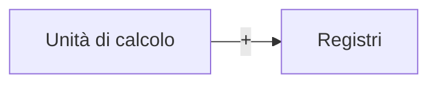

16-07-2023 17:53
Stato: #ideaLez 
Tag: #ArchitettureDiCalcolo #SistemiOperativi

> Si può dire assieme all'unità di controllo costituisca il nucleo (*core*) della CPU

>[!example] Esempio di un ciclo di data path
>L'ALU prende in input due operandi e memorizza il risultato in un registro

>[!warning] Nota bene :
>Ogni ciclo di data path corrisponde ad un ***ciclo di clock***

---
# References 
[[Architetture e Sist. di calcolo - Slide e lezioni]]
