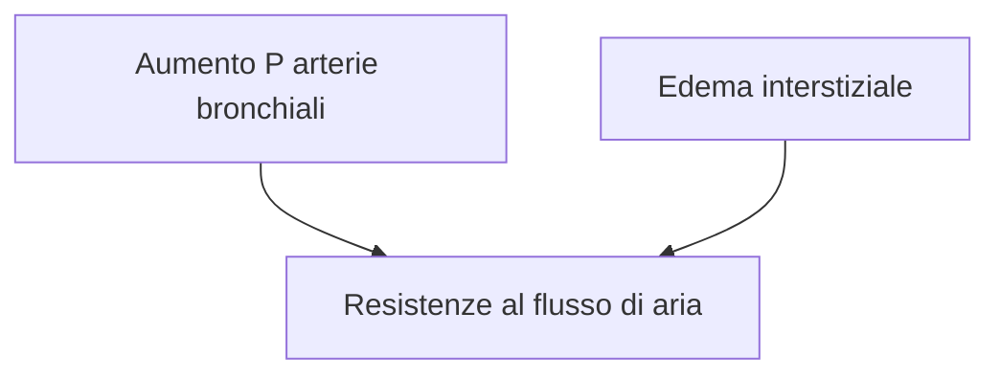

\08-02-2025 \17:18

--- 
>Episodi acuti di grave mancanza del respiro e tosse che avvengono generalmente di notte e svegliano il paziente

- Si associa spesso *asma cardiaca*
	- Essenziale differenziare dall'[[Condivisi/FarmacologiaBruno/Miscellanea necessaria/Asma bronchiale|Asma bronchiale]]
- Non si allevia in posizione seduta

--- 
# Reference:
[[Scompenso cardiaco|Scompenso cardiaco]]