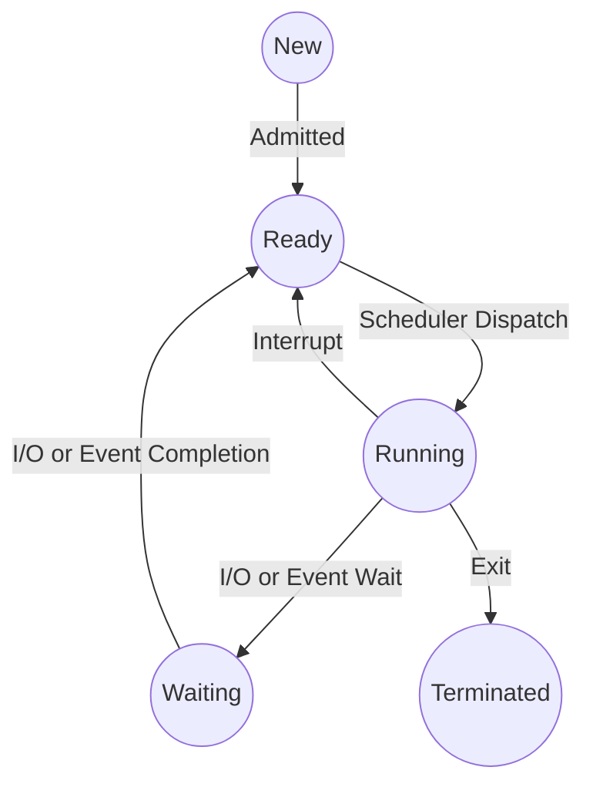

23-07-2023 17:30
Stato: #ideaLez 
Tag: #ArchitettureDiCalcolo #SistemiOperativi

## Step
1. Il programma inizialmente è passivo sul disco, ==inattivo==
2. Una volta che viene caricato il processo diviene ==in esecuzione==
	- Cosa sancisce l'attivazione
		- Nelle GUI l'attivazione segue il doppio click 
		- Nelle CLI si inserisce un eseguibile nella linea di comando
	- Al processo vengono assegnati due valori per descrivere il minimo ed il massimo di spazio occupabile in memoria
### Stati d'esecuzione 
- Durante l'esecuzione i processi sono soggetti a transizioni di stato descrivibili con un'automa a stati finiti, queste transizioni vengono eseguite dagli [[Scheduler]]

#### New
- Creazione di un processo nuovo, caricamento del codice dal disco in ram
#### Running
##### Da ready: dispatch
- Quando il dispatcher (elemento dello scheduler), in seguito al blocco del processo in esecuzione (**==transizione interrupt running-ready==**), sceglie il processo tra tutti i processi ready
#### Waiting
- Processo in attesa
##### Da running: richiesta di I/O 
#### Ready
##### Da new: admitting
- Quando lo scheduler a medio/lungo termine ammette il nuovo processo nella coda d'attesa attiva (ready queue) per la CPU
>[!warning] Ready queue
>==Coda di priorità e non FIFO==
##### Da running: revoca 
###### Nello scheduling a priorità
- Quando arriva al sistema un processo con priorità maggiore
###### Nei sistemi a partizione di tempo
- Per esaurimento del quanto di tempo
###### Al verificarsi un interrupt esterno
##### Da waiting: NON ESISTE
#### Terminated
##### Da running
###### Per terminazione normale
- Con chiamata (suppongo [[System call]]) al SO per indicare il completamento delle attività
###### Per terminazione anomala
- Uso scorretto delle risorse
- Esecuzione di istruzioni non consentite (**[[Interrupt#Trap o eccezione|trap]]**)
---
# References 
[[Architetture e Sist. di calcolo - Sbobine]]
