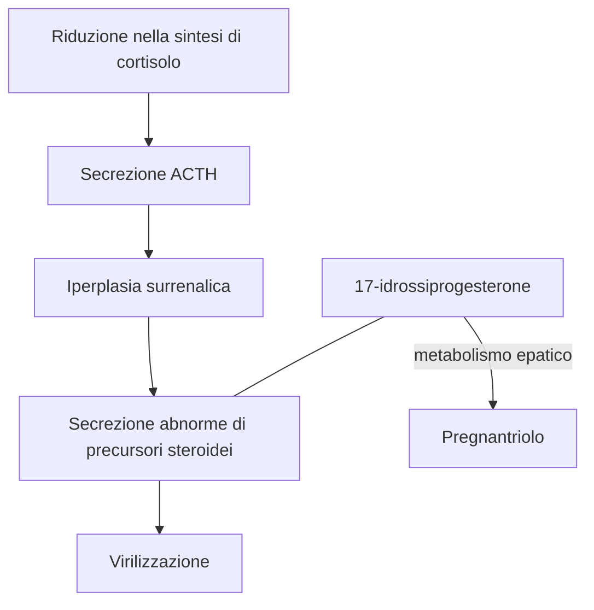

2024-12-27 15:21
Stato: #idealibro 
Tag: #Farmacologia #SistemaEndocrino 

---
## Diagnosi e trattamento di disturbi delle funzioni corticosurrenaliche
### Insufficienza corticosurrenalica
#### Cronica (malattia di Addison)
- L'**insufficienza corticosurrenalica cronica** (addisonismo) è caratterizzata da debolezza, affaticamento, perdita di peso, ipotensione, iperpigmentazione ed incapacità di mantenere i livelli ematici di glucosio a digiuno. 
- Nei soggetti che presentano tale sindrome, ==anche banali stimoli== di tipo nocicettivo, traumatico o infettivo ==possono portare ad insufficienza surrenalica acuta con shock ed infine morte==.
- Nell'**insufficienza corticosurrenalica primaria**, devono essere somministrati 20-30 mg di ==idrocortisone== al giorno, quantità che vanno aumentate in periodi distress.
	- Sebbene l'idrocortisone possieda una certa attività mineralcorticoide, il trattamento dev'esser ==integrato da opportune quantità di un ormone sodio-ritentivo==, quale il fludrocortisone.
	- **I glucocorticoidi di sintesi**, che sono a lunga durata d'azione e presentano ridotta (ad es. prednisone) o sono essenzialmente privi (ad es. desametasone), si veda tab-39-1 (N.d.T.) di attività sodio-ritentiva, ==non dovrebbero essere usati== in questi pazienti
#### Acuta
- Sospettando un'insufficienza corticosurrenalica acuta, bisogna istituire immediatamente l'opportuna terapia.
- Oltre a ==rilevanti quantità di idrocortisone per via parenterale==, il trattamento comprende la ==correzione di anormalità dei liquidi e degli elettroliti== corporei e la cura di fattori precipitanti.
	- L'**idrocortisone** (emisuccinato sodico o fosfato) viene somministrato ==IV ogni 8 ore alla dose di 100 mg fino a quando il paziente non si è stabllizzato==. 
	- La dose viene poi gradualmente ridotta, fino a raggiungere il dosaggio di mantenimento in 5 giorni.
- La somministrazione di **ormoni sodio-ritentivi** è ripresa ==quando== la posologia totale di ==idrocortisone== è stata ridotta a ==50 mg/l== die.

### Ipofunzione e iperfunzione corticosurrenalica
#### Iperplasia corticosurrenalica congenita
- Questo gruppo di disturbi è caratterizzato da ==specifici difetti nella sintesi di cortisolo==. 
- **In gravidanze a rischio** a causa di iperplasia corticosurrenalica congenita, il ==feto== può essere ==protetto da== anomalie genitali mediante la somministrazione di ==desametasone== alla madre. 
##### Mancanza dell'attività p450c21 (21$\beta$-ossidrilasi)

###### Fisiopatologia
- Difetto più comune, porta ad una ==riduzione nella sintesi di cortisolo== e quìndi ad un ==aumento compensatorio della secrezione di ACTH==.
- La ==ghiandola== surrenale diventerà ==iperplastica== ed elaborerà ==quantità abnormemente elevate di precursori== quali il *17-idrossiprogesterone* che verrà indirizzato verso la via biosintetica degli androgeni, con conseguente ==virilizzazione==.
###### Diagnosi
- Il **metabolismo** di questo composto **nel fegato** porta al *pregnantriolo*, che nell'anzidetta sindrome è caratteristicamente ==escreto in elevate quantità con le urine== e può essere ==usato a scopo diagnostico== e per controllare l'efficacia della terapia sostitutiva con glucocorticoidi.
- Tuttavia, il **metodo più affidabile** [^1] per diagnosticare questa patologia è il riscontro di un'==aumentata risposta del 17-idrossiprogesterone plasmatico alla stimolazione con ACTH==.

##### Difetto nella 11-idrossilazione
- Vengono prodotte **elevate quantità di 11-desossicorticosterone (DOC);**
- Poiché questo steroide ha attività ==mineralcorticoide==, ne conseguirà ipertensione con o senza alcalosi ipokaliemica.
##### Difetto nella 17-ossidrilazione
- Quando nei surreni e nelle gonadi è carente la la 17-ossidrilazione deputata alla sintesi sia di glucocorticoidi che di androgeni, sarà presente anche ==ipogonadismo==. 
- D'altra parte sono formate ==quantità aumentate di DOC== (a causa dell'aumentata produzione di ACTH) e di conseguenza si verificano anche in questo caso segni e sintomi caratteristici di un eccesso di mineralcorticoidi, quali ad es. ipertensione ed ipokaliemia
##### **Aspetti clinici**
- Quando esaminato per la prima volta, ==il bambino== con iperplasia corticosurrenalica congenita può essere in una ==crisi surrenalica acuta== ([[#Acuta|Per il trattamento]])
- Dopo che il paziente si è stabilizzato, si inizia una **terapia con idrocortisone**
	- 12-18 ${mg}/{m^{2}\,}die$ suddiviso in quantità ineguali (due terzi al mattino, un terzo nel tardo pomeriggio)
		- Il dosaggio viene poi modificato in modo da permettere crescita e maturazione ossea normali e per prevenire un eccesso di androgeni. 
	- **In alcuni casi** è stata anche utillizzata la terapia a ==giorni alterni con prednisone== per conseguire una maggiore soppressione della produzione di ACTH senza aumentare l'inibizione della crescita. 
	- Pazienti con **perdite saline** devono essere trattati con ==fludrocortisone==, 0,05-0,2 $mg/l \; die$ per os, e ==con aggiunta di sale== per mantenere nella norma la pressione sanguigna, l'attività reninica plasmatica e la concentrazione degli elettroliti.
#### Sindrome di Cushing
##### Eziologia
- Questa sindrome è ==di regola il risultato di iperplasia corticosurrenalica bilaterale secondaria ad un adenoma ipofisario== (*malattia di Cushing*), ma talora è dovuta a neoplasie o iperplasia nodulare del corticosurrene o produzione ectopica di ACTH da parte di altri tumori.
##### Manifestazioni cliniche
- Le manifestazioni sono quelle tipiche da eccesso cronico di glucocorticoidi.
	- Quando l'ipersecrezione dei glucocorticoidi è marcata e prolungata, un ==volto rotondo, pletorico e obesità al tronco== colpiscono in maniera caratteristica.
	- In genere, le manifestazioni di **perdita di proteine** sono frequenti e comprendono ==riduzione delle masse muscolari==, ==assottigliamento della cute== con comparsa di *strie rubrae e petecchie*, lenta guarigione delle ferite, osteoporosi. 
	- Altri seri problemi comprendono disturbi mentali, ipertensione e diabete. 
##### Trattamento
- La sindrome di Cushing è trattata mediante ==rimozione chirurgica del tumore== secernente ACTH o cortisolo, ==irradiazione== del tumore ipofisario, o ==resezione== di una o ambedue le ==ghiandole surrenaliche==. 
- I pazienti devono ricevere ==dosi elevate di cortisolo== durante e dopo l'intervento chirurgico.
	- Dosi di 300 mg di cortisolo idrosolubile (ad es. come emisuccinato, N.d.T.) vanno senz'altro somministrate, come infusione IV continua il giorno dell'intervento. 
	- La dose dev'essere ridotta alle ==quantità normali di sostituzione in maniera graduale==, in quanto una rapida riduzione puo portare a febbre e dolori articolari. 
- Nel caso sia stata effettuata la surrenectomia, il **mantenimento a lungo termine** è simile a quello indicato precedentemente per l'insufficienza corticosurrenalica 
	- Per l'impiego in alcune forme di sindrome di Cushing di mifepristone e pasireotide, si veda [[Gli steroidi corticosurrenalici e antagonisti#Inibitori della sintesi ed antagonisti dei glucocorticoidi]]
#### Sindrome della resistenza generalizzata primaria ai glucocorticoidi (sindrome di Chrousos)
##### Eziologia
- Questa rara condizione genetica, acquisita o su base ereditaria, è generalmente dovuta a ==mutazioni inattivanti del gene del recettore per i glucocorticoidi==.
##### Manifestazioni e fisiopatologia
- Nel tentativo di compensare questo difetto, l'**asse ipotalamo-ipofisi-surrene** è **iperfunzionante** con aumentata produzione di ACTH che porta ad **elevati livelli circolanti di** 
	- **Cortisolo** e di precursori del cortisolo, quali corticosterone e 11-deossicorticosterone con attività mineralcorticoide 
		- Portando di conseguenza ad ==ipertensione==, con o senza alcalosi metabolica
	- **Androgeni surrenalici**.
		- Con conseguente ==iperandrogenismo==, che si manifesta con ==virilizzazione== e ==pubertà precoce== nei bambini e acne, ==irsutismo==, ==calvizie== di tipo maschile e ==irregolarità mestruali== (principalmente oligomenorrea e ipofertilità) nelle donne.
##### Terapia
- La terapia di questa sindrome consiste di **alte dosi di glucocorticoidi sintetici**, come il desametasone essenzialmente privo di attività mineralcorticoide.
- Questi dosaggi vengono aggiustati gradualmente al fine di normalizzare la produzione del cortisolo, dei precursori del cortisolo e degli ormoni androgeni
#### Aldosteronismo
>[!warning] Nota bene:
>Questa sindrome viene qui ricordata per informazione e non perché i glucocorticoidi risultino efficaci in senso soppressivo (N.d.T.)

##### Eziologia
- L'**aldosteronismo primario** di regola è conseguenza di un'eccessiva produzione di aldosterone dovuta ad un ==adenoma corticosurrenalico==.
	- Puo esser anche dovuto ad un'**abnorme secrezione da parte di ghiandole iperplastiche o di un tumore maligno**.
- Questa sindrome può esser prodotta da eccessiva secrezione di 11-deossicorticosterone, corticosterone o di 18-idrossicorticosterone, tutti composti ad attività mineralcorticoide. 
##### Manifestazioni
- I segni clinici come ipertensione, affaticamento e tetania, sono ==conseguenti alla continua perdita di potassio con le urine==, la quale porta a [[ipokaliemia]], [[Alcalosi metabolica]] ed [[ipernatremia]]. 
- A **differenza dei pazienti con aldosteronismo secondario**, quelli affetti da aldosteronismo primario presentano ==bassi livelli di attività reninica plasmatica e di angiotensina II==. 
- Qualora vengano trattati con **fludrocortisone** (0,2 mg due volte al giorno per os per 3 giorni) o con acetato di **desossicorticosterone** (20 $mg/l \;die$ IM per 3 giorni), essi ==non riescono a ritenere sodio== e la secrezione di aldosterone non risulta ridotta in maniera significativa.
##### Diagnosi e trattamento
- Quando il disturbo è lieve, ==può essere difficile diagnosticarlo con la misurazione della potassiemia==. 
	- Può essere invece diagnosticato da un ==rapporto a  umentato tra aldosterone plasmatico e renina=
- Si riscontra invece in essi un **miglioramento con la somministrazione di spironolattone**, che blocca i recettori dell'aldosterone, e la risposta a questo composto ha valore diagnostico e terapeutico

### Uso di glucocorticoidi a scopo diagnostico
- E talora necessario **sopprimere la secrezione di ACTH** ==allo scopo di identificare l'origine di un particolare ormone e stabilire se la sua produzione sia o meno influenzata da quella di ACTH==. 
#### Perché il desametasone
- In queste circostanze, risulta utile l'**impiego di composti molto potenti quali il *desametasone***, dato che l'effetto si ha per piccole quantità ed è ==minore la possibilità di confusione== nell'interpretazione delle determinazioni ormonali nel sangue e nelle urine; 
	- Ad esempio:
		- **Se** una completa soppressione della secrezione di ACTH può essere raggiunta con l'uso di 50 mg di **cortisolo**, i ==17-idrossicorticoidi urinari suoi metaboliti saranno 15-18 mg nelle 24 ore==, dato che un terzo della dose viene recuperato nelle urine come 17-idrossicorticoidi. 
		- **Se** si utilizzerà la **dose equivalente di desametasone**, ossia 1,5 mg, ==l'escrezione sarà solo di 0,5 mgl/24== ore ed i livelli ematici saranno bassi.
#### DDX Cushing/Depressione
- Il test di soppressione al desametasone risulta **utile per la diagnosi di** ==sindrome di Cushing== ed è stato anche usato nella diagnosi differenziale degli ==stati depressivi==.
	- **Tecnica**
		- ==Un mg== di desametasone viene somministrato ==per os alle 23==, ed un ==prelievo di plasma== è effettuato ==al mattino successivo==.
	- **Risultati**
		- **In individui normali**, le ==concentrazioni di cortisolo== sono di regola ==inferiori a 3 $\micro g/dL$,== 
			- **Nella sindrome di Cushing** sono ==di regola superiori a 5 $\micro g/dL$,==. 
- I **risultati sono meno attendibili in presenza di** 
	- Depressione, ansietà, malattie concomitanti ed altre ==situazioni comportanti stress== 
	- Se il paziente ha preso ==farmaci che aumentano il catabolismo epatico del desametasone==. 

#### DDX Cushing/Pseudo-Cushing
- Per distinguere fra ipercortisolismo dovuto a stati d'ansia, depressione ed alcolismo (sindrome pseudo-Cushing) da un lato e sindrome di Cushing vera dall'altro, viene eseguito un **test combinato** che consiste nella
	- somministrazione di ==desametasone== (0,5 mg per os ogni 6 ore per due giorni) 
	- ==seguita da un test standard di stimolazione con ormone stimolante la corticotropina== (CRH), 1 mg/kg somministrato come bolo IV 2 ore dopo 1'ultima dose di desametasone.
#### DDX Cushing/tumori della corteccia surrenalica
- Nei pazienti in cui è stata **diagnosticata clinicamente una sindrome di Cushing**, e la diagnosi è stata **confermata da elevato cortisolo libero nelle urine**, la ==soppressione indotta da alte dosi di desametasone potrà aiutare a distinguere i pazienti con malattia di Cushing da quelli con tumori della corteccia surrenalica== producenti steroidi o con sindromi caratterizzate da produzione ectopica di ACTH.
	- Nei pazienti **con malattia di Cushing**, l'effetto soppressivo del desametasone produrrà una ==riduzione del 50% dei livelli di ormone==. 
	- **Nei pazienti in cui non si verifica tale soppressione**, il **livello di ACTH** sarà 
		- **Basso** in presenza di un ==tumore surrenalico producente cortisolo==
		- **Elevato** nei pazienti con una ==neoplasia ectopica producente ACTH==
##### Protocollo I
- Il desametasone è **somministrato** per os alla dose di 
	- ==0,5 mg ogni 6 ore per due giorni==
	- ==seguiti da 2mg ogni 6 ore per altri due giorni== 
- Sono quindi misurati nelle urine il cortisolo o i suoi metaboliti (*test di Liddle*); 
##### Protocollo II
- **In alternativa**, il desametasone è **somministrato**
	- In una ==singola dose di 8 mg alle 23== ed il cortisolo plasmatico viene misurato alle 8 del mattino seguente

## Corticosteroidi surrenalici e stimolazione della maturazione polmonare nel feto
- ==La maturazione polmonare nel feto è regolata dalla secrezione fetale di cortisolo==. 
- Il **trattamento della madre con forti dosi di glucocorticoidi** riduce l'incidenza della sindrome di difficoltà respiratoria nei bambini partoriti prematuramente. 
	- Quando il parto è previsto prima delle 34 settimane di gestazione, è comunemente impiegato ==betametasone, 12 mg IM, seguiti da un'ulteriore dose di 12 mg 18-24 ore dopo==.
		- Viene scelto il **betametasone perché** il legame proteico di questo glucocorticoide ed il metabolismo placentare sono inferiori rispetto a quelli del cortisolo, permettendo un ==aumentato passaggio attraverso la placenta al feto==.

## Glucocorticoidi e affezioni non corticosurrenaliche

- Gli analoghi di sintesi del cortisolo possono essere utili per il trattamento di un diverso gruppo di malattie non riferibili a qualsiasi conosciuto disturbo della funzione corticosurrenalica.
- L'**utilità** dei glucocorticoidi in queste affezioni deriva dalla loro ==capacità di sopprimere le risposte infammatorie ed immunitarie e di alterare la funzione leucocitaria==
	- Essi risultano utili nei disordini in cui la ==risposta dell'ospite== sia la ==causa== delle principali ==manifestazioni== della malattia.
### Rischi ed errori
- Nei casi in cui la **risposta infiammatoria** o immunitaria sia **importante** **ai fini del controllo del processo patologico**, la ==terapia== con glucocorticoidi può essere invece ==pericolosa==
	- Il suo **uso insieme con la terapia specifica** per il processo morboso, è invece ==giustificato== allo scopo di prevenire un danno irreparabile da una risposta infiammatoria.
- Dato che i glucocorticoidi **non sono di regola curativi**, ==il processo patologico può progredire== mentre le manifestazioni cliniche sono soppresse. 
	- Pertanto, la ==terapia cronica sistemica con glucocorticoidi dovrebbe essere intrapresa con grande cura== e solo quando la gravità della malattia richiede il loro impiego e siano state esaurite misure meno pericolose.
### Raccomandazioni e aspetti posologici
- In generale, si dovrebbe tentare di tenere il processo patologico sotto controllo usando **composti ad attività media o intermedia**, quali il ==prednisone== ed il ==prednisolone== (tab. 39-1), assieme ad altre misure secondarie utili a mantenere basse le dosi.
- Se possibile, dovrebbe esser utilizzata la ==somministrazione a giorni alterni== .
- La terapia non dovrebbe esser diminuita o sospesa bruscamente.
### Precauzioni e controindicazioni
- Quando si prevede un trattamento prolungato, è utile effettuare ==radiografie del torace ed un test alla tubercolina==, poiché la terapia con glucocorticoidi può riattivare una tubercolosi latente. 
- Si dovrebbe **escludere** la presenza di
	- **Diabete**
	- Ulcera peptica
	- **Osteoporosi** 
	- Disturbi psicologici
	- Alterazioni della funzionalità cardiovascolare.
### Impiego nei trapianti
- Un'applicazione molto importante dei glucocorticoidi è il trattamento del rigetto dei trapianti.
- L'efficacia di questi agenti si basa sulla loro capacità di ridurre l'espressione degli antigeni da parte del tessuto trapiantato, ritardare la rivascolarizzazione e interferire con la sensibilizzazione dei linfociti T citotossici e la generazione di cellule produttrici di anticorpi.

# Azioni sfavorevoli
- I **benefici** ottenuti dall'uso dei glucocorticoidi ==variano considerevolmente==.
	- Essi devono esser accuratamente ==ponderati in rapporto ai diversi effetti sull'intero organismo==.
- I maggiori **effetti indesiderati** dei glucocorticoidi sono il ==risultato delle loro azioni ormonali== (precedentemente descritte) e portano al quadro clinico di una *sindrome di Cushing iatrogena* (si veda in prosieguo).
- Quando i glucocorticoidi sono usati **per brevi periodi** (meno di due settimane), ==non è comune rilevare gravi effetti collaterali== anche per dosi abbastanza elevate. 
	- Tuttavia, **sono state talora riscontrate**
		- Insonnia
		- Modificazioni comportamentali (principalmente ipomania) 
		- Ulcere peptiche acute
- La **pancreatite acuta** è un evento avverso raro, ma serio, della somministrazione di glucocorticoidi a dosi elevate.

## Effetti metabolici
- La maggior parte dei pazienti cui vengono somministrate **giornalmente dosi di idrocortisone pari a 100 mg** o più (ovvero quantità equivalenti di glucocorticoidi di sintesi) **per periodi superiori a 2 settimane** va incontro ad una serie di alterazioni che sono state definite come ==sindrome di Cushing iatrogena==. 
- La velocità di comparsa è in funzione della dose e dell'assetto genetico del paziente.
### Inizialmente
- **Sul viso** in genere appaiono 
	- Arrotondamento
	- Rigonfiamento
	- Accumulo di grasso 
	- Aspetto pletorico (*facies lunaris*). 
- Il **grasso** tende anche ad essere **ridistribuito dalle estremità** ==al tronco, alla nuca e nelle fossette sopraclavicolari==. 
- Si rileva un'**aumentata crescita di fine peluria** sul ==volto==, sulle ==cosce== e sul ==tronco==. 
- Può aversi **comparsa di acne** e sono stati rilevati **insonnia** ed **aumento dell'appetito**. 
- Qualora i glucocorticoidi vengano utilizzati per la terapia di malattie e sindromi pericolose o invalidanti, la loro somministrazione deve essere proseguita malgrado la comparsa delle anzidette alterazioni.
### In seguito
- I **cambiamenti metabolici** di fondo che le accompagnano possono, tuttavia, essere ==assai gravi== al momento in cui divengono evidenti.
- Il **prolungato catabolismo delle proteine** e la **diversione degli amminoacidi verso la produzione di glucosio** aumentano il fabbisogno di insulina e ==dopo un sufficiente periodo di tempo comportano==:
	- Aumento di peso;
	- Deposito di grasso a livello viscerale; 
	- Miopatia e riduzione delle masse muscolari;
	- Assottigliamento della cute con strie e smagliature violacee;
	- **Iperglicemia** ed infine comparsa di
		- Diabete
			- Una volta manifestato, va trattato con dieta ed insulina 
			- Essenzialmente di tipo II
		- Osteoporosi 
		- Necrosi asettica dell'anca.
	- Anche la **guarigione di ferite** è ritardata.
- È consigliata una dieta ad elevato contenuto di proteine e potassio

## Altre complicazioni
### Gastriche
- Altre complicazioni di rilievo sono rappresentate dallo sviluppo di ==ulcere gastriche== e dalle complicanze di queste.
### Infettive
- ==Reperti clinici== associati con alcune sindromi, in particolare infezioni batteriche e micotiche, possono essere ==mascherati dai glucocorticoidi== e, quando vengono date dosi elevate, i pazienti devono essere attentamente controllati per evitare seri incidenti.
### Muscolari
- La frequenza di ==miopatia grave== è maggiore in pazienti trattati con glucocorticoidi a lunga durata d'azione.
### Aspecifiche
- In alcuni pazienti, la somministrazione di questi ultimi è stata associata a ==nausea==, ==vertigini== e ==perdita di peso==
	- Si provvede cambiando glucocorticoide, riducendo la dose e aumentando l'apporto di proteine e di potassio.
### Neurologiche e oftalmologiche
- Si possono verificare ==ipomania e psicosi acute==, particolarmente in pazienti che ricevono dosi elevate di glucocorticoidi. 
- Un trattamento di lunga durata con composti a durata d'azione intermedia o lunga si associa a ==depressione== ed a sviluppo di ==cataratte posteriori subcapsulari==.
	- In questi pazienti sono raccomandate visite psichiatriche periodiche ed esami con la lampada a fessura. 
- Un **aumento della pressione intraoculare** è abituale, e può insorgere un glaucoma.
	- Si può anche avere ==ipertensione endocranica benigna==. 
### Pediatriche
- Per dosi di 45 $mg/m2/die$ o più di idrocortisone o suoi equivalenti si ha, nei bambini, ==ritardo dell'accrescimento==.
	- I ==glucocorticoidi a durata d'azione intermedia o lunga hanno un maggiore effetto== inibitorio sulla crescita rispetto a dosi equivalenti di steroidi naturali. 
### Sull'equilibrio elettrolitico
- Se vengono dati ==in quantità più elevate di quelle fisiologiche==, steroidi quali cortisone e idrocortisone, che posseggono **effetti mineralcorticoidi** in aggiunta a quelli glucocorticoidi, portano ad una qualche ==ritenzione di sodio e di liquido== ed a ==perdita di potassio==. 
- In **pazienti con normale funzione cardiovascolare e renale**, ciò comporta la comparsa di un'==alcalosi ipocloremica ed ipokaliemica== e di un aumento della pressione arteriosa.
- In **pazienti con ipoproteinemia, malattie renali ed epatopatie**, può aversi anche la comparsa di ==edemi==. 
- In **pazienti con affezioni cardiache**, anche una ritenzione di sodio di entita molto modesta può portare ad ==insufficienza cardiaca==. 
- Questi **effetti** possono essere **ridotti** al minimo ==usando glucocorticoidi sintetici non sodio-ritentivi==, e mediante restrizione dell'apporto di sodio ed ==opportuno supplemento di potassio==.
## Soppressione corticosurrenalica
- In caso di **somministrazione prolungata di corticosteroidi** (oltre 2 settimane):
### Trattamento prolungato (settimane o mesi):
- In caso di **stress lievi**:
    - ==Raddoppiare la dose per 24-48 ore==.
- In caso di **stress seri** (es. traumi accidentali o interventi chirurgici):
    - Aumentare la ==dose fino a 10 volte per 48-72 ore==.
- **Riduzione del dosaggio**:
    - Va effettuata ==progressivamente==.
    - In caso di interruzione:
        - Ridurre lentamente fino a raggiungere ==livelli sostitutivi==.

### Ripristino funzionale:
- Sono **necessari**:
    - ==2-12 mesi== per il recupero dell'asse ipotalamo-ipofisi-surrene.
    - Altri ==6-9 mesi== per il ritorno a livelli normali di cortisolo.
>[!warning] Nota bene:
> - La soppressione indotta da glucocorticoidi **non è un problema ipofisario**.
> 	- Il trattamento con **ACTH** non accelera il recupero.

### Riduzione troppo rapida del dosaggio:
- **Conseguenze nei pazienti con malattia** trattata con glucocorticoidi:
    - ==Ricomparsa dei sintomi== della malattia, anche con maggiore intensità.
- **Conseguenze nei pazienti senza malattia specifica** (es. operati per morbo di Cushing):
    - Possibile sviluppo di sintomi da riduzione rapida, tra cui:
        - Anoressia
        - Nausea o vomito
        - Perdita di peso
        - Apatia
        - Mal di testa
        - Febbre
        - Dolore articolare o muscolare
        - Ipotensione posturale

### Dipendenza da glucocorticoidi:
- Alcuni **sintomi** possono manifestarsi anche con:
    - ==Livelli normali o elevati di glucocorticoidi== in circolo.
    - Indicando una condizione di **dipendenza da glucocorticoidi**.

# Controindicazioni e precauzioni
## Precauzioni speciali
- Soggetti trattati con glucocorticoidi dovrebbero essere attentamente osservati relativamente alla **possibile comparsa di**
	- Iperglicemia
	- Glicosuria
	- Ritenzione sodica con edema o ipertensione
	- Ipokaliemia
	- Ulcera peptica
	- Osteoporosi 
	- Infezioni nascoste. 
- La **dose** dovrebbe essere la ==più bassa possibile==, ed un **dosaggio intermittente** (ad es. a giorni alterni) dovrebbe esser utilizzato ==quando risultati terapeutici soddisfacenti== possono essere ottenuti con questo schema di trattamento.
- Persino **in pazienti che ricevono dosi** relativamente **modeste** di glucocorticoidi, occorre provvedere ad un loro ==aumento== anche sensibile ==nell'evenienza di stress== come interventi chirurgici o malattie ricorrenti o accidenti traumatici.

## Controindicazioni
- I glucocorticoidi vanno utilizzati con estrema cautela in pazienti con
	- Ulcera peptica
	- Cardiopatie 
	- Ipertensione con insufficienza cardiaca
	- Alcune malattie infettive quali 
		- La varicella 
		- La tubercolosi,
	- Psicosi
	- Diabete
	- Osteoporosi o glaucoma.
# Scelta del farmaco e schema di trattamento
- I fattori da tenere conto nella scelta dei glucocorticoidi sono 
	- Agli ==effetti== antinfiammatori e mineralcorticoidi
	- Alla ==durata== d'azione
	- Al ==costo== 
	- Agli schemi di ==dosaggio== 
## ACTH a confronto coi corticosteroidi glucoattivi
- In **pazienti con surreni normali**, ==era impiegato l'ACTH== allo scopo di provocare un'accentuata secrezione di cortisolo endogeno e realizzare così effetti tipici di questo steroide.
- **Tuttavia**, fatta eccezione per quando si desidera un aumento degli androgeni, l'impiego dell'ACTH come agente terapeutico ==è stato abbandonato==. 
	- Per i casi in cui si era voluta vedere una maggiore efficacia dell'ACTH rispetto ai glucocorticoidi, con ogni probabilità venivano somministrate quantità di glucocorticoidi inferiori a quelle prodotte dai dosaggi di ACTH
## Dosaggio
- Nello stabilire la dose che dev'essere usata, **il medico deve considerare** 
	- La ==gravità== dell'affezione
	- La ==quantità di farmaco probabilmente necessaria== per ottenere l'effetto desiderato 
	- La ==durata== della cura. 
### Per condizioni corticosurrenaliche
- In alcune malattie, la quantità richiesta per il mantenimento dell'effetto terapeutico desiderato è inferiore alla dose necessaria per ottenere l'effetto iniziale;
	- Dovrebbe essere, pertanto, accertata la **dose più bassa necessaria per mantenere l'effetto terapeutico** voluto, ==riducendo gradualmente la dose iniziale== fino a quando non si osservi un'accentuazione dei segni o sintomi.
- **Quando** è **necessario mantenere in maniera costante elevate concentrazioni** di corticosteroidi glucoattivi nel plasma allo scopo di sopprimere la secrezione di ACTH, sono consigliabili 
	- ==Preparazioni per via parenterale== *a lento assorbimento*
	- ==Piccole dosi somministrate per os== *ad intervalli frequenti*. 
### In altre condizioni
- Una **situazione opposta** esiste relativamente all'impiego dei glucocorticoidi nel trattamento delle affezioni su ==base infiammatoria o allergica==.
	- La stessa quantità totale data ==in poche dosi può essere più efficace== che se data in molte dosi più piccole o come preparazione per via parenterale a lento assorbimento.
- **Gravi patologie autoimmuni** che coinvolgono organi vitali devono essere ==trattate aggressivamente==, ed un sottodosaggio può risultare altrettanto pericoloso di un sovradosaggio.
	- Allo scopo di minimizzare il deposito di complessi immuni e l'afflusso di leucociti e macrofagi, si richiede ==inizialmente la somministrazione di 1 $mg/kg/die$ di prednisone== in dosi frazionate.
		- Questa posologia viene mantenuta fino a quando non si abbia risposta delle manifestazioni gravi. 
		- La dose può essere ==successivamente gradualmente ridotta==.

### Posologie più complesse
- Qualora **dosi elevate** siano richieste **per periodi di tempo prolungato**, può esser tentata la somministrazione del composto ==a giorni alterni== dopo aver raggiunto un soddisfacente controllo della malattia.
	- Quando usate in questo modo, ==anche grandi quantità di ormoni== (ad es. 100 mg di prednisone al giorno) ==possono talora esser somministrate solo con minimi effetti collaterali== perché vi è un periodo di recupero tra ciascuna dose. 
	- Il **passaggio** ad un trattamento a giorni alterni può esser fatto ==dopo che il processo patologico è sotto controllo==.
		- Dovrebbe esser ==effettuato gradualmente== con misure addizionali di supporto tra le dosi.
- Quando si sceglie un glucocorticoide per l'uso a dosi elevate, è ==consigliabile uno steroide con più breve durata d'azione e scarsi effetti mineralcorticoidi== (ad es. il *prednisone*, N.d.T.). 
	- **Se possibile**, dovrebbe esser dato ==come una dose singola al mattino== (cioè in coincidenza del picco ematico circadiano del cortisolo, v. fig, 39-2, N.d.T.).
## Speciali modalità di dosaggio
- L'uso, in **terapia locale**, di ==preparazioni topiche== per affezioni cutanee, ==preparazioni oftalmiche== per affezioni oculari, ==iniezioni intra-articolari== per affezioni delle articolazioni, ==inalazioni di glucocorticoidi== nell'asma e ==clisteri a base di idrocortisone== per la colite ulcerativa, dà la possibilità di fornire **elevate quantità di steroidi ai tessuti malati riducendo gli effetti sistemici seri**.
	- Il *beclometasone dipropionato* ed altri glucocorticoidi somministrati **come aerosol**, in primo luogo *budesonide*, *flunisolide* e *mometasone furoato*, sono efficaci ==nella terapia dell'asma== (si veda il cap. 20).
	- Il *beclometasone dipropionato*, il *triamcinolone acetonide*, il *budesonide*, il *flunisolide* ed il *mometasone furoato* sono disponibili **come spray nasali** ==per il trattamento di riniti allergiche==. 
	- Corticosteroidi in pomate, creme, lozioni e spray sono **largamente utilizzati in dermatologia**. 
		- Queste preparazioni sono discusse in maggiore dettaglio nel cap. 61.
- Essi sono efficaci a dosi (==1-2 somministrazioni locali da 1 a 3 volte al giorno==) che nella maggior parte dei pazienti comportano ==tassi plasmatici troppo bassi per influenzare la funzione corticosurrenalica== e per esercitare effetti sistemici.

[^1]: di certo non il migliore in quanto quello è detenuto unicamente dal dr. matteo bisignano

---
# Reference
[[Gli steroidi corticosurrenalici e antagonisti]]