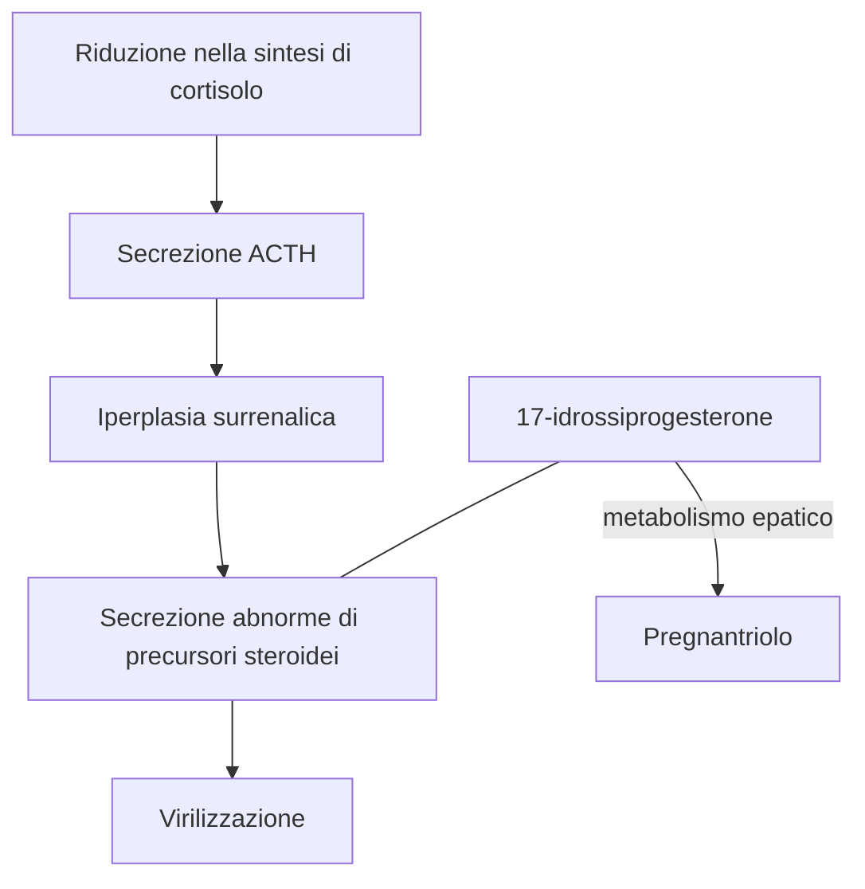

2024-12-27 15:21
Stato: #idealibro 
Tag: #Farmacologia #SistemaEndocrino 

---
## Diagnosi e trattamento di disturbi delle funzioni corticosurrenaliche
### Insufficienza corticosurrenalica
#### Cronica (malattia di Addison)
- L'**insufficienza corticosurrenalica cronica** (addisonismo) è caratterizzata da debolezza, affaticamento, perdita di peso, ipotensione, iperpigmentazione ed incapacità di mantenere i livelli ematici di glucosio a digiuno. 
- Nei soggetti che presentano tale sindrome, ==anche banali stimoli== di tipo nocicettivo, traumatico o infettivo ==possono portare ad insufficienza surrenalica acuta con shock ed infine morte==.
- Nell'**insufficienza corticosurrenalica primaria**, devono essere somministrati 20-30 mg di ==idrocortisone== al giorno, quantità che vanno aumentate in periodi distress.
	- Sebbene l'idrocortisone possieda una certa attività mineralcorticoide, il trattamento dev'esser ==integrato da opportune quantità di un ormone sodio-ritentivo==, quale il fludrocortisone.
	- **I glucocorticoidi di sintesi**, che sono a lunga durata d'azione e presentano ridotta (ad es. prednisone) o sono essenzialmente privi (ad es. desametasone), si veda tab-39-1 (N.d.T.) di attività sodio-ritentiva, ==non dovrebbero essere usati== in questi pazienti
#### Acuta
- Sospettando un'insufficienza corticosurrenalica acuta, bisogna istituire immediatamente l'opportuna terapia.
- Oltre a ==rilevanti quantità di idrocortisone per via parenterale==, il trattamento comprende la ==correzione di anormalità dei liquidi e degli elettroliti== corporei e la cura di fattori precipitanti.
	- L'**idrocortisone** (emisuccinato sodico o fosfato) viene somministrato ==IV ogni 8 ore alla dose di 100 mg fino a quando il paziente non si è stabllizzato==. 
	- La dose viene poi gradualmente ridotta, fino a raggiungere il dosaggio di mantenimento in 5 giorni.
- La somministrazione di **ormoni sodio-ritentivi** è ripresa ==quando== la posologia totale di ==idrocortisone== è stata ridotta a ==50 mg/l== die.

### Ipofunzione e iperfunzione corticosurrenalica
#### Iperplasia corticosurrenalica congenita
- Questo gruppo di disturbi è caratterizzato da ==specifici difetti nella sintesi di cortisolo==. 
- **In gravidanze a rischio** a causa di iperplasia corticosurrenalica congenita, il ==feto== può essere ==protetto da== anomalie genitali mediante la somministrazione di ==desametasone== alla madre. 
##### Mancanza dell'attività p450c21 (21$\beta$-ossidrilasi)

###### Fisiopatologia
- Difetto più comune, porta ad una ==riduzione nella sintesi di cortisolo== e quìndi ad un ==aumento compensatorio della secrezione di ACTH==.
- La ==ghiandola== surrenale diventerà ==iperplastica== ed elaborerà ==quantità abnormemente elevate di precursori== quali il *17-idrossiprogesterone* che verrà indirizzato verso la via biosintetica degli androgeni, con conseguente ==virilizzazione==.
###### Diagnosi
- Il **metabolismo** di questo composto **nel fegato** porta al *pregnantriolo*, che nell'anzidetta sindrome è caratteristicamente ==escreto in elevate quantità con le urine== e può essere ==usato a scopo diagnostico== e per controllare l'efficacia della terapia sostitutiva con glucocorticoidi.
- Tuttavia, il **metodo più affidabile** [^1] per diagnosticare questa patologia è il riscontro di un'==aumentata risposta del 17-idrossiprogesterone plasmatico alla stimolazione con ACTH==.

##### Difetto nella 11-idrossilazione
- Vengono prodotte **elevate quantità di 11-desossicorticosterone (DOC);**
- Poiché questo steroide ha attività ==mineralcorticoide==, ne conseguirà ipertensione con o senza alcalosi ipokaliemica.
##### Difetto nella 17-ossidrilazione
- Quando nei surreni e nelle gonadi è carente la la 17-ossidrilazione deputata alla sintesi sia di glucocorticoidi che di androgeni, sarà presente anche ==ipogonadismo==. 
- D'altra parte sono formate ==quantità aumentate di DOC== (a causa dell'aumentata produzione di ACTH) e di conseguenza si verificano anche in questo caso segni e sintomi caratteristici di un eccesso di mineralcorticoidi, quali ad es. ipertensione ed ipokaliemia
##### **Aspetti clinici**
- Quando esaminato per la prima volta, ==il bambino== con iperplasia corticosurrenalica congenita può essere in una ==crisi surrenalica acuta== ([[#Acuta|Per il trattamento]])
- Dopo che il paziente si è stabilizzato, si inizia una **terapia con idrocortisone**
	- 12-18 ${mg}/{m^{2}\,}die$ suddiviso in quantità ineguali (due terzi al mattino, un terzo nel tardo pomeriggio)
		- Il dosaggio viene poi modificato in modo da permettere crescita e maturazione ossea normali e per prevenire un eccesso di androgeni. 
	- **In alcuni casi** è stata anche utillizzata la terapia a ==giorni alterni con prednisone== per conseguire una maggiore soppressione della produzione di ACTH senza aumentare l'inibizione della crescita. 
	- Pazienti con **perdite saline** devono essere trattati con ==fludrocortisone==, 0,05-0,2 $mg/l \; die$ per os, e ==con aggiunta di sale== per mantenere nella norma la pressione sanguigna, l'attività reninica plasmatica e la concentrazione degli elettroliti.
#### Sindrome di Cushing
##### Eziologia
- Questa sindrome è ==di regola il risultato di iperplasia corticosurrenalica bilaterale secondaria ad un adenoma ipofisario== (*malattia di Cushing*), ma talora è dovuta a neoplasie o iperplasia nodulare del corticosurrene o produzione ectopica di ACTH da parte di altri tumori.
##### Manifestazioni cliniche
- Le manifestazioni sono quelle tipiche da eccesso cronico di glucocorticoidi.
	- Quando l'ipersecrezione dei glucocorticoidi è marcata e prolungata, un ==volto rotondo, pletorico e obesità al tronco== colpiscono in maniera caratteristica.
	- In genere, le manifestazioni di **perdita di proteine** sono frequenti e comprendono ==riduzione delle masse muscolari==, ==assottigliamento della cute== con comparsa di *strie rubrae e petecchie*, lenta guarigione delle ferite, osteoporosi. 
	- Altri seri problemi comprendono disturbi mentali, ipertensione e diabete. 
##### Trattamento
- La sindrome di Cushing è trattata mediante ==rimozione chirurgica del tumore== secernente ACTH o cortisolo, ==irradiazione== del tumore ipofisario, o ==resezione== di una o ambedue le ==ghiandole surrenaliche==. 
- I pazienti devono ricevere ==dosi elevate di cortisolo== durante e dopo l'intervento chirurgico.
	- Dosi di 300 mg di cortisolo idrosolubile (ad es. come emisuccinato, N.d.T.) vanno senz'altro somministrate, come infusione IV continua il giorno dell'intervento. 
	- La dose dev'essere ridotta alle ==quantità normali di sostituzione in maniera graduale==, in quanto una rapida riduzione puo portare a febbre e dolori articolari. 
- Nel caso sia stata effettuata la surrenectomia, il **mantenimento a lungo termine** è simile a quello indicato precedentemente per l'insufficienza corticosurrenalica 
	- Per l'impiego in alcune forme di sindrome di Cushing di mifepristone e pasireotide, si veda [[Gli steroidi corticosurrenalici e antagonisti#Inibitori della sintesi ed antagonisti dei glucocorticoidi]]
#### Sindrome della resistenza generalizzata primaria ai glucocorticoidi (sindrome di Chrousos)
##### Eziologia
- Questa rara condizione genetica, acquisita o su base ereditaria, è generalmente dovuta a ==mutazioni inattivanti del gene del recettore per i glucocorticoidi==.
##### Manifestazioni e fisiopatologia
- Nel tentativo di compensare questo difetto, l'**asse ipotalamo-ipofisi-surrene** è **iperfunzionante** con aumentata produzione di ACTH che porta ad **elevati livelli circolanti di** 
	- **Cortisolo** e di precursori del cortisolo, quali corticosterone e 11-deossicorticosterone con attività mineralcorticoide 
		- Portando di conseguenza ad ==ipertensione==, con o senza alcalosi metabolica
	- **Androgeni surrenalici**.
		- Con conseguente ==iperandrogenismo==, che si manifesta con ==virilizzazione== e ==pubertà precoce== nei bambini e acne, ==irsutismo==, ==calvizie== di tipo maschile e ==irregolarità mestruali== (principalmente oligomenorrea e ipofertilità) nelle donne.
##### Terapia
- La terapia di questa sindrome consiste di **alte dosi di glucocorticoidi sintetici**, come il desametasone essenzialmente privo di attività mineralcorticoide.
- Questi dosaggi vengono aggiustati gradualmente al fine di normalizzare la produzione del cortisolo, dei precursori del cortisolo e degli ormoni androgeni
#### Aldosteronismo
>[!warning] Nota bene:
>Questa sindrome viene qui ricordata per informazione e non perché i glucocorticoidi risultino efficaci in senso soppressivo (N.d.T.)

##### Eziologia
- L'**aldosteronismo primario** di regola è conseguenza di un'eccessiva produzione di aldosterone dovuta ad un ==adenoma corticosurrenalico==.
	- Puo esser anche dovuto ad un'**abnorme secrezione da parte di ghiandole iperplastiche o di un tumore maligno**.
- Questa sindrome può esser prodotta da eccessiva secrezione di 11-deossicorticosterone, corticosterone o di 18-idrossicorticosterone, tutti composti ad attività mineralcorticoide. 
##### Manifestazioni
- I segni clinici come ipertensione, affaticamento e tetania, sono ==conseguenti alla continua perdita di potassio con le urine==, la quale porta a [[ipokaliemia]], [[Alcalosi metabolica]] ed [[ipernatremia]]. 
- A **differenza dei pazienti con aldosteronismo secondario**, quelli affetti da aldosteronismo primario presentano ==bassi livelli di attività reninica plasmatica e di angiotensina II==. 
- Qualora vengano trattati con **fludrocortisone** (0,2 mg due volte al giorno per os per 3 giorni) o con acetato di **desossicorticosterone** (20 $mg/l \;die$ IM per 3 giorni), essi ==non riescono a ritenere sodio== e la secrezione di aldosterone non risulta ridotta in maniera significativa.
##### Diagnosi e trattamento
- Quando il disturbo è lieve, ==può essere difficile diagnosticarlo con la misurazione della potassiemia==. 
	- Può essere invece diagnosticato da un ==rapporto a  umentato tra aldosterone plasmatico e renina=
- Si riscontra invece in essi un **miglioramento con la somministrazione di spironolattone**, che blocca i recettori dell'aldosterone, e la risposta a questo composto ha valore diagnostico e terapeutico

### Uso di glucocorticoidi a scopo diagnostico
- E talora necessario sopprimere la secrezione di ACTH allo scopo di identificare l'origine di un particolare ormone e stabilire se la sua produzione sia o meno influenzata da quella di ACTH. In queste circostanze, risulta utile l'impiego di composti molto potenti quali il desametasone, dato che l'effetto si ha per piccole quantità ed è minore la possibilità di confusione nell'interpretazione delle determinazioni ormonali nel sangue e nelle urine. Ad es., se una completa soppressione della secrezione di ACTH può essere raggiunta con l'uso di 50 mg di cortisolo, i 17-idrossicorticoidi urinari suoi metaboliti saranno 15-18 mg nelle 24 ore, dato che un terzo della dose viene recuperato nelle urine come 17-idrossicorticoidi. Se si utilizzerà la dose equivalente di desametasone, ossia 1,5 mg, l'escrezione sarà solo di 0,5 mgl/24 ore ed i livelli ematici saranno bassi.
Il test di soppressione al desametasone risulta utile
per la diagnosi di sindrome di Cushing ed è stato anche
usato nella diagnosi differenziale degli stati depressivi.
Un mg di desametasone viene somministrato per os
alle 23, ed un prelievo di plasma è effettuato al matti-
no successivo. In individui normali, le concentrazioni
di cortisolo sono di regola inferiori a3 p.gldL, mentre
nella sindrome di Cushing sono di regola superiori a
5 1;gldL.I risultati sono meno attendibili in presenza
di depressione, ansietà, malattie concomitanti ed altre
situazioni comportanti stress, oppure se il paziente ha
preso farmaci che aumentano il catabolismo epatico del
desametasone. Per distinguere fra ipercortisolismo do-
r,uto a stati d'ansia, depressione ed alcolismo (sindrome
pseudo-Cushing) da un lato e sindrome di Cushing vera
dall'altro, viene eseguito un test combinato che consiste
nella somministrazione di desametasone (0,5 mgper os
ogni 6 ore per due giorni) seguita da un test standard di
stimolazione con ormone stimolante la corticotropina
(CRH), 1 mg/kg somministrato come bolo IV 2 ore do-
po 1'ultima dose di desametasone.
Nei pazienti in cui è stata diagnosticata clinicamente
una sindrome di Cushing, e la diagnosi è stata conferma-
ta da elevato cortisolo libero nelle urine, la soppressione
indotta da alte dosi di desametasone potrà aiutare a distin-
guere i pazienti con malattia di Cushing da quelli con tu-
mori della corteccia surrenalicaproducenti steroidi o con
sindromi carulterizzate da produzione ectopica di ACTH.
Il desametasone è somministrato per os alla dose di 0,5
mg ogni 6 ore per due giomi, seguiti da2mg ogni 6 ore
per altri due giorni, e sono quindi misurati nelle urine il
cortisolo o i suoi metaboliti (test di Liddle); in alternati-
va, il desametasone è somministrato in una singola dosedi 8 mg alle23 ed il cortisolo plasmatico viene misurato
alle 8 del mattino seguente. Nei pazienti con malattia di
Cushing, l'effetto soppressivo del desametasone pro-
durrà una riduzione del 50% dei livelli di ormone. Nei
pazienti in cui non si verifica tale soppressione, il livello
di ACTH sarà basso in presenza di un tumore surrenalico
producente cortisolo, ma sarà elevato nei pazienti con
una neoplasia ectopica producente ACTH

## Corticosteroidi surrenalici e stimolazione della maturazione polmonare nel feto

## Glucocorticoidi e affezioni non corticosurrenaliche

# Azioni sfavorevoli

## Effetti metabolici

## Altre complicazioni

## Soppressione corticosurrenalica

# Controindicazioni e precauzioni
## Precauzioni speciali

## Controindicazioni

# Scelta del farmaco e schema di trattamento

## ACTH a confronto coi corticosteroidi glucoattivi

## Dosaggio

## Speciali modalità di dosaggio

# Aldosterone

## Effetti fisiologici e farmacologici

## Metabolismo

# Desossicorticosterone (DOC)

# Fludrocortisone

[^1]: di certo non il migliore in quanto quello è detenuto unicamente dal dr. matteo bisignano

---
# Reference
[[Gli steroidi corticosurrenalici e antagonisti]]