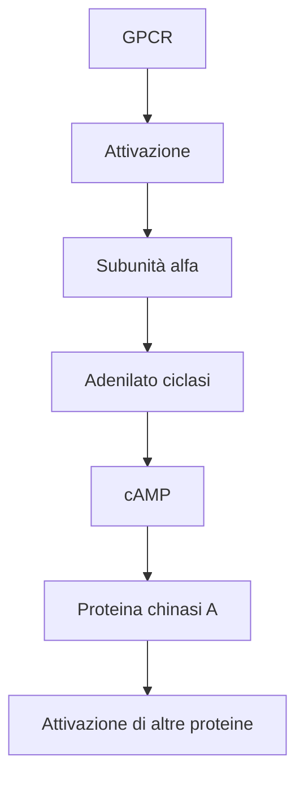

11-05-2023 12:39
Stato: #ideaL
Tag: #Citologia #PatologiaGenerale 

```mermaid
graph TD
A[GPCR] --> B[Attivazione]
B --> C[Subunità alfa]
C --> D[Adenilato ciclasi]
D --> E[cAMP]
E --> F[Proteina chinasi A]
F --> G[Attivazione di altre proteine]
```

---
# References 

[[Patologia Generale - Robbins]]