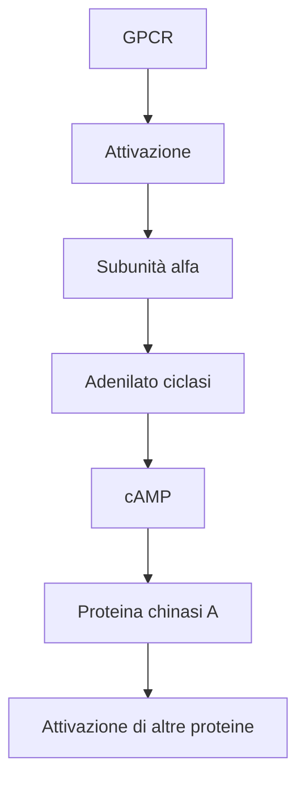
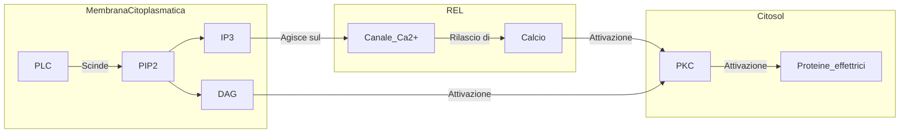

11-05-2023 12:39

--- 

##  Classificazione
### Classe A - rhodopsin like
- Muscarinici etc
### Classe B1 - secretine
- Glucagon like peptide 1
- GH
### Classe B - di adesine
### Classe C - metabotropici per il Glutammato
- GABA - B
- GPCR orfane
### Classe F - frizzled and smoothened
- SMO (smoothened)
- Frizzled di tipo A e B

## Struttura
- 7 domini transmembrana
	- Estremità ammino terminale extracitoplasmatica per il ligando 
	- Estremità carbossiterminale intracitoplasmatica per le proteine G
- Proteina eteromerica a 3 domini
### Subunità $\alpha$
- Principale
- Agisce come scambiatore di nucletidi guanilici
	- Lega il GDP a riposo
	- Si attiva quando lega il GTP 
		- Il passaggio da GDP a GTP è mediato dal cambiamento conformazionale indotto dal ligando
#### Tipo S 

- Stimolatoria
- Agisce sull'adenilato ciclasi

##### Struttura della PKA
- In condizioni di riposo è un tetramero eterogeneo formato da 
	- Due subunità R
	- Due subunità C
		- Inibiscono 
- Quando il cAMP (4 molecole) lega le subunità R avviene il rilascio delle subunità C 
##### Metabolismo del cAMP
- A carico delle *fosfodiesterasi* che lo portano alla forma 5'-AMP con una riduzione
	- Su di esce agiscono come inibitrici
		- [[Sildenafil]]
		- [[Caffeina]]
		- [[Teofillina]]

#### Tipo I
- Inibitrice
- Come bersaglio ha sempre l'adenilato ciclasi ma la inibisce
	- Fosforila un sito dell'adenilato ciclasi che ha azione inibitoria 
- Regola 
#### Tipo Q
- Agiscono sulla fosfolipasi C-$\beta$ e alla fine culminano nella via della **PKC**

#### Tipo 1-2
- Attiva rho, una GTPasi

### Subunità $\beta \, \gamma$
- Target
	- Src
	- [[MAP chinasi|RAS]]
	- PLC
	- Canali ionici
	- Proteina GRK
		- Fosforila il GTP inibendo la proteina G
- Ruolo fondamentale nella *desensitizzazione eterologa*

---
# References 

[[Patologia Generale - Robbins]]
[[Farmacologia - Lezione 3]]