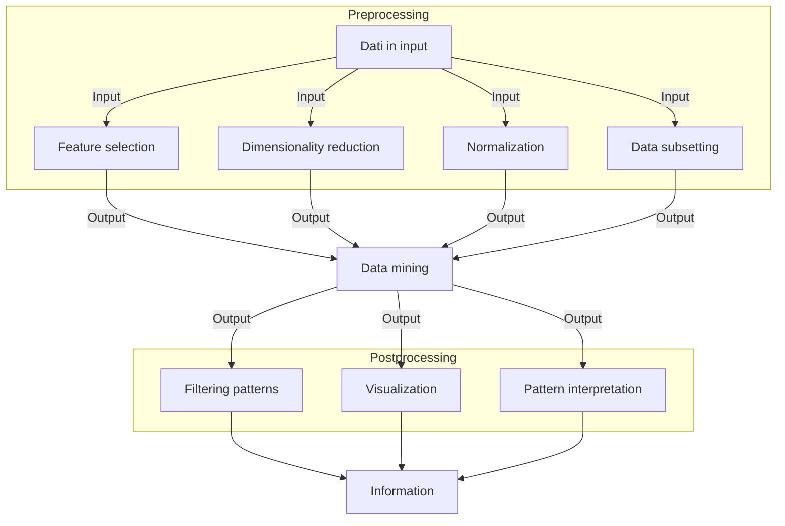

02-10-2023 10:07

--- 

> Per data mining si intende una tecnologia che unisce a metodi tradizionali di analisi dei dati degli algoritmi per processare grosse quantità di dati.

## Cos'è il data mining
> Il data mining è il processo mediante il quale si possono scoprire informazioni utili in grossi depositi di dati

- Sono sempre esistiti sistemi di information retrieval ma hanno sempre fatto uso di di strutture indicizzate sulla base delle caratteristiche più esplicite degli elementi presi in considerazione
### Data mining e knowledge discovery
- La scoperta della conoscenza nelle basi di dati avviene grazie ad una serie di processi che permettono di estrapolare informazioni utili dai dati grezzi

#### Dati in input
- Possono essere raccolti in moltissimi ==formati== diversi
- Non necessariamente fanno parte di un deposito centralizzato, possono anche essere distribuiti
#### Preprocessing
- L'obiettivo del preprocessing è quello di rendere i dati grezzi adeguati alle analisi successive
- Consiste in una sere di operazioni
	- Unione dei dati a partire da molteplici fonti
	- Pulizia dei dati dal *rumore* e dai duplicati
	- Selezione delle registrazioni/osservazioni/caratteristiche rilevanti
- Step più laborioso
#### Data mining
- Permette il cosiddetto "closing the loop" (chiusura del cerchio)
	- Fornisce un valido strumento a supporto delle decisioni 
#### Postprocessing
- Fase necessaria per integrare i risultati ottenuti dal data mining e garantire che essi siano validi e utili
- Esempio: visualizzazione
## Motivating Challenges
- Le difficoltà incontrate nell'analisi dei dati tradizionali possono essere sintetizzate in:
### Scalabilità
### Elevata dimensionalità
- Fondamentale per la medicina.
- I dati possiedono numerosissimi attributi
### Dati eterogenei e complessi
### Distribuzione e possesso dei dati
### Analisi non tradizionali
- Attualmente si cerca di automare il processo di generazione e valutazione delle ipotesi
## Le origini del data mining

## I compiti del data mining
### Predizione
- L'obiettivo 
### Descrizione

## Scope and Organization of the Book

---
# Reference: [[Data mining e Bioimmagini - Libro]]