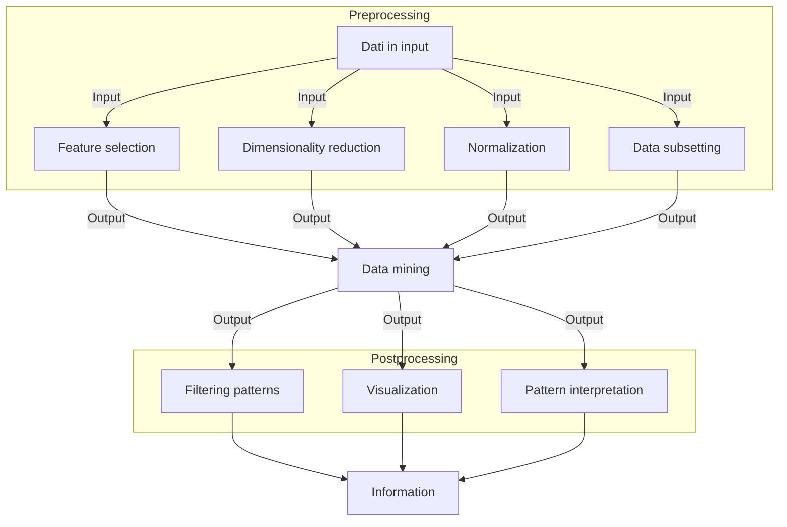

02-10-2023 10:07

--- 

> Per data mining si intende una tecnologia che unisce a metodi tradizionali di analisi dei dati degli algoritmi per processare grosse quantità di dati.

## Cos'è il data mining
> Il data mining è il processo mediante il quale si possono scoprire informazioni utili in grossi depositi di dati

- Sono sempre esistiti sistemi di information retrieval ma hanno sempre fatto uso di di strutture indicizzate sulla base delle caratteristiche più esplicite degli elementi presi in considerazione
### Data mining e knowledge discovery
- La scoperta della conoscenza nelle basi di dati avviene grazie ad una serie di processi che permettono di estrapolare informazioni utili dai dati grezzi

#### Dati in input
- Possono essere raccolti in moltissimi ==formati== diversi
- Non necessariamente fanno parte di un deposito centralizzato, possono anche essere distribuiti
#### Preprocessing
- L'obiettivo del preprocessing è quello di rendere i dati grezzi adeguati alle analisi successive
- Consiste in una sere di operazioni
	- Unione dei dati a partire da molteplici fonti
	- Pulizia dei dati dal *rumore* e dai duplicati
	- Selezione delle registrazioni/osservazioni/caratteristiche rilevanti
- Step più laborioso
#### Data mining
- Permette il cosiddetto "closing the loop" (chiusura del cerchio)
	- Fornisce un valido strumento a supporto delle decisioni 
#### Postprocessing
- Fase necessaria per integrare i risultati ottenuti dal data mining e garantire che essi siano validi e utili
- Esempio: visualizzazione
## Sfide 
- Le difficoltà incontrate nell'analisi dei dati tradizionali possono essere sintetizzate in:
### Scalabilità
### Elevata dimensionalità
- Fondamentale per la medicina.
	- I dati in questo caso possiedono numerosissimi attributi e ciò complica di gran lunga l'analisi
### Dati eterogenei e complessi
### Distribuzione e possesso dei dati
### Analisi non tradizionali
- Attualmente si cerca di automare il processo di generazione e valutazione delle ipotesi
## Le origini del data mining

## I compiti del data mining
### Predittivi
> Un compito di predizione consiste nel predire il valore di un particolare attributo in funzione dei valori di altri attributi
- L'attributo il quale valore vogliamo predire il valore si chiama *target* o *variabile dipendente*, gli altri attributi sono detti *explanatory* o *variabili indipendenti*
#### Modellazione predittiva
- Per questi compiti è necessario costruire un modello in grado di esprimere la variabile target in funzione di quelle explanatory
- Cambia in base al tipo di variabile
##### Classificazione
- Usata per le variabili discrete
	- Ad esempio prevedere se un utente web possa fare degli acquisti, in quanto la variabile target è legata ad un valore binario o comunque limitato
##### Regressione
- Usata per le variabili continue
	- Ad esempio, prevedere il prezzo futuro di un'azione, poiché può asssumere un'infinità di valori

### Descrittivi
> In questo caso l'obiettivo è di estrapolare pattern capaci di riassumere le relazioni sottostanti i dati
- I suddetti pattern possono essere
	- Correlazioni
	- Trends (tendenze)
	- Cluster (agglomerati)
	- Traiettorie
	- Anomalie

##### Analisi di associazione
##### Analisi a cluster
- L'obiettivo in questo caso è di trovare gruppi di osservazioni strettamente correlate in maniera tale da distinguerle
>[!example] Clustering di documenti
>
>- Ogni articolo è rappresentato da una serie di parole accoppiate al numero di volte in cui compaiono nell'articolo.
>- Si può notare come i primi 4 articoli siano a tampo economico mentre gli ultimi 4 riguardino la salute.
>- Un buon algoritmo di clustering deve essere in grado di raggruppare correttamente in base alla frequenza delle parole che appaiono negli articoli

##### Anomaly detection

## Scopo e organizzazione del libro
- In sintesi 
	- Analisi d'assocazione
		- Capitolo 6, si analizzano
			- Set di elementi frequenti e importanti per il data mining
				- Massimali
				- Chiusi
				- Hyperclique
			- Regole di associazione
			- Alcuni degli algoritmi utilizzati per generarle
		- Capitolo 7, topic più avanzati come
			- Applicazione dell'analisi di associazione a dati
				- Categorici 
				- Continui
				- Concettualmente gerarchica
			- Analisi d'associazione per 
				- Pattern consecutivi
					- In cui è presente un ordine
				- A grafo 
				- Su relazioni negative
					- In cui se un elemento (item) è presente allora l'altro non lo è

---
# Reference: [[Data mining e Bioimmagini - Libri]]