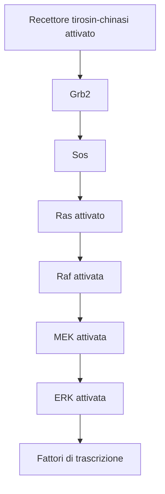

31-03-2023 12:10
Stato: #IdeaLez
Tag: #PatologiaGenerale #Citologia #BiologiaMolecolare 

^77faa8
- Attivata dal fattore trascrizionale NFkB che è coinvolto nell'attivazione di geni che codificano per diverse interleuchine ed effettori della risposta immunitaria (vedi tossina carbonchiosa [[L'azione patogena dei batteri]])

---
# References 

[[Patologia Generale - Lezioni]]