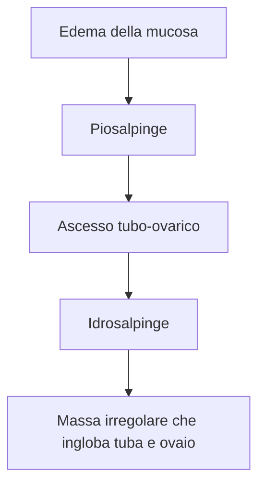

04-09-2024 22:27

--- 

> [!info] Definizione
> 
> - *Infiammazione estesa alla pelvi a partenza dalla parete tubarica, spesso con diffusione ai tessuti adiacenti*, quali
> 	- Il peritoneo pelvico
> 	- L’ovaio, la sierosa uterina
> 	- Il meso-ovario (attraverso la mesosalpinge) 
> 	- Il retroperitoneo (attraverso il parametrio). 
> 

## Epidemiologia
- Nei Paesi industrializzati ha una prevalenza di 10-15 casi su 1000 donne di età compresa fra i 20 e 40 anni. 
- L’==80% dei casi== di PID (Pelvic Inflammatory Disease) si osserva ==in donne sessualmente attive==
- I fattori di rischio sono infatti correlati all’==età del primo rapporto== sessuale, al ==numero dei partner== sessuali, alla presenza di ==vaginosi batterica== e a una storia anamnestica di infezioni sessualmente trasmesse, nonché all’**uso di pessari** (contraccettivi e non) e di ==dispositivi intrauterini anticoncezionali==.
## Eziologia
- Fondamentalmente infiammatoria: 
- Occorre precisare che la salpingite **tubercolare**, pur riconoscendo un’**origine**, peraltro ==rara, per via ascendente==, ha ==più spesso== un’origine ==ematogena==, derivante da una tubercolosi polmonare primaria.

## Manifestazioni
- Il ==dolore addominale== è il **sintomo** più comune, anche se può essere assente. In un numero elevato di casi, la PID ==si associa a infertilità==. 
### Evoluzione del quadro infettivo

#### Nelle fasi iniziali dell’infezione 
- A carico della **lamina propria** si osserva un’==infiammazione di tipo granulocitario con secrezione purulenta== che arriva al lume: *piosalpinge*.
- Qualora si formino ==aderenze== che chiudono più o meno completamente le fimbrie, la piosalpinge può risolversi e venire sostituita da *idrosalpinge* (distensione della tuba con presenza di liquido citrino).
#### Man mano che l’infezione progredisce
- L’**infiltrato** flogistico diventa ==linfoplasmacellulare==, le pliche tubariche si fondono e si formano follicoli linfocitari.
	- Nei **casi più gravi**, la ==flogosi== può estendersi ==oltre la sierosa tubarica== provocando peri-salpingiti, peri-ovariti e ovariti, e creando le condizioni per la formazione di ==aderenze tubo-ovariche==.
		- L’*ascesso tubo-ovarico* (tubo-ovarite suppurativa) che in tal modo viene a crearsi, ==si presenta come una massa pelvica che può porre diversi problemi di diagnosi differenziale==. 

--- 
# Reference:
[[Salpingi]]
[[Ovaio]]
