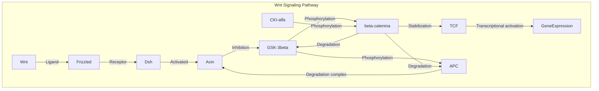

07-06-2023 09:17
Stato: #progetto #articolo 
Tag: #PatologiaGenerale #Oncologia #ApparatoDigerente 

> Il 5% dei casi di CRC ha causa genetica
> Il 20% del restante 95% ha familiarità positiva

- 3 Pathway principali aggiuntivi: 
	- **CIN**
		- Instabilità cromosomica
	- **MSI**
		- Instabilità dei microsatelliti
	- **CIMP**
		- Del metilatore delle isole CpG (ipermetilazione)
	- Mutazioni di oncogeni e di oncosoppressori
	- Mutazioni di almeno 4-5 geni
	- L'accumulo di mutazioni piuttosto che il loro ordine
- 5 sottotipi clinici
	- CIMP high/MSI high (12% of CRC); 
		- Originates in serrated adenomas and is characterized by BRAF mutation and MLH1 methylation.
	- CIMP high/MSI low or microsatellite stable (8%); 
		- Originates in serrated adenomas and is characterized by BRAF mutation and methylation of multiple genes.
	- CIMP low/MSI low or microsatellite stable (20%); 
		- Originates in tubular, tubulovillus, or serrated adenomas and is characterized by chromosomal instability (CIN), _K-ras_ mutation, and _MGMT_ methylation. 
	- CIMP negative/microsatellite stable (57%); 
		- Originates in traditional adenoma and is characterized by CIN.
	- Hereditary Non Polyposis Colorectal Cancer (HNPCC);
		- CIMP negative/MSI high; negative for _BRAF_ mutations

## Hereditary Syndromes
### Familial Adenomatous Polyposis
- It's a colonic polyposis syndrome 
- Caused by germinal mutations of the adenomatous polyposis coli (APC) gene
#### APC GENE
>Gatekeeper of cellular proliferation in colon
- Localized on chromosome 5a21, highly penetrant autosomal dominant disorder
- The majority of mutation are frameshift or nonsense mutations
- It regulates epithelial homeostasis by regulating degradation of cytoplasmic beta-catenin
	- Its accumulation causes alterations in cell proliferation, differentiation, migration and apoptosis.
		- Also chromosomal stability working on microtubules 
-  All of this is encoded in the Wnt Signaling pathway

### MYH-Associated Polyposis
- Autosomal recessive disorder caused by  mutationin the MYH gene
- Base excision repair gene primarily targeting oxidative DNA damage
- High frequency of somatic APC mutations
	- Clinical consequence
		- Presents at older age
### Lynch syndrome
- Autosomic dominant condition caused by germline mutations in DNA mismatch repair genes
	- Consequence: increased rate of mutations and a higher potential for malignancy
- Microsatellite instability

# Review
- The most important genes are APC, K-ras and p53
- They rarely are mutated together
## Chromosomal instability
- The most common genes that present losses or gains are VEFG, MYC, MET, LYN and PTEN
### K-ras oncogene
- Mutated in 30-60% of CRC and large adenomas
- Important role as it activates downstream targets such as 
	- BCL-2, H2AFz, RAP1B TBX19, E2F4, and MMP1
- It should be locked in its inactivated form but a mutation can change its base state affecting multiple cellular pathways
### 5q allele
- 20-50% of CRC present allelic loss of chromosome 5q
	- APC and MMC (mutated in colorectal cancer) genes are located in this chromosome
- APC somatic mutations are shown in 60-80% of CRC and precursior lesions
### Wnt pathway
- Central role in supporting intestinal epithelial renewal
- Other than its role in regulation of beta catenin it also affects 
	- Cell cycle progression
		- Acting on c-myc and cyclin D1
	- Angiogenesis
	- Apoptosis
- Other pathways converge into this
- APC is not the only inhibitor as MCC results in cell cycle regulatory proteins heavily involved in the wnt/beta-catenin pathway
	- MCC is usually silenced by hypermethylation

##### Immagini
![[Pasted image 20230607155357.png]]
![[Pasted image 20230607155417.jpg]]

---
# References 

<iframe height= 800 width= 100% src="https://onlinelibrary.wiley.com/doi/10.1111/j.1440-1746.2012.07200.x
"></iframe>