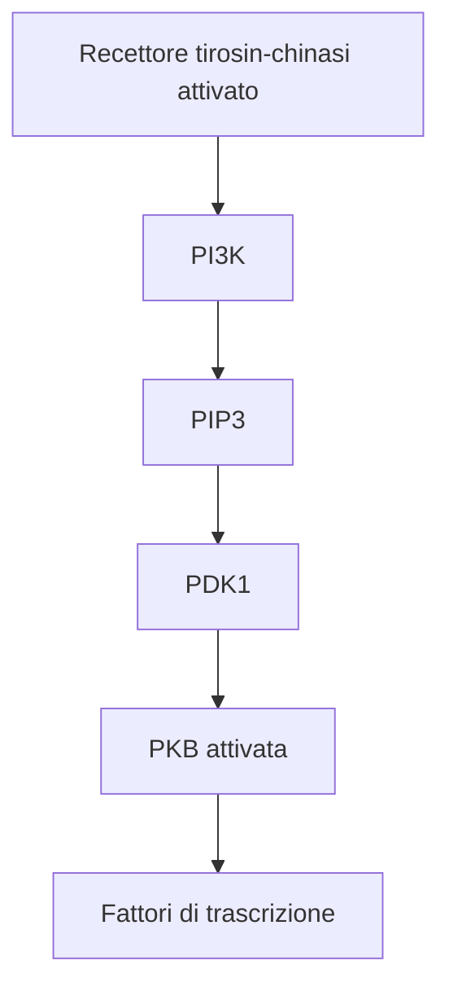

31-03-2023 12:15
Stato: #IdeaLez
Tag: #PatologiaGenerale #Citologia 

```mermaid 
graph TD
A[Recettore tirosin-chinasi attivato] --> B[PI3K]
B --> C[PIP3]
C --> D[PDK1]
D --> E[PKB attivata]
E --> F[Fattori di trascrizione]
```

^fec657

---
# References 

[[Patologia Generale - Lezioni]]