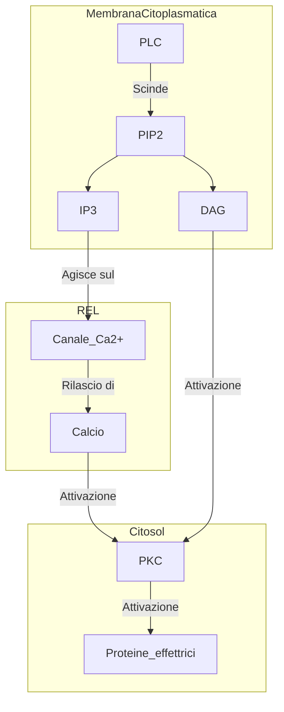

23-10-2023 14:18

--- 

```mermaid
graph TD
subgraph MembranaCitoplasmatica 
	PLC -->|Scinde| PIP2 
	PIP2 --> DAG 
	PIP2 --> IP3
end

subgraph REL 
	Canale_Ca2+ -->|Rilascio di| Calcio
end

subgraph Citosol 
	IP3 -->|Agisce sul| Canale_Ca2+
	Calcio -->|Attivazione| PKC 
	PKC -->|Attivazione| Proteine_effettrici
	DAG -->|Attivazione| PKC 
end 
```

--- 
# Reference