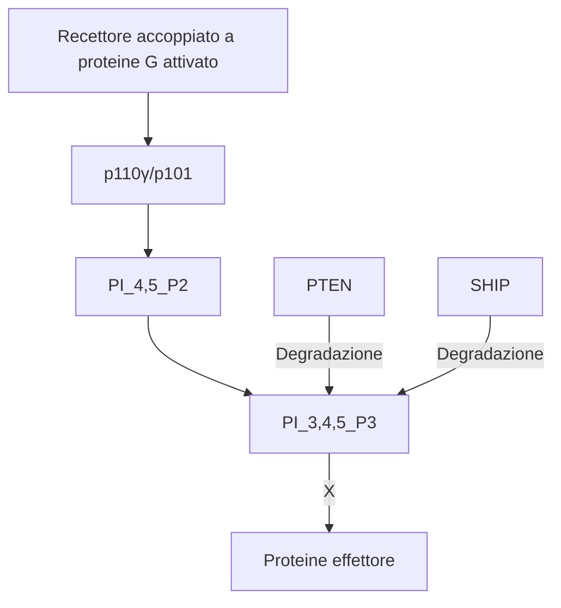

15-04-2023 17:42
Stato: #IdeaLez
Tag: #PatologiaGenerale 

# Migrazione cellulare: la chemiotassi
## Fenomeni interessati
### Infiammazione e diapedesi
La produzione di [[I mediatori dell'infiammazione|mediatori dell'infiammazione]] è uno dei meccanismi alla base della diapedesi e quindi della migrazione cellulare dei leucociti. I leucociti stessi li producono richiamando e attivando altre cellule immunitarie ([[Flogosi cronica#Cross talk tra macrofagi e linfociti]])

### Neoplasie 
La migrazione cellulare è quel fenomeno alla base dei processi di metastasi.
Le cellule assumono motilità e danno origine a tumori secondari, terziari etc. rendendo molto più complesso il quadro terapeutico, spesso ingestibile.
### Patologie cardiovascolari e neurologiche
Come nel caso del'aterosclerosi
### Patologie dell'apparato locomotore
Ad esempio artrite ed osteoporosi.
### Rigenerazione tissutale
Le cellule che vanno incontro a turnover migrano dal pool staminale
## Il ruolo delle chemochine
> Le chemochine sono le molecole alla base del processo di migrazione cellulare

- Fondamentalmente rientrano tra quei ==fattori extracellulari== in grado di generare, tramite interazione ligando/recettore, dei ==segnali biochimici== (fosforilazione del recettore) ed infine dei ==processi biofisici== (cambio di conformazione sterica del recettore)
### I recettori
Sono alla base della fisiopatologia di numerose malattie, anche gravi
#### Promiscuità delle chemochine
In sintesi: un recettore può legare diverse chemochine e una chemochina può legarsi a diversi recettori, questo permette di ottenere un reclutamento cellulare molto più vasto e diversificato
## Signaling e trasduzione del segnale
Come tutti i fenomeni cellulari, la migrazione è regolata da specifici pathway che possono essere intaccati in vari punti da vari fenomeni tra cui le mutazioni geniche
### Esempi
#### Nel caso del tumore mammario HER1

- Le vie di segnalazione associate al recettore HER1/HER2 da tenere in considerazione per quanto riguarda il tumore mammario sono
	- Quella della MAP chinasi  ![[MAP chinasi#^77faa8]]
	-  Quella della PI3K ![[PKB#^fec657]]
- Attualmente il farmaco specifico per il trattamento di queste condizioni è il [[trastuzumab]]
#### GPCR e p110 

- La p110 gamma è chinasi facente parte della famiglia delle PI3K
- Come in tutte le cascate trasduzionali delle GPCR si ha distacco della subunità alfa ad ==attività gtpasica== (dispendio di energia) da quella beta e gamma
	- In questo caso queste ultime subunità si legano al complesso p110 gamma/p101 e fosforilano l'inositolo 4,5 bifosfato ad inositolo 1,4,5 trifosfato che è il vero e proprio secondo messaggero
#### CSF-1 
- Il *colony stimulating factor* 1 (o macrophages' colony stimulating factor) e una citochina che funge da fattore di crescita ematopoietico 
	- In particolare è associato alla differenziazione dei monociti in macrofagi.
- In seguito al suo legame con il rispettivo recettore sono molteplici gli effetti intracellulari:
	- Stimola direttamente la cdc42 e la Rac che a sua volta attiva, oltre alla sua cascata trasduzionale, la Rho

#### GPCR e altre vie della chemiotassi

### Regolazione ed inibizione 
- La chemiotassi dipende principalmente dalla via delle fosfatidilinositolo 3-chinasi, poiché questa via ha numerose implicazioni in fenomeni neoplastici essa è finemente regolata
#### Proteine implicate nella regolazione
##### SHIP e PTEN

##### Antagonisti della PI3K

## La polarizzazione cellulare

- Componente fondamentale del movimento cellulare
### Ruolo nella migrazione cellulare
- La cellula grazie ai lamellopodi aderisce alla matrice extracellulare e si muove come una sorta di lombrico: ==movimento *ameboide*==
	- Questo movimento avviene secondo un ciclo preciso in cui si possono quindi distinguere delle aree ai poli, una sorta di "testa" che si estende e una sorta di "coda" che si retrae
### Il citoscheletro

- Alla base di questi fenomeni ci sono proteine contrattili del citoscheletro visibili e chiaramente distinguibili grazie alla *microscopia confocale*
- ==Actina==, ==vinculina==, ==tubulina== sono alcuni tra i protidi alla base della struttura del ==citoscheletro== al quale si legano gli organelli citoplasmatici, garantiscono quindi la stabilità della struttura cellulare sia in condizioni statiche che durante il movimento
# Excursus sui fibroblasti
- Quando si fanno studi in vitro è molto importante tenere in considerazione i possibili effetti che il microambiente può avere sullo sviluppo delle cellule prese in considerazione.
- I fibroblasti sono sicuramente una componente attiva nel microambiente tissutale e hanno un ruolo importantissimo negli sviluppi neoplastici secernendo fattori particolari
- Di base hanno una forma allungata e fusiforme 
	- In seguito a vari fenomeni in grado di attivarli possono assumere forme completamente diverse
# Fagocitosi
- Neutrofili e macrofagi sono le cellule del sistema immunitario atte alla fagocitosi di patogeni ed elementi non self
- La fagocitosi consiste in varie fasi
	1. Riconoscimento e attacco
	2. Inglobamento
	3. Fusione del fagosoma con le vescicole perossidasiche
	4. Uccisione

### ROS
- Il meccanismo principale per l'uccisione dei patogeni è il burst ossidativo causato dalla rapida degranulazione di organelli contenenti specie reattive dell'ossigeno ([[ROS]]): 
	- Ione superossido
	- Ipoclorito di sodio
	- Perossido di idrogeno
- **NOTA BENE**
	- In caso di rilascio errato degli enzimi lisosomiali nella matrice extracellulare invece che nei fagosomi: *[[Leucocitosi]]*
	- Accade ad esempio nell'[[Artrite reumatoide]]
		- Una flogosi cronica a carico delle articolazioni con versamento di liquidi e quindi impotenza funzionale
		- Il primum movens sono gli enzimi lisosomiali rilasciati all'esterno nel tessuto cartilagineo
#### Formazione: NOXS
- Anche detta *burst respiratorio* o *esplosione perossidasica*
- L'enzima più importante per la formazione di ROS è il complesso della NADPH ossidasi: [[NOXS]]

##### Struttura
La NOXS utilizzata come prototipo è quella isolata dai fagociti ed è costituita da: 
- Due subunità di membrana
	- La gp91 phox
	- La p22 phox
- Tre subunità citosoliche
	- La p47 phox
	- La p67 phox
	- Rac 1 o 2
##### Meccanismo d'azione
- In condizioni normali, la NOX è inattiva e le subunità regolatorie sono separate dalla subunità catalitica.
- Quando la cellula viene stimolata da fattori esterni, come citochine o fattori di crescita, le subunità regolatorie si uniscono alla subunità catalitica e attivano la NOX. 
- La NOX catalizza la trasformazione dell'ossigeno molecolare (O2) in superossido (O2-), che è una ROS altamente reattiva. Il superossido può poi essere convertito in altre ROS, come il perossido di idrogeno (H2O2) e l'ipoclorito (OCl-), che possono anche causare danni cellulari.
#### Effetti
- Rientrano nei cosiddetti radicali liberi
	- Inducono danni sulla membrana e sul DNA, questi ultimi possono indurre a loro volta fenomeni neoplastici
#### Implicazioni patologiche/terapeutiche
- In caso di ridotta produzione di ROS si scatena la cosiddetta malattia granulomatosa cronica
- Per contrastare la produzione eccessiva di ROS 
	- A livello endogeno si azionano due classi di enzimi: le catalasi e le perossidasi
	- A livello esogeno ci sono una serie di composti, presenti soprattutto nella frutta e nella verdura, che manifestano effetti ==antiossidanti==
### Il riconoscimento
- Avviene mediante interazione ligando-recettore
#### Classi di recettori sui macrofagi
##### Per le opsonine
- Le [[Opsonine|opsonine]] sono proteine del siero che si legano a particelle estranee, come batteri o cellule morte, per facilitare la loro fagocitosi da parte dei leucociti.
	- Tra esse troviamo proteine del complemento e [[Immunoglobuline|immunoglobuline]], i macrofagi presentano in particolare recettori per il *frammento cristallizzato (Fc)* di queste ultime
##### Integrine
- Si legano a particelle opsonizzate da fibrinonectina/vitronectina
##### Per il mannosio
- Si legano a glucano e LPS (lipopolisaccaridi)
##### Recettori spazzini o *scavenger*
#### Sinergia macrofagi - linfociti
- L'azione fagocitaria e di APC (antigen presenting cells)da parte dei macrofagi e delle cellule dendridiche è il principale meccanismo alla base della differenziazione dei linfociti B in plasmacellule capaci di sintetizzare immunoglobuline per opsonizzare i patogeni
	- Tra le patologie riguardanti le plasmacellule è molto importante tenere a mente i [[Plasmocitoma|plasmocitomi]]
# Tipi di infiammazioni acute
Da tenere a mente che in caso di ascessi i batteri nidificano a tal punto da creare un microambiente anche resistenze a farmaci come gli antibiotici
## Eritematosa
- Causata ad esempio da stimoli ipertermici
- Colpisce soprattutto gli epiteli di rivestimento: classica pelle arrossata post ustione di primo grado
## Fibrinosa
- Causata da batteri com elo pneumococco o il clostridiu difteriae
- Colpisce le alte vie respiratorie ma anche pericardio e peritoneo
- Caratterizzata da elevata produzione di fibrina

## Sierosa
- Causata da infezioni batteriche come quella del micoplasma della tubercolosi 
- Colpisce pleure e peritoneo

## Caterreale
- Fondamentalmente produzione di secreto
## Purulenta
- Causata da accumuli di detti batteri piogeni che producono molto secreto
## Emorragica o necrotico-emorragica
- Causata da batteri come il tifo, il carbonchio
- Estremamente grave
## Allergica
- Nelle cosiddette riniti e congiuntiviti stagionali, si ha reattività dovuta soprattutto a produzione di [[IgE]]

---
# References 

[[Patologia Generale - Lezioni]]