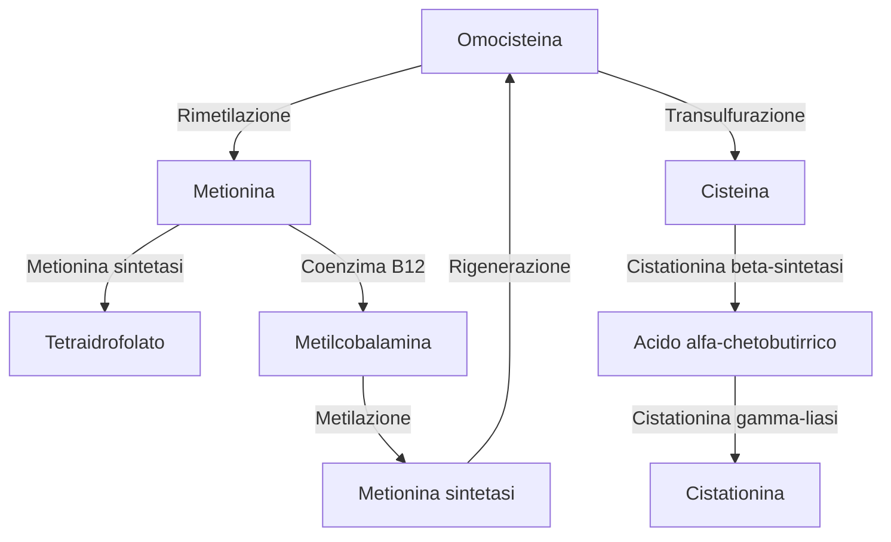

15-02-2024 20:02

--- 

- Il 50% delle morti da malattia cardiovascolare è data da cardiopatia ischemica, in italia:
	- 44%
	- 250.000 decessi annui
	- Riduzione della mortalità del 30%
- In presenza di infarto o cardiomiopatia ischemica i primi esami sono di carattere morfologico/anatomico (coronarografia)

### Fattori di rischio modificabili
#### Dislipidemia
- Ipercolesterolemia
	- Studi sulla correlazione tra ipercolesterolemia e patologia delle coronarie
		- Framingham
		- MRFIT

- Vedi [[Metabolismo lipoproteine.canvas|Metabolismo lipoproteine]]

| Composizione | Chilomicroni | VLDL | IDL | LDL | HDL |
| ---- | ---- | ---- | ---- | ---- | ---- |
| Proteica | 1,5-2,5 | 5-10 | 15-20 | 20-25 | 40-55 |
| Lipidica | 97-99 | 90-95 | 80-85 | 75-80 | 50-55 |

##### Categorie

##### Prelievo
- Dieta
- Digiuno
- Sospensione di terapie influenzanti
- In assenza di flogosi recenti
##### Analisi
- Sfruttano metodi enzimatico colorimetrici
	- Il colesterolo LDL si ricava tramite la formula di Friedewald
		- Totale - HDL - Trigliceridemia / 5
		- Si misura inoltre in nmol/L invece di mg/dl
###### Valori di riferimento
| - | Totale | LDL | HDL | Trigliceridi |
| ---- | ---- | ---- | ---- | ---- |
| Ottimale | <200 | <100 | \>55 | <150 |
| Rischio moderato | 200-239 | 100-159 | <55 | 150-200 |
| Rischio alto | \>240 | \>160 |  | 200-500 |

###### Aspetto dei sieri
- Chilomicroni: tappo
- LDL: Scuro
- Altri tipi: bianco

#### Fumo
#### Ipertensione
#### Diabete mellito
#### Attività fisica
### Fattori di rischio non modificabili
- Età
- Sesso
- Genetico
### Fattori di rischio modificabili emergenti
#### Omocisteina
> Aminoacido solforato che deriva dalla dimetilazione della metionina

##### Ruolo
- Non si sa di preciso ma è concordato che sia strettamente legata a patologie cardiache
	- I primi studi furono fatti sull'[[omocistinuria]] (deficit di cistationina $\beta$ sintetasi)
##### Metabolismo dell'omocisteina

##### Dosaggio
- Normale
	- 5-12 $\micro mol/L$ 
- Moderatamente elevato
	- 13-60 $\micro mol/L$ 
- Severamente elevato
	- >60 $\micro mol/L$ 

#### Fibrinogeno
- Non esistono metodi sensibili e specifici visto che risente di altri fattori
#### Lipoproteina A
- LDL in cui ApoB100 lega la ApoA
- Associata ad aterosclerosi e patologia cardiovascolare
	- Partecipa alla formazione della placca
	- Induce la proliferazione delle cellule muscolari lisce
	- Diminuisce l'efficienza del sisetma fibrinolitico
#### Indici di funzione fibrinolitica 
##### PAI-1
##### D-dimero
#### Indici di infiammazione
##### PCR
- Fortemente aspecifica ma non aumenta in caso di malattie autoimmuni prive di processo infiammatorio in quel momento
- Associata a processi infettivi in corso
##### ICAM-1
##### Il-6

## Marcatori di lesione e funzione miocardica
### Indicatori
#### Precoci

##### Creatinchinasi MB
###### Tempistiche
- 3-4h aumento
- 10-12h picco
- Durata in circolo di 48-72h
###### Informazioni
- Direttamente proporzionale alla zona infartuata
- Bassa specificità (musc scheletrico)

##### Mioglobina
###### Tempistiche
- Insorgenza entro 1-2h
- Picco ridotto: 6-12h
###### Caratteristiche
- Da associare ad anidrasi carbonica III per aumentarne la specificità
##### Troponine
- Picco entro le 20-24h
- Tieni conto dei limiti
###### Troponina C
- Non viene mai dosata perché aspecifica
###### Troponina T
- Lega la tropomiosina
- 240h
- Dosaggio in 2h
###### Troponina I
- 144h
- dosaggio in soli 10 minuti
#### Tardivi
##### LDH
- LD1/LD2 specifiche del miocardio
- Insorgenza tardiva 12-14h
- Picco 36-48h
- Durata 7g
##### Miosina
- Catene MHC (isoforme alfa e beta nel miocardio)
	- Durata 10gg
- MCL1 - MCL2
	- Durata 14 gg
##### AST/GOT
- Troppo aspecifico
- Non fornisce informazioni aggiuntive ai precedenti
### Test multiparametrici
### Marcatori di funzione
#### ANP 
- Distensione atriale
#### BNP
- Distensione ventricolare
- Stimoli endocrini
##### Sintesi simil insulina
- Pre - proBNP 
	- Peptide guida
- pro-BNP
	- Si divide in
		- BNP
		- NT-Pro-BNP
#### CNP
#### DNP
#### Urodilatina

--- 
# Reference:
[[Patologia clinica - Lezioni, slide e sbobine]]
