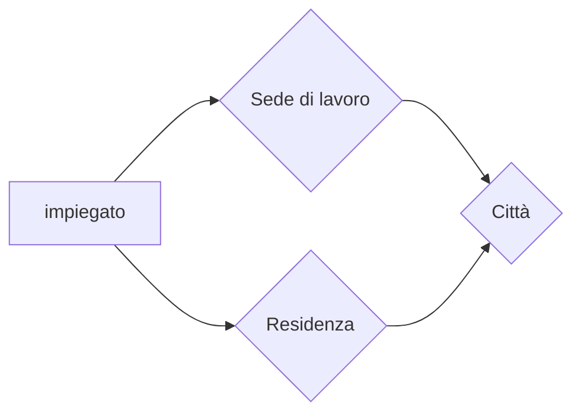
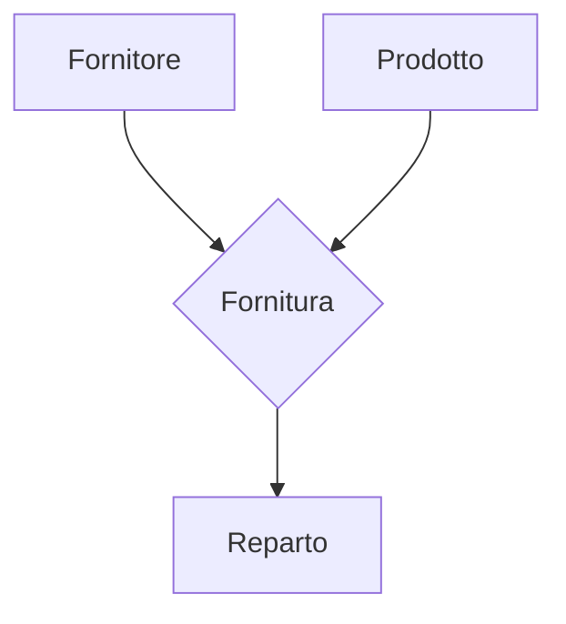

10-02-2023 18:36
Stato: #ideaL
Tag: #BasiDiDati #ProgettazioneBdd 

## Fasi del ciclo di vita di un sistema informativo

## Raccolta e analisi dei requisiti
### Esempi
#### BDD bibliografica

#### BDD società di formazione

##### Frasi specifiche
- Di carattere generale
    - 
- Relative ai partecipanti
    - 
- Relative ai datori di lavoro
    - 
- Relative ai corsi
    - 
- Relative a tipi specifici di partecipanti
    - 
- Relative ai docenti
    - 

## Progettazione
- [[Introduzione BDD#Architettura del DBMS]]

### Progettazione concettuale
- Modello ER 
    - [[Introduzione BDD#^2d402e]]
#### I costrutti del modello [[2. Metodologie e modelli]]
##### Entità
> Classe di oggetti (fatti, persone, cose) della realtà di interesse con proprietà comuni e con esistenza “autonoma”
- 
- Entità vs Istanza (occorrenza) di entità
    - L'occorrenza è l'elemento della classe
    - Nello schema ER si rappresentano le entità, non le singole istanze

##### Relationship
> Legame logico fra due o più entità, rilevante nell'applicazione di interesse

- Esempi
    - Residenza
        - Fra persona e città
    - Frequenza
        - Tra studente e corso
###### Occorrenze di relazioni

> Una occorrenza di una relationship n-aria è una n-upla di occorrenze di entità, una per ciascuna entità coinvolta
> > Nel caso binario:
>    Una occorrenza di una relationship binaria è una coppia di occorrenze di entità, una per ciascuna entità coinvolta

**Nota bene**
- ==SU UNA RELAZIONE LE OCCORRENZE NON POSSONO ESSERE RIPETUTE==
- In quel caso basta fare una **Promozione di relazione** 
    ###### Due relazioni sulle stesse entità

###### Relazioni n-aria

##### Attributo
##### Identificatore
##### Generalizzazione
#### Quali costrutti utilizzare?
- se ha proprietà significative e descrive oggetti con esistenza autonoma
    - entità
- se è semplice e non ha proprietà
    - attributo
- se correla due o più concetti 
    - relationship
- se è caso particolare di un altro 
    - generalizzazione
#### Design pattern
> Soluzioni a problemi comuni
- Reificazione di attributo di entità
    - 
- Part of
    - 
- Istance of
    - 
- Reificazione di relazione binaria
    - 
- Reificazione di relazione ricorsiva
    - 
- Reificazione di attributo relazione
    - 

#### Storicizzazione di un concetto
##### Esempio 1

##### Esempio 2

    ##### Evoluzione di concetto

#### Relazione ternaria

#### Esempio società di formazione
- Schema scheletro
    - 
- Aggiungendo partecipanti, datori di lavoro e tipi specifici di partecipanti
    - 
- 
### Progettazione logica

## Modelli
![[Introduzione BDD#^4e46aa]]

---
# References 

[[Basi di dati - Slide Irina]]

<iframe height= 800 width= 100% src="https://drive.google.com/file/d/1jp6lrOaQe2fMydmt-ioW3OlYnpRFywCp/view?usp=share_link"></iframe>
<iframe height= 800 width= 100% src="https://drive.google.com/file/d/1mCxAnAOS_2G24mIrtJktxYYLay1XtJf0/view?usp=share_link"></iframe>
