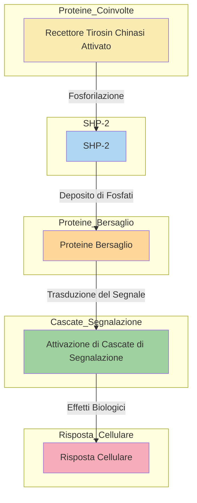

29-08-2023 18:56
Stato: #ideaL
Tag: #Citologia #Microbiologia 

```mermaid 
graph TD
A[Recettore Tirosin Chinasi Attivato] -->|Fosforilazione| B[SHP-2]
B -->|Deposito di Fosfati| C[Proteine Bersaglio]
C -->|Trasduzione del Segnale| D[Attivazione di Cascate di Segnalazione]
D -->|Effetti Biologici| E[Risposta Cellulare]

style A fill:#F9EBB2
style B fill:#AED6F1
style C fill:#FFD699
style D fill:#9ED19E
style E fill:#F7ACB9

subgraph Proteine_Coinvolte
	style A fill:#F9EBB2
	A
end

subgraph SHP-2
	style B fill:#AED6F1
	B
end

subgraph Proteine_Bersaglio
	style C fill:#FFD699
	C
end

subgraph Cascate_Segnalazione
	style D fill:#9ED19E
	D
end

subgraph Risposta_Cellulare
	style E fill:#F7ACB9
	E
end

```

---
# References
[[Microbiologia - La Placa]]