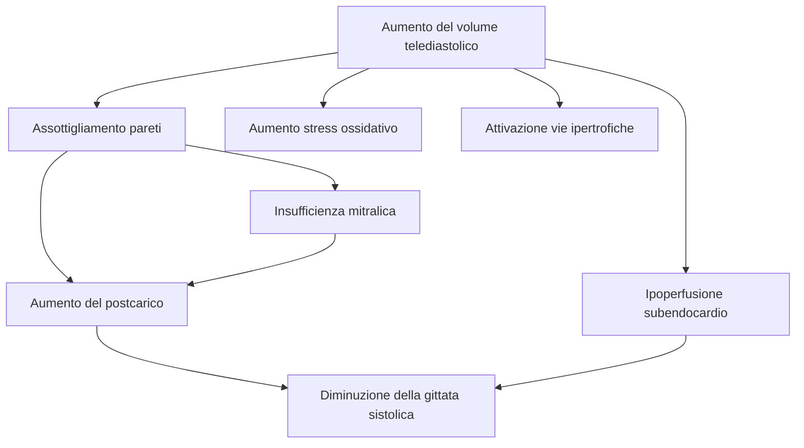

2024-01-21 10:16

--- 
# Patologia - Robbins
- Epidemiologia
	- detto anche ==**insufficienza cardiaca congestizia**==
	- condizione comune, in genere progressiva con prognosi negativa
	- colpisce il 2% della popolazione
- Insorgenza
	- quando il cuore non è in grado di fronteggiare le richieste metaboliche dei tessuti
		- salvo a spese di un'elevata pressione di riempimento
	- spesso fase terminale di molte forme di cardiopatia cronica
		- sviluppo in modo insidioso a partire dagli effetti cumulativi di
			- sovraccarico cronico di lavoro
			- cardiopatia ischemica
	- accelerazione di un'improvvisa ICC
		- stress emodinamici acuti
		- sovraccarico di fluidi
		- disfunzione valvolare repentina
- **Meccanismi fisiologici** atti al **mantenimento** di pressione arteriosa/perfusione degli organi
	- meccanismi
		- *meccanismo di Frank-Starling*
			- maggiori volumi → dilatazione del cuore → ponti crociati actina-miosina
		- *fenomeni adattativi del miocardio* (inclusa ipertrofia con o senza dilatazione delle camere cardiache)
			- ipertrofia = risposta compensatoria del miocardio all'aumentato lavoro meccanico
				- chiamasi *rimodellamento ventricolare*
		- *attivazione dei sistemi neuroumorali* per aumentare la funzione cardiaca e/o regolare i volumi e le pressioni di riempimento
			- rilascio di *noradrenalina* dai nervi cardiaci adrenergici del SNA
			- attivazione del sistema *renina-angiotensina-aldosterone*
			- rilascio di *ANP* e *BNP*
	- sul lungo periodo
		- possono essere sufficienti a mantenere la normale gittata cardiaca a fronte delle perturbazioni acute
			- ma la **capacità di mantenimento può venire SUPERATA**
		- ulteriori alterazioni strutturali causate da
			- apoptosi dei miociti
			- alterazioni del citoscheletro intracellulare
			- deposizione di matrice extracellulare
		- ==*disfunzione sistolica*==: progressivo deterioramento della funzione contrattile miocardica
			- diminuzione nella EF (Ejection Fraction), di norma compresa tra il 45 e il 65%, avviene in seguito a
				- danno ischemico
				- insufficiente adattamento al sovraccarico di pressione/volume dato da
					- ipertensione
					- valvulopatia
					- dilatazione ventricolare
		- ==*disfunzione diastolica*==
			- incapacità delle camere di espandersi e riempirsi durante la diastole
			- cause
				- ipertrofia ventricolare sx
				- fibrosi miocardica
				- pericardite costrittiva
				- deposizione di amiloide
## Ipertrofia cardiaca: fisiopatologia e progressione fino allo scompenso
- ==*Ipertrofia*== dei miociti
	- causata da
		- prolungato aumento del lavoro meccanico
			- sovraccarico di pressione, volumi o segnali trofici
	- determina
		- aumento delle dimensioni e del peso del cuore
		- 
	- richiede
		- aumentata sintesi proteica
		- aumento della quantità di mitocondri
		- nuclei ingranditi attribuibili ad aumento della ploidia
- Tipologia
	- ==*ipertrofia da sovraccarico pressorio*==
		- nuovi sarcomeri vengono assemblati in parallelo all'asse longitudinale della cellula
		- espansione dell'area della sezione trasversale dei miociti nei ventricoli
		- aumento concentrico dello spessore della parete
	- ==*ipertrofia da sovraccarico volumetrico*==
		- nuovi sarcomeri assemblati in serie con quelli esistenti
		- dilatazione ventricolare
	- 
	- relazione con l'attività sportiva
		- ipertrofia indotta da esercizio fisico aerobico
			- associata ad ipertrofia da carico di volume (**ipertrofia fisiologica**)
				- aumento della densità dei capillari
				- riduzioni della frequenza cardiaca a riposo e della pressione arteriosa
		- ipertrofia indotta da esercizio statico (es. sollevamento pesi)
			- associata ad ipertrofia da carico di pressione
			- più probabilmente correlata ad alterazioni dannose
- Miglior parametro di misurazione
	- peso del cuore e NON spessore parietale
		- se 2-3 volte quello normale
			- ipertensione sistemica
			- cardiopatia ischemica
			- stenosi aortica
			- insufficienza mitralica
			- cardiomiopatia dilatativa
		- se tre-quattro volte quello normale
			- insufficienza aortica
			- cardiomiopatia ipertrofica
- Cambiamenti a livello tissutale e cellulare
	- 
	- assenza di proporzionale aumento del numero di capillari nutritizi
		- apporto di O2 e nutrienti ridotto
	- consumo di O2 e richieste metaboliche elevati
		- aumentato carico di lavoro
	- deposizione di tessuto fibroso (==*fibrosi interstiziale*==)
	- modificazioni molecolari
		- espressione di geni precoci immediati
			- *FOS*
			- *JUN*
			- *MYC*
			- *EGR1*
		- contributo allo sviluppo dello scompenso
			- alterazioni del metabolismo miocardico
			- alterazione della distribuzione intracellulare degli ioni calcio
			- apoptosi dei miociti
			- riprogrammazione dell'espressione genica
				- variazioni nell'espressione di [[Traduzione e regolazioni epigenetiche|miRNA]]
		- 
- Conseguenze
	- il cuore ipertrofico risulta vulnerabile allo scompenso associato a ischemia
		- morte ;)
- Autopsia
	- cuori pesanti e dilatati, possono presentare pareti relativamente sottili
	- aumento della massa cardiaca → eccesso di mortalità e morbilità
		- ==*cardiomegalia*==: fattore indipendente dal rischio di morte improvvisa
- Caratterizzazione
	- gradi differenti di ridotta gittata cardiaca e ridotta perfusione tissutale (**insufficienza anterograda**)
	- ristagno di sangue nel sistema venoso di capacitanza (**insufficienza retrograda**)
		- può causare
			- ==*edema polmonare*==
			- ==*edema periferico*==
			- entrambi
	- sistema cardiovascolare = circuito chiuso
		- scompenso cardiaco sx e dx possono verificarsi indipendentemente, ma, spesso, portano a ==**scompenso cardiaco globale**==
## Scompenso cardiaco sinistro
[[Condivisi/FarmacologiaBruno/Miscellanea necessaria/Scompenso cardiaco sinistro]]
## Scompenso cardiaco destro
[[Condivisi/FarmacologiaBruno/Miscellanea necessaria/Scompenso cardiaco destro]]

# Cardiologia - Harrison
## Insufficienza cardiaca

> L'insufficienza cardiaca (!C) è una sindrome che insorge nei pazienti che, **a causa di alterazioni** ereditate o acquisite **della struttura e/o della funzione cardiaca**, sviluppano una ==costellazione di sintomi clinici== (dispnea e astenia) e segni (edema e rantoli) che portano a frequenti ricoveri in ospedale, a una ==riduzione della qualità== di vita ==e== a una minore ==aspettativa di vita.==
### Epidemiologia
- L'IC è un problema mondiale crescente, con più di 20 milioni di persone interessate. 
#### Prevalenza ed incidenza
- La **prevalenza** totale dell'IC nella popolazione adulta nei Paesi sviluppati è del 2%.
	- Questa prevalenza **segue un andamento esponenziale**, aumentando con l'età, e colpisce ii 6-1O% della popolazione di età superiore a 65 anni. 
	- Quella **complessiva** ==aumenterà== in parte perché le attuali terapie per le patologie cardiache, quali l'infarto miocardico (IM), le patologie valvolari cardiache e le aritmie, consentono una ==più lunga sopravvivenza dei pazienti==
- Nonostante l'**incidenza relativa** dell'IC sia ==più bassa nelle donne rispetto agli uomini==, le donne costituiscono almeno la metà dei casi a causa della loro maggiore aspettativa di vita.
#### Geografia
- In **Nord America e in Europa** il rischio di sviluppare LC nel corso della vita è approssimativamente di ==uno su cinque per una persona di 40 anni==.
- ==Si sa molto poco== della prevalenza e del rischio di sviluppare IC **nelle nazioni in via di sviluppo** a causa della carenza di studi in questi Paesi.

#### Categorie cliniche
- Sebbene una volta si pensasse che l'IC si manifestasse primariamente in un con testo di ridotta frazione di eiezione (FE) del ventricolo sinistro (VS), studi epidemiologici hanno dimostrato che ==circa la metà dei pazienti che sviluppano IC ha una FE normale o preservata== (FE ~40/50%). 
- **Di conseguenza**, i pazienti con IC adesso sono suddivisi in **due ampi gruppi**: 
	1) ==IC con FE ridotta== 
		- Comunemente definito come *scompenso sistolico*
	2) ==IC con FE preservata== 
		- Comunemente definito come *scompenso diastolico*

### Eziologia
> 
Ogni condizione che porti a un'alterazione della struttura del VS o della sua funzione può predisporre il paziente a sviluppare IC. 

- Nonostante l'**eziologia** del'IC in pazienti aventi una **FE preservata** ==differisca== da coloro che hanno una **FE depressa**, ci sono ==considerevoli punti in comune== tra le eziologie di queste due condizioni.

#### Alterazioni cardiovascolari e metaboliche
- Nei Paesi industrializzati, la **malattia coronarica** (coronary artery disease, *CAD*) è divenuta la ==causa predominante in uomini e donne di IC==, di cui è responsabile per il 60-75% dei casi.
- L'**ipertensione** contribuisce a sua volta allo sviluppo della malattia ==nel 75% dei pazienti==, la maggior parte dei quali soffre di CAD. 
- Anche il **diabete mellito** contribuisce ad aumentare il rischio
#### Idiopatica
- Nel **20-30% dei casi** di IC con FE depressa, ==le basi esatte dell'eziologia non sono molte==.
	- Ci si riferisce a **questi pazienti** come affetti da una *miocardiopatia non ischemica, dilatativa o idiopatica* (Cap. 231 ).
- Anche **precedenti infezioni virali** o l'**esposizione a tossine** (per es., alcoliche o chemioterapeutiche) possono causare una miocardiopatia dilatativa.

#### Difetti citoscheletrici
- Inoltre, sta diventando sempre più chiaro che un grande numero di casi di miocardiopatia dilatativa è secondario a specifici **difetti genetici**, soprattutto a livello ==del citoscheletro==.
	- La maggior parte delle **forme familiari** di miocardiopatia dilatativa è ereditata in modo ==autosomico dominante==.
- Sono state fin ora identificate **mutazioni** di geni codificanti per 
	- Proteine citoscheletriche 
		- ==Desmina==
		- *Miosina cardiaca*
		- ==Vinculina==
	- Proteine della ==membrana nucleare==
- La miocardiopatia dilatativa è inoltre **associata** alle ==distrofie== muscolari di ==Duchenne==, di ==Becker== e ==dei cingoli superiori o inferiori==.
- Le **condizioni che comportano un'elevata gittata cardiaca** (per es., fistola arterovenosa, anemia) sono raramente responsabili dello sviluppo di IC in un cuore normale.
	- In ogni caso, ==in presenza di sottostante malattia strutturale== cardiaca, queste condizioni ==possono portare a IC conclamata==.

### Patogenesi
- L’IC può essere vista come una ==patologia progressiva che ha inizio con un evento scatenante== (_index event_) ==che danneggia il muscolo cardiaco==, determinando una perdita della funzionalità dei miociti o, in alternativa, compromettendo la capacità del miocardio di generare forza, impedendo così una normale contrazione del cuore.

- Questo evento scatenante porta alla riduzione della capacità di pompa del cuore e può
	- **Insorgere improvvisamente**
		- Come nel caso di un ==infarto miocardico==
	- Avere un **esordio graduale o insidioso**
		- Come ==nel sovraccarico emodinamico== di pressione o volume 
	- Essere di **origine ereditaria**
		- Come accade in molte miocardiopatie genetiche

- **In molti casi**, i pazienti rimangono asintomatici o paucisintomatici in seguito alla riduzione iniziale della funzione di pompa, sviluppando **sintomi** ==solo dopo un certo periodo di tempo==. 
	- Perciò, nell’ambito di questa struttura concettuale, ==la disfunzione ventricolare sinistra è== *necessaria, ma non sufficiente*, per lo sviluppo dell’IC.
	- La **ragione** precisa per cui alcuni pazienti con disfunzione ventricolare sinistra restano asintomatici ==non è ancora del tutto chiara==.
		- Tuttavia, una **possibile spiegazione** è l’attivazione di una serie di ==meccanismi compensatori== in risposta alla disfunzione ventricolare e/o al danno cardiaco, in grado di sostenere e regolare la funzionalità del ventricolo sinistro per un periodo che può durare mesi o anni.

#### Meccanismi compensatori

1. L’**attivazione dell’asse renina-angiotensina-aldosterone (RAA) e del sistema nervoso adrenergico**, responsabili del mantenimento della gittata cardiaca attraverso l’aumento della ritenzione di sodio e acqua (Fig. 227-2).
2. L’**aumento della contrattilità cardiaca**.
3. **Attivazione di molecole vasodilatatrici** , tra cui i peptidi natriuretici atriale e cerebrale (_atrial natriuretic peptide_, ANP, e _brain natriuretic peptide_, BNP), le prostaglandine (PGE2 e PGI2) e l’ossido nitrico (_nitric oxide_, NO), che ==contrastano l’eccessiva vasocostrizione periferica==. 

#### Insorgenza dei sintomi
- Tuttavia, **a un certo punto i pazienti diventano francamente sintomatici**, con un conseguente e significativo aumento della morbilità e della mortalità. 
- Sebbene i **meccanismi esatti** responsabili di questa transizione ==non== siano ancora ==completamente noti==, la **progressione** verso l’IC sintomatica è ==associata a un’aumentata attivazione dei sistemi neuro-ormonali, adrenergici e citochinici==, che determinano una serie di cambiamenti adattativi nel miocardio, noti collettivamente come _rimodellamento del ventricolo sinistro_.
#### IC con ==FE preservata==
- Diversamente dalla nostra comprensione della patogenesi dell’IC con frazione di eiezione ridotta, i **meccanismi** alla base dell’IC con frazione di eiezione preservata sono ==ancora oggetto di studio==.
- **In passato** si riteneva che la ==disfunzione diastolica== fosse l’==unico meccanismo== responsabile dello sviluppo dell’IC con frazione di eiezione preservata; tuttavia, studi di popolazione suggeriscono che **altri fattori** possano giocare un ruolo importante, tra cui un ==aumento della rigidità vascolare e ventricolare== (_ventricolo-vascolare_).
### Fisiopatologia
- Il **rimodellamento del ventricolo sinistro** si sviluppa ==in risposta a una serie di complessi eventi== a livello cellulare e molecolare.
- Queste alterazioni includono:
	1. ==ipertrofia== dei miociti,
	2. ==alterazioni== nelle proprietà ==contrattili== dei miociti,
	3. ==perdita progressiva di miociti== per necrosi, apoptosi e morte cellulare autofagica,
	4. *desensibilizzazione beta-adrenergica*,
	5. **alterazioni** della ==funzione energetica== e del ==metabolismo== miocardico,
	6. **riorganizzazione della matrice extracellulare** con perdita della struttura collagene organizzata che circonda i miociti, con conseguente sostituzione da parte di una matrice interstiziale di collagene incapace di fornire un adeguato supporto strutturale.

- Gli **stimoli biologici alla base di questi profondi cambiamenti** includono 
	- Lo ==stiramento meccanico== dei miociti
	- I ==neurormoni circolanti== (ad esempio, noradrenalina e angiotensina II)
	- Le ==citochine infiammatorie== (come il fattore di necrosi tumorale, TNF)
	- Altri peptidi e ==fattori di crescita== (come l’endotelina) 
	- ==Specie reattive dell’ossigeno== (come il superossido e l’ossido nitrico, NO).
- Questa analisi fornisce il razionale clinico per l’utilizzo di agenti farmacologici che antagonizzano questi meccanismi nei pazienti con IC.

>[!help]- Neurormoni o...?
>- Sebbene queste molecole siano spesso indicate come *neurormoni*, questa ==terminologia storica== può essere ==fuorviante==, poiché ==alcuni== di essi, come la noradrenalina e l’angiotensina II, ==possono essere sintetizzati direttamente nel miocardio==, esercitando effetti sia autocrini che paracrini.

#### Disfunzione sistolica
- Essenzialmente, un'attivazione neuroromonale prolungata comporta **alterazioni** trascrizionali e post-trascrizionali **nei geni** e nelle proteine che ==regolano l'accoppiamento eccitazione-contrazione== e le interazioni crociate
- Il risultato ultimo è un'**alterazione funzionale della capacità dei miociti di contrarsi** 
#### Disfunzione diastolica
##### Cause
- **Riduzione della concentrazione di ATP**
	- Inibizione dell'attività dei SERCA2A
- **Incremento della pressione telediastolica**
	- Per ritardo di riempimento -> ad es. riduzione della compliance 
	- Da frequenza eccessiva
##### Piccolo circolo
- Elevate pressioni di riempimento telediastolico -> elevate pressioni dei capillari polmonari

#### Rimodellamento del ventricolo sinistro
> Variazioni di massa, volume, forma del VS in seguito a danno cardiaco/anomalo carico emodinamico

- Può da solo contribuire alla progressione dell'IC
	- I cambiamenti nella geometria del ventricolo possono portare ad aumento della tensione meridiana di parete generando carico ex novo
- In sintesi il carico meccanico generato dal rimodellamento del VS porta a
	- Diminuzione della gittata cardiaca
	- Aumento della dilatazione del VS
	- Aumento del sovraccarico emodinamico

### Manifestazioni cliniche
#### Sintomi
- I **sintomi cardine** dell'IC sono ==affaticamento== e ==difficoltà del respiro==.
- Nonostante la **fatica** sia stata ==tradizionalmente associata== a un ridotto flusso cardiaco nell'IC, è verosimile che anche le anomalie muscolo-scheletriche e ==altre comorbilità non cardiache== (es. anemia) ==contribuiscano== alla sintomatologia.

- **Negli stadi precoci** di IC, la ==dispnea== è osservabile solo ==sotto sforzo==;
	- Comunque, **con la progressione della malattia**, la dispnea insorge ==in seguito a sforzi più lievi== e, alla fine, può manifestarsi anche a riposo. 
- L'**origine della dispnea** nello scompenso è verosimilmente ==multifattoriale== (Cap. 33).
	- Il **meccanismo più importante** è la ==congestione polmonare== con accumulo di **liquidi** interstiziali o intra-alveolari, che ==attivano i== *recettori J juxtacapillari*, che a loro volta ==stimolano la respirazione rapida e superficiale== caratteristica della dispnea cardiaca.
	- **Altri fattori** che contribuiscono alla dispnea sotto sforzo includono 
		- La ==riduzione della compliance polmonare==
		- L'==aumento delle resistenze delle vie aeree==
		- L'==affaticamento dei muscoli respiratori== e/o del diaframma 
		- L'==anemia==.
- La dispnea può diventare **meno frequente con** l'==insorgenza di scompenso del ventricolo destro (VD)== e di insufficienza tricuspidale.
##### [[Ortopnea]]
- Manifestazione tardiva
- Presente anche in altre condizioni
##### [[Dispnea parossistica notturna (DPN)]] 
##### [[Respiro di cheyne-stokes]]
##### [[Edema polmonare]] acuto
#### Altri sintomi
##### Gastrointestinali
- Anoressia, nausea, senso di sazietà
- Dolore addominale e gonfiore
- Congestione epatica anche dolorosa 
	- Da stiramento della capsula di Glisson
	- ==Polso epatico==
##### Cerebrali
- Confusione, disorientamento, sonnolenza
	- In particolare in anziani con arteriosclerosi cerebrale 
##### Urinari
- Nicturia

### Esame obiettivo
#### Aspetto generale e segni vitali

- Vasocostrizione periferica -> ==cianosi== di labbra e letto ungueale
- Eccessiva attività adrenergica -> ==tachicardia== sinusale
- Grave disfunzione ventricolare -> ==riduzione pressione sanguigna== 
#### Vene giugulari
- Stima della pressione dell'atrio destro
- Nei primi stadi diventa eccessivamente elevata con una pressione prolungata (circa 1min) sull'addome: *reflusso addomino-giugulare positivo*

#### Obiettività polmonare
- Edema polmonare -> crepitii polmonari
	- **Rantoli** in entrambi i campi
		- Specifici per IC in caso di assenza di patologie polmonari concomitanti, ma ==assenti in pazienti con IC cronica==
	- Affanno espiratorio (*asma cardiaca*)
- I versamenti sono per lo più associati a scompenso biventricolare
	- ==Le vene pleuriche drenano in entrambe le circolazioni==
#### Obiettività cardiaca

- Essenziale ma spesso non sufficiente a stabilire la gravità
- Cardiomegalia -> itto prolungato e su due interspazi
- Sovraccarico di volume con tachicardia-> terzo tono ($S_3$) o *galoppo protodiastolico*
	- Segno di grave compromissione emodinamica
- Quarto tono
	- Aspecifico

#### Addome ed estremità
- **Epatomegalia**
	- Associata a dolore alla palpazione
	- Se presente **rigurgito tricuspidale** -> ==polso epatico==
- **Ittero**
	- Da riduzione della funzionalità epatica secondaria all'ipossia
- **Edema periferico**
	- ==Manifestazione cardine== dell' IC
		- Non è specifica 
		- Solitamente è assente in quei pazienti che sono stati trattati in modo adeguato con diuretici.
	- Generalmente ==simmetrici e declivi==
		- Nei pazienti deambulanti
			- Si presenta prevalentemente a livello delle caviglie e della regione pretibiale 
		- **Nei pazienti costretti a letto**
			- L'edema può essere rilevabile nella regione sacrale (edema ==presacrale==) e ==a livello dello scroto==. 
	- Edemi di lunga durata possono essere ==associati a indurimento e pigmentazione della cute==
#### Cachessia cardiaca
- In caso di IC cronica grave, prognosi complessivamente infausta
- Meccanismo multifattoriale
### Diagnosi
- Relativamente chiara quando il paziente presenta i **classici segni e sintomi** dell'IC, ma ==non sono né specifici, né sensibili==. 
- Di conseguenza, **la chiave** per porre diagnosi ==è avere un alto indice di sospetto==, in particolare per i pazienti a rischio elevato. 
- Quando questi pazienti si presentano con segni e sintomi di IC, dovrebbero essere eseguiti ulteriori esami di laboratorio.
#### Esami di laboratorio di routine
- Ai pazienti con IC di nuova insorgenza e a quelli con IC cronica e scompenso acuto **vanno prescritti** 
	- un emocromo completo, 
	- gli elettroliti,
	- azoto ureico ematico,
	- creatinina sierica,
	- enzimi epatici
	- analisi delle urine.
- **In pazienti selezionati** deve essere valutata la presenza di 
	- ==diabete mellito== (glicemia a digiuno o test di tolleranza orale al glucosio), 
	- ==dislipidemia== (quadro .lipidico a digiuno)
	- anomalie tiroidee (livello degli ormoni stimolanti la tiroide).
#### Elettrocardiogramma
- Un ECG di routine a 12 derivazioni è ==sempre raccomandato==.
- Il **ruolo fondamentale** dell'ECG è
	- ==Valutare il ritmo cardiaco==
	- Determinare la presenza di
		- Ipertrofia ventricolare sinistra 
		- Un precedente IM
			- Presenza o assenza di onde Q
	- Definire la durata del QRS per accertare se il paziente potrà trarre beneficio da una terapia (re) sincronizzante (vedi oltre).
- Un **ECG normale** ==esclude== verosimilmente una ==disfunzione sistolica del VS==.
#### Radiografia del torace
- Questo esame fornisce **informazioni** utili riguardo le ==dimensioni== e la ==forma cardiaca==, così come lo stato della ==circolazione polmonare==, e può identificare cause non cardiache dei sintomi del paziente.
- Sebbene i pazienti con IC acuta mostrino segni di ipertensione polmonare, edema interstiziale e/o edema polmonare, la maggioranza dei pazienti con IC cronica non ha segni.
	- L'assenza di questi reperti in pazienti con IC cronica riflette l'aumentata capacità del sistema linfatico di rimuovere i fluidi interstiziali e/o polmonari.
#### Valutazione della funzione del VS
##### Ecodoppler
- Il **test più utile** è l'==ecocardiogramma Doppler bidimensionale==, che è in grado di fornire 
	- Una ==stima semiquantitativa delle dimensioni e delle funzioni del VS==
	- **Valutazione** della presenza o assenza di anomalie della ==motilità valvolare== e/o della ==cinesi parietale== (indicativi di precedente IM). 
		- Il riscontro di **dilatazione atriale sinistra** e di **ipertrofia del VS**, insieme alle **anormalità di riempimento diastolico** del VS, rilevato tramite Doppler pulsato e tissutale, sono ==utili per la valutazione dell'IC con FE preservata==.
	- L'ecocardiogramma Doppler bidimensionale è inoltre fondamentale per determinare la **dimensione del** *VD* e **le pressioni polmonari**, ==elementi critici== nella valutazione e nella ==gestione del cuore polmonare.==
##### RM
- Anche la **RM** fornisce un'==analisi esaustiva dell'anatomia== e della funzione cardiaca e rappresenta l'==attuale gold standard== per la determinazione di massa e volume del VS. 

##### Frazione d'eiezione
- Il **migliore indice di funzione ventricolare sinistra** è la ==FE== (gittata sistolica divisa per il volume telediastolico).
	- Poiché la FE è ==facile da misurare== con test non invasivi ed è di facile concettualizzazione, ha guadagnato un vasto consenso tra i clinici.
	- Sfortunatamente, la FE **ha dei limiti** come indice reale di contrattilità, dal momento che ==è influenzata da alterazioni del precarico e del postcarico==.
		- Per esempio, la FE del VS è **aumentata** ==nell'insufficienza mitralica== a causa dell'eiezione di sangue nell'atrio sinistro a bassa pressione.
		- Ciononostante, con l'eccezione di quanto precedentemente discusso
			- **FE normale** (>=50%) -> ==Funzione sistolica adeguata==
			- **FE significativamente ridotta** (<30-40%) -> ==Contrattilità diminuita==.
#### Marker biologici
##### Peptidi natriuretici
- I **livelli circolanti di peptide natriuretico atriale** rappresentano strumenti utili nella diagnosi dell’insufficienza cardiaca (IC).
	- Sia il peptide natriuretico di tipo B (B-type natriuretic peptide, BNP) che il frammento N-terminale del pro-BNP (NT-pro-BNP), ==rilasciati dal cuore scompensato==, sono marker ==relativamente sensibili== della presenza di IC con frazione di eiezione ridotta (FE ridotta).
		- Tuttavia, risultano **elevati anche nei pazienti con frazione di eiezione preservata**, sebbene in misura minore.
###### Variazioni
- È importante considerare che i **livelli** di peptide natriuretico 
	- **Aumentano** 
		- Con l’età 
		- In presenza di insufficienza renale
		- Nelle donne 
		- Nello scompenso cardiaco destro, indipendentemente dalla causa.
	- **Si riducono** *falsamente*
		- Nei pazienti obesi
		- In soggetti trattati adeguatamente

 >[!warning] Nota bene:
 Una **concentrazione normale** di peptide natriuretico ==in un paziente non trattato== è di ==fondamentale== importanza ==per escludere la diagnosi di IC==.

##### Altri marker
- *Troponina T e I, proteina C-reattiva, recettori per il TNF e l’acido urico*
	- ==Possono risultare elevati== e fornire informazioni prognostiche rilevanti.
	- Sebbene le misurazioni seriali di uno o più di questi biomarker possano orientare la terapia dell’IC, al momento **non sono raccomandate** a tale scopo.

#### Test da sforzo

- I test da sforzo su tapis roulant o cicloergometro non rappresentano esami di routine per i pazienti con insufficienza cardiaca (IC), ma risultano **utili** ==per valutare la necessità di trapianto cardiaco== nei pazienti con IC avanzata (Cap. 228).

- Un **picco di consumo di ossigeno (VO₂) inferiore a 14 ml/kg/min** è ==associato a una prognosi sfavorevole==. 
	- È stato dimostrato che i **pazienti con VO₂ <14 ml/kg/min**, in generale, presentano una ==sopravvivenza migliore con il trapianto== cardiaco rispetto alla terapia farmacologica.

### Diagnosi differenziale
- L'IC va **distinta da**
	- Congestione circolatoria secondaria a [[Patologia Generale - McCance#Alterazioni dell'equilibrio idrico, sodico e del cloruro|alterazioni dell'equilibrio idrico e salino]]
	- Cause non cardiache di [[edema polmonare]]
- È ==molto difficile distinguere la dispnea cardiaca da quella polmonare== -> **indagini diagnostiche**
	- BNP e NT-Pro-BNP bassi aiutano ad escludere cause cardiache
	- Imaging non invasivo
	- Test di funzionalità polmonare

### [[Trattamento dell'insufficienza cardiaca]]
### Prognosi
- Nonostante i numerosi progressi recenti nella valutazione e nella gestione dell'IC, lo sviluppo di IC sintomatica comporta ancora una **prognosi sfavorevole**.
- Studi basati su comunità indicano che il ==30-40%== dei pazienti **muore** ==entro un anno== dalla diagnosi e il ==60-70% entro 5 anni==, soprattutto per il peggioramento del'IC o per eventi improvvisi (probabilmente a causa di aritmie ventricolari). 
- È difficile predire la prognosi in ogni individuo; tuttavia
	- I pazienti che presentano ==sintomi a riposo== (*classe IV NYHA* [^1]), hanno un tasso di mortalità annuale del 30-70%
	- Pazienti in cui i ==sintomi== compaiono in seguito ad ==attività moderata== (*classe II NYHA*), hanno un tasso di mortalità annuale del 5-10%.
- Lo stato funzionale è quindi un importante fattore prognostico predittivo (vedi Tab. 272-2) 
## Cuore polmonare

> Il cuore polmonare o *cardiopatia polmonare* è definito come:
> - La **dilatazione** e l'**ipertrofia del ventricolo destro** in risposta a malattie 
> 	- Del circolo vascolare polmonare
> 	- Del parenchima polmonare

- Storicamente **da questa definizione sono escluse** 
	- Le ==cardiopatie congenite== 
	- Le ==malattie== i cui lo ==scompenso== cardiaco ==destro== è ==secondario== a disfunzioni del cuore sinistro

### Eziologia ed epidemiologia
- Il cuore polmonare **si sviluppa** in risposta a **alterazioni acute o croniche del sistema vascolare polmonare e/o del parenchima polmonare** *==in grado di causare ipertensione polmonare==*
	- Conseguenza estrema di suddette alterazioni, associata a deciso peggioramento della prognosi
#### Epidemiologia e ruolo della diagnosi
- La **prevalenza** della patologia è ==difficile da accertare== per **due ragioni**
	- ==Non tutti i casi di malattia polmonare cronica sviluppano cuore polmonare==
	- La ==nostra capacità di diagnosticare== ipertensione polmonare e cuore polmonare è relativamente ==poco sensibile==
		- Gli strumenti più utili attualmente sono 
			- L'eco-Doppler bidimensionale
			- Il dosaggio BNP
#### Cause principali e chiarimenti
- Sebbene **BPCO e bronchiti croniche** siano alla **base di circa il 50% dei casi** *va ribadito* che ==qualsiasi affezione della vascolarizzazione e del parenchima polmonare può portare a cuore polmonare==
##### Nelle **patologie polmonari interstiziali** 
- C'è una *correlazione inversa* tra 
	- L'==aumento della pressione arteriosa polmonare== 
		- L'ipertensione polmonare porta a
			- Un aumento delle resistenza vascolari polmonari
			- Mismatch ventilazione/perfusione
	- La ==sopravvivenza dei pazienti==
- La **fibrosi e l'infiammazione** interstiziale portano a
	- ==Aumento dello spessore della barriera alveolo-capillare==
	- ==Riduzione della superficie disponibile per lo scambio gassoso==
	- ==Diminuzione del volume capillare polmonare==
##### [[Sindrome da apnea ostruttiva durante il sonno (OSAS)|OSAS]] e cuore destro
- Prima si credeva fossero una delle due cause principali di scompenso del VD
- Attualmente si ritiene che alle OSAS si debbano accompagnare BPCO e ipossiemia diurna per causare ipertensione polmonare sostenuta

### Fisiopatologia e meccanismi di base
> Il **meccanismo fisiopatologico** più comune è un'==ipertensione polmonare== sufficiente a portare a ==dilatazione del VD==

- ==Gravità e insorgenza== sono influenzate da **molteplici fattori** (vedi [[Ipertensione polmonare]])
	- **Ipertensione polmonare**
		- ==Ipossia== secondaria ad alterazioni degli scambi gassosi
		- Ipercapnia
		- ==Acidosi==
	- **Alterazioni del sovraccarico di volume del VD**
		- Esercizio fisico
		- ==Frequenza cardiaca==
		- Policitemia
		- ==Aumentata ritenzione idrosalina== 
#### Conseguenze sistemiche
- Sono ==correlate ad alterazioni== 
	- Della ==gittata cardiaca==
		- **Anatomicamente** il ==VD== è una camera dilatabile, a parete sottile, ==più adatta a sopportare carichi di volume rispetto a carichi di pressione==
			- Il carico pressorio continuato imposto dall'ipertensione polmonare causa scompenso ventricolare destro
	- Dell'==omeostasi di sali e acqua==
#### Cuore polmonare acuto  
- Insorge ==in seguito a stimoli improvvisi e gravi==
	- Embolia polmonare massiva
- È caratterizzato da **dilatazione e scompenso** *==senza ipertrofia==*
#### Cuore polmonare cronico
- Associato ad una **ipertensione** ==a evoluzione più lenta e progressiva==
- Caratterizzato da **dilatazione** *==e ipertrofia==* del VD

### Manifestazioni cliniche
#### Sintomi
#### Segni

- Molti **segni** sono ==presenti anche nell'IC con ridotta FE==
	- Tachipnea
	- Elevate pressioni venose giugulari
	- Epatomegalia 
	- Edemi delle estremità inferiori
- [[Diagnosi delle malattie cardiovascolari#**Onda positiva *v*|Onde v prominenti]] nel polso venoso giugulare 
- [[Diagnosi delle malattie cardiovascolari#Fremiti|Fremito]] del VD palpabile ==lungo il margine sternale sinistro== o l'epigastrio
- [[Diagnosi delle malattie cardiovascolari#Tono da eiezione|Click da eiezione]] ==polmonare sistolico==
- ==Aumento d'intensità== del [[Diagnosi delle malattie cardiovascolari#Soffi olosistolici (pansistolici)|murmure olosistolico]] dell'insufficienza tricuspidale ==durante l'inspirazione== ("*segno di Carvallo*")
	- *Va perduto con il peggioramento dello scompenso del VD*
- **Cianosi**
	- Segno tardivo
### Diagnosi strumentale
- Mostra **ingrossamento**
	- Dell'==arteria polmonare principale==
	- Dei ==vasi ilari==
	- Dell'==arteria polmonare destra discendente==
##### TC spirale del torace 
- Utile nella **diagnosi** ==di malattia tromboembolica acuta==
##### Scintigrafia
- Si fa **misura** del ==rapporto ventilazione-perfusione polmonare== 
	- Molto affidabile per porre diagnosi di [[Trombosi venosa profonda e tromboembolia polmonare|malattia tromboembolica cronica]]
##### TC ad alta risoluzione del torace
- Strumento più accurato per la **diagnosi** di 
	- ==Enfisema== 
	- ==Pneumopatia interstiziale==
##### Ecocardiografia bidimensionale
- **Anatomia** delle ==valvole==
- **Misurazioni** del ==VD==
- **Movimenti paradossi sistolici** del ==setto interventricolare==

##### Ecografia doppler
- Per la **valutazione** delle ==pressioni arteriose polmonari==
##### RM
- Utile per definire **struttura e funzione** del ==VD==
	- In particolar nei pazienti in cui l'imaging con ecocardiografia bidimensionale è difficoltoso per grave pneumopatia
##### Cateterismo cardiaco destro
- Per confermare la **diagnosi** ==d'ipertensione polmonare== 
- Per **escludere** che lo scompenso cardiaco destro sia dovuto a ==elevate pressioni cardiache sinistre==
##### Livelli di BNP e NT-BNP
- Elevati nei pazienti con cuore polmonare secondario a stiramento del VD

### Trattamento
- L'**obiettivo primario** -> ==curare la patologia polmonare sottostante==
	- Purtroppo la maggior parte delle volte la patologia è già in stato avanzato
#### Principi terapeutici generali
- **Ventilazione meccanica** non invasiva
	- Obiettivo -> Sa$_{O_2}$ >= 90-92%
- **Broncodilatatori** e steroidi
- **Trattamento di infezioni** sottostanti
- **Diuretici**
	- Indicazioni simili a quelle per l'IC cronica
	- Rischio nel cronico di
		- Alcalosi da contrazione 
		- Peggioramento dell'ipercapnia
- **Digossina**
	- Utilità dubbia
	- Può portare ad aritmie in un contesto di ipossia tissutale e acidosi
	- Da somministrare con estrema cautela ed a basse dosi

---
# Reference
[[Patologia del cuore e dei vasi]]
[[Malattie del cuore]] - harrison

---
# Appendice
[^1]: 

[^2]: 

