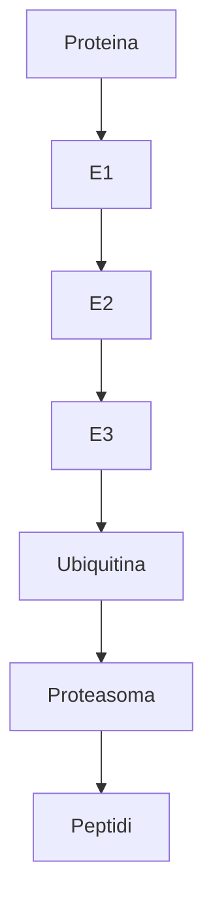

13-05-2023 16:40
Stato: #IdeaL 
Tag: #PatologiaGenerale #Citologia 

In questo diagramma, la proteina viene marcata con l'ubiquitina attraverso una serie di enzimi chiamati E1, E2 ed E3. La proteina marcata viene quindi riconosciuta dal proteasoma, una macchina molecolare che la degrada in peptidi. ù

---
# References 

[[Patologia Generale - Lezioni]]